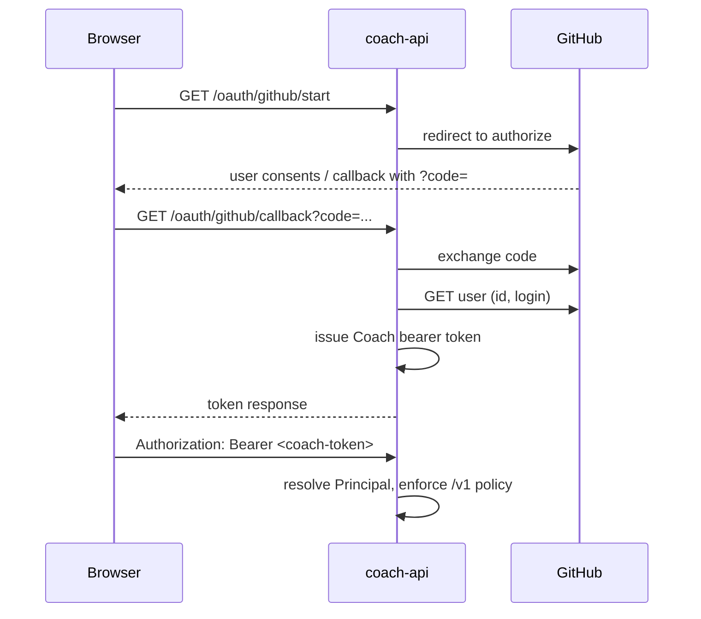
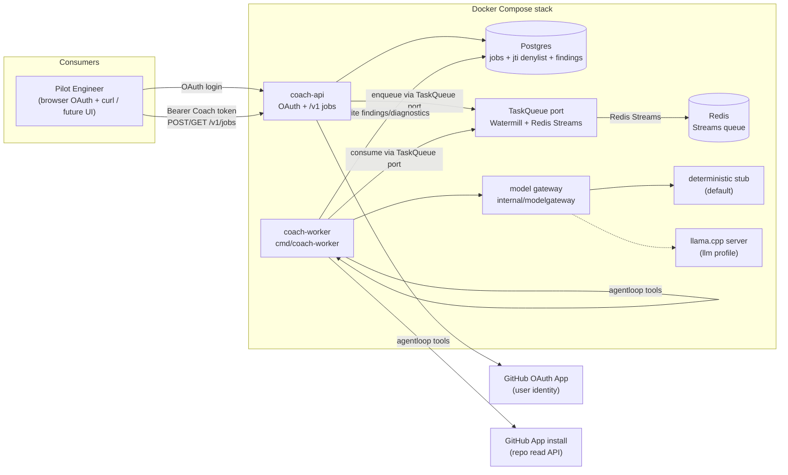
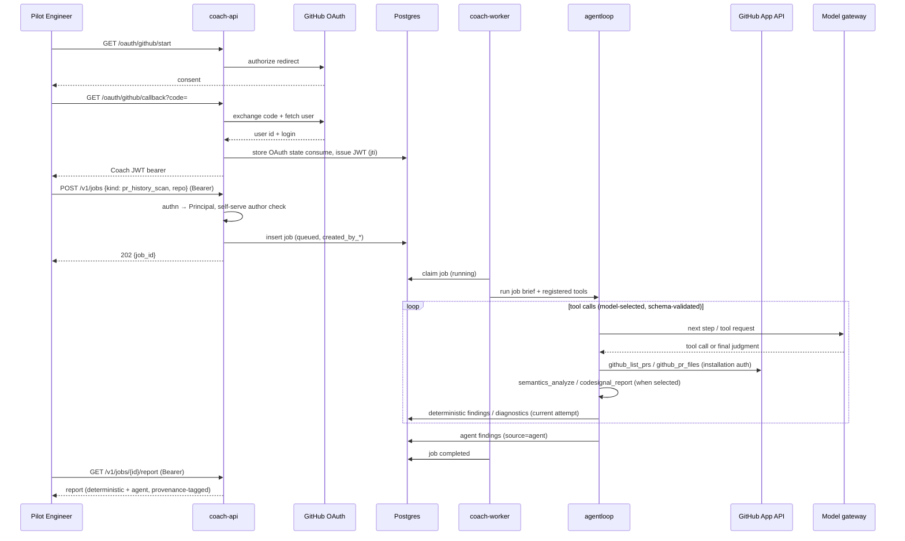

# Feature: Coach API Platform Groundwork

## Problem Statement

Coach's analysis capabilities (`pkg/semantics`, `pkg/codesignal`) are only reachable through a local CLI against a local git checkout, so nobody can consume Coach feedback without cloning the repo and running Go tooling themselves. There is no remote surface that can run asynchronous code-quality analysis — deterministic signals combined with LLM-as-judge rubric evaluation — over a person's recent pull requests or a whole repository. Before investing in SGLang serving and an AWS deployment, the platform's end-to-end flow (API → job queue → agent tool loop → local LLM → report) must be validated entirely locally.

## Personas

| Persona | Impact | Notes |
| ------- | ------ | ----- |
| Pilot Engineer | Positive | Signs in with GitHub, submits scans of their own last 10 PRs or a repo baseline; receives async code-quality reports without installing Go tooling |
| Platform Operator | Positive | Runs the whole stack with one `docker compose` invocation; configures the GitHub OAuth App (identity) and GitHub App installation (repo read); validates the flow before paying for GPUs/AWS |
| Future Harness Integrator | Neutral | Not served yet, but the versioned HTTP API is the seam harness hooks and a web UI will later consume |
| Human Reviewer | Positive (secondary) | Benefits indirectly when pilot engineers act on findings before requesting review |

## Value Assessment

- **Primary value**: Future — lays the platform seam (API contract, job model, model-gateway interface, agent tool loop) that harness hooks, a web UI, and the SGLang/AWS deployment will build on without rework.
- **Secondary value**: Customer — gives the pilot-engineer pool a working feedback loop (self-serve PR-history and baseline scans) that generates the product feedback needed to prioritize further investment.

## User Stories

### Story 1: Authenticate with GitHub and use the async analysis API

As a **Pilot Engineer**,
I want **to sign in with my GitHub identity and then submit an analysis job over HTTP and poll for its result**,
so that I can **get Coach feedback without running any local tooling, under an identity Coach can trust**.

#### Acceptance Criteria

- The coach-api shall act as a **GitHub OAuth App** for end-user authentication: a browser (or equivalent) completes GitHub's OAuth authorization-code flow against Coach-configured client id/secret/callback; on success Coach verifies the GitHub user (at minimum stable numeric id + login) and issues a Coach-managed API credential.
- After a successful OAuth login, the coach-api shall issue a Coach-signed **JWT** bearer access token whose claims carry a **Principal** (`provider=github`, verified GitHub `login`, and GitHub user id as `subject`), plus standard expiry (`exp`) and a unique token id (`jti`) for revocation. That JWT is the only credential accepted on protected `/v1` routes in the pilot.
- The coach-api shall require a valid Coach-issued JWT bearer on every protected `/v1` request; if the token is missing, expired, revoked (denylisted `jti`), fails signature/issuer validation, or is not a Coach JWT, then the coach-api shall respond `401`.
- When a client POSTs a valid job request to `/v1/jobs`, the coach-api shall persist the job with status `queued`, record the authenticated principal as the job creator (`created_by_provider`, `created_by_subject`, `created_by_login`), and respond `202` with the job id.
- When a client GETs `/v1/jobs/{id}`, the coach-api shall return the job's current status (`queued`, `running`, `completed`, `failed`) and, when completed, a link to its report, only if the authenticated principal matches the job's persisted `created_by_*` fields; otherwise the coach-api shall respond `403`.
- When a client GETs `/v1/jobs/{id}/report`, the coach-api shall return the report only if the authenticated principal matches the job's persisted `created_by_*` fields; otherwise the coach-api shall respond `403`.
- If a job request names an unsupported job kind or fails params-schema validation (see Data Model Changes), then the coach-api shall respond `400` and persist nothing.
- If a requested job id does not exist, then the coach-api shall respond `404`.
- If a report is requested for a job that is not yet `completed`, then the coach-api shall respond `409` including the job's current status.
- The coach-api shall return every error response in a stable JSON envelope `{"error": {"code": "<machine_readable>", "message": "<human_readable>"}}`, locked by the Task 1 golden-file test. Machine-readable codes for the pilot include at least: `unauthenticated`, `unauthorized`, `invalid_request`, `job_not_found`, `job_not_completed`, `unsupported_job_kind`, `repo_not_authorized`, and `internal_error`.
- The coach-api shall serve all protected API endpoints under a versioned `/v1` prefix. OAuth start/callback routes may live outside `/v1` (e.g. `/oauth/github/start`, `/oauth/github/callback`) and are unauthenticated by design.
- If GitHub returns an `error` parameter to `/oauth/github/callback` (e.g., `access_denied`), the coach-api shall respond `400` with a stable error envelope and shall not issue a Coach token.
- Automated tests and the compose smoke shall authenticate via an **injectable test principal / token-mint path** that is disabled unless explicitly enabled by operator configuration (e.g. `COACH_AUTH_TEST_MINT=1` in the core compose profile only). Production-like configurations shall not expose test minting. Acceptance tests must cover both: OAuth callback → Coach token → authenticated `/v1` call (against a fake GitHub OAuth), and `401` without a token.

#### Notes

Async submit/poll only in v1 — no webhooks, no streaming. Report retrieval is `GET /v1/jobs/{id}/report`.

**Two distinct GitHub integrations (do not conflate):**

| Integration | Role | Who holds credentials |
| ----------- | ---- | --------------------- |
| **GitHub OAuth App** | End-user **identity** for Coach (who is calling the API) | Coach OAuth client id/secret; user grants access to their GitHub identity |
| **GitHub App installation** (`pkg/githubingest`) | Server-side **repository read** (contents, PR lists, files) | Installation id + app private key; not the user's OAuth token |

Pilot authentication is **GitHub OAuth as the sole production identity provider**. Coach does **not** use statically provisioned bearer-token→login tables as the primary mechanism. `403` is reserved for authenticated-but-not-permitted requests (e.g. Story 2 self-serve mismatch).

**Identity seam (forward-compatible):** handlers and policy see a `Principal` (`provider`, `subject`, `login`, …), not raw OAuth protocol details. v1 implements only `provider=github` via the GitHub OAuth App. Additional OAuth2/OIDC providers are out of scope for this groundwork but must not require redesigning job authz checks—only a new provider adapter that produces the same `Principal` shape.

**Deferred (solve later):** per-principal repository allowlists on submit — see Open Questions. Job-ownership enforcement on status/report reads is required in this groundwork.

### Story 2: Scan my last 10 pull requests

As a **Pilot Engineer**,
I want **a scan of the last 10 merged/open PRs I authored in a given repository**,
so that I can **see recurring code-quality signals across my recent work**.

#### Acceptance Criteria

- When a `pr_history_scan` job runs, the system shall list at most the 10 most recent pull requests that (a) were authored by the requested GitHub login in the requested repository and (b) are either **open** or **merged** (closed-unmerged PRs are excluded), ordered by most recently updated (`updated_at` descending), and analyze each PR's changed files (base and head sides) through the `pkg/semantics` → `pkg/codesignal` pipeline, with tool invocations going through `internal/agentloop` (see Design).
- When per-PR deterministic analysis completes, the system shall evaluate the results against the configured LLM-as-judge rubrics (via the model gateway / agent loop) and record the judgments alongside — never in place of — the deterministic findings.
- The coach-api shall accept a `pr_history_scan` only when the effective `author_login` equals the authenticated principal's verified GitHub `login` (from GitHub OAuth, Story 1); if they differ, then the coach-api shall respond `403` (self-serve scans). If `author_login` is omitted from params, the coach-api shall default it to the principal's GitHub login. If the authenticated principal's provider is not `github`, then `pr_history_scan` shall respond `403`.
- The coach-api shall accept a `pr_history_scan` only when the principal has a role in the requested repository according to GitHub. The authorization check shall consider both direct collaborator access and organization-derived access (e.g., org membership with team or base permissions). If the principal lacks access, or if the Coach GitHub App installation cannot read the repository, the coach-api shall respond `403` with code `repo_not_authorized` and persist nothing.
- The API shall provide no endpoint to enumerate or scan arbitrary third-party authors or repositories.
- If GitHub returns fewer than 10 matching pull requests, then the system shall analyze the available set and record the actual count in `summary.pr_count` in the report.
- If an individual PR's analysis fails (fetch error, unsupported language, oversized file), then the system shall record a per-PR diagnostic and continue with the remaining PRs rather than failing the whole job.

#### Notes

PR diff analysis does not require a local git checkout. The worker fetches base and head contents for each changed file via `pkg/githubingest` and invokes the `codesignal_report` tool with that content; the tool produces PR-level deterministic findings through the existing `pkg/semantics` → `pkg/codesignal` pipeline.

#### Notes

The self-serve constraint encodes the no-surveillance principle (PRD §11, architecture doc §11 "no developer scoring") into the API shape itself. Enforcement rests on **verified GitHub identity from the OAuth App login** (Story 1), not on operator-provisioned static token bindings. The user's OAuth grant authenticates them *to Coach*; it is not used as the worker's credential to read repositories—that remains the GitHub App installation path in `pkg/githubingest`.

### Story 3: Baseline-scan a repository

As a **Pilot Engineer**,
I want **a baseline scan of a whole repository at its default branch**,
so that I can **see the repo's current code-quality signal surface before making changes**.

#### Acceptance Criteria

- When a `repo_baseline_scan` job runs, the system shall obtain the repository's tree at the requested (or default) ref — via GitHub Contents/git tree APIs for `repo_owner`+`repo_name`, or via a local fixture path only when the worker is configured with an operator-trusted local fixture path for credential-free smoke (never from a client-supplied clone URL) — and produce a baseline report over all files with extensions supported by the `pkg/semantics` language registry (currently `.go`, `.ts`, `.tsx`), reusing the existing baseline analysis path, with analysis/rubric tool invocations going through `internal/agentloop`.
- When baseline deterministic analysis completes, the system shall run the configured rubric judgments over the aggregated signals and include them in the report with `source=agent` provenance.
- The coach-api shall reject any job params that include a client-supplied clone URL (`git_url` or equivalent) with `400`; clone URLs are not part of the public params schema.
- The coach-api shall accept a `repo_baseline_scan` only when the principal has a role in the requested repository according to GitHub, using the same repository-authorization check as `pr_history_scan` (direct collaborator or organization-derived access). If the principal lacks access, or if the Coach GitHub App installation cannot read the repository, the coach-api shall respond `403` with code `repo_not_authorized` and persist nothing.
- If the repository cannot be fetched (not found, auth failure, too large per configured budget), then the system shall fail the job with a sentinel-mapped, actionable error message.

### Story 4: Run the whole platform locally

As a **Platform Operator**,
I want **one Docker Compose stack that runs coach-api, the worker, Postgres, and a local LLM**,
so that I can **validate the entire flow on a laptop before investing in SGLang or AWS**.

#### Acceptance Criteria

- When the operator runs the core compose profile, the system shall start coach-api, coach-worker, Postgres, and Redis with no model weights required, using the deterministic model stub.
- Where the `llm` profile is enabled, the system shall route agent judgments through a llama.cpp server speaking its OpenAI-compatible API, selected purely by configuration — no code change.
- When the end-to-end smoke task runs against the core profile, the system shall complete a submitted job through the full API → queue → worker → agent tool loop → model gateway (stub) → report path and exit non-zero on any failure.
- The system shall expose all compose lifecycle and smoke commands as `mise` tasks (the repo's single command interface).

### Story 5: Trustworthy provenance

As a **Platform Operator**,
I want **deterministic findings and agent judgments kept structurally distinct**,
so that I can **always tell reproducible evidence apart from model opinion**.

#### Acceptance Criteria

- The system shall tag every stored finding with `source=deterministic` or `source=agent`, and agent output shall never modify or suppress a deterministic finding.
- The system shall record, for every agent judgment: the rubric id and version, the model identity reported by the gateway, and schema-validation status.
- If a model response fails rubric schema validation after bounded retries, then the system shall store the failure as a diagnostic and deliver the deterministic portion of the report anyway.

---

## Design

> Engineering standards: `AGENTS.md` (inlined into `CLAUDE.md`). Binding constraints respected here: `pkg/semantics` never imports `pkg/githubingest` (or any GitHub client) and vice versa; acceptance-test-first policy applies to every task; all commands are `mise` tasks.

### Alignment with `docs/architecture/system-overview.md`

This groundwork deliberately trims the architecture doc's v1 platform to what an API-triggered local pilot needs, while preserving its load-bearing principles:

- **Kept**: deterministic-before-inference; deterministic/agent provenance separation (§2, §6.3C); model access only through a gateway contract so llama.cpp → SGLang is a backend swap (§6.3E); no developer scoring (§11); advisory-only, no repo mutation.
- **Deferred, not contradicted**: GitHub webhook ingestion, SQS/DynamoDB/outbox machinery, snapshot service, adk-go agent runtime, AWS deployment. The trigger here is an authenticated API call, so the ingestion plane is unnecessary for validation. The groundwork phase uses an application-owned `TaskQueue` port backed by Watermill, with adapters for both **Redis Streams** (local Docker Compose and Redis-first customer deployments) and **SQS** (AWS-leaning customer deployments). DynamoDB and outbox machinery remain deferred to the webhook-driven production platform. Postgres continues to own job state, findings, diagnostics, and the JWT `jti` denylist.
- **Changed**: consumption is decoupled from the feedback platform — v1 consumers poll the API; harness hooks and a web UI come later against the same contract. End-user auth is a **GitHub OAuth App** (verified identity → Coach-issued API tokens) rather than static operator-provisioned bearer tables; repository reads remain GitHub App installation auth via `pkg/githubingest`.

> **Auth-model note**: The architecture doc's §14 Groundwork summary currently mentions "static bearer tokens bound to GitHub logins." That description is stale: this spec's OAuth-App + Coach-JWT design is the binding groundwork auth model. The architecture doc will be reconciled once the OAuth flow is validated; until then, this spec prevails on auth for the groundwork phase.

### Authentication and identity

**Goal**: people authenticate to Coach with their GitHub identity. GitHub is the sole identity provider in this groundwork; other OAuth2/OIDC providers are a later adapter behind the same principal model.

**Rules**:

1. **Principal** is the only identity type job handlers and authz checks consume: `{provider, subject, login}` where v1 GitHub maps `provider="github"`, `subject=<github numeric user id as string>`, `login=<github login>`.
2. **Coach-issued JWTs** are the API credential (`Authorization: Bearer <jwt>`). Claims include at least `provider`, `sub` (GitHub user id), `login`, `iss`, `exp`, and `jti`. Validation is signature + issuer + expiry + `jti` not denylisted. GitHub access tokens from the OAuth exchange are used only during login to verify identity (and optionally refresh profile); they are **not** accepted as `Authorization` on `/v1/jobs` and are **not** passed to the worker for repo reads.
3. **GitHub App installation** credentials remain the worker/ingestion path for Contents/PR APIs (`pkg/githubingest`). OAuth identity ≠ repo-fetch credential.
4. **Self-serve** (Story 2): `effective author_login == principal.login` for `provider=github`. No third-party author scans.
5. **Test/smoke auth**: an explicit, config-gated token mint (or in-process principal injector in unit tests) produces the same `Principal` shape without a live GitHub OAuth round-trip. Must be off unless operator-enabled; compose `core` profile may enable it for `platform-smoke` only.
6. **Future IdPs**: a new provider implements "complete external login → `Principal`"; `/v1` authz and self-serve rules stay provider-aware only where GitHub login is required (PR author matching). Non-GitHub principals cannot satisfy `pr_history_scan` self-serve until a later mapping story exists—out of scope here.
7. **OAuth scopes**: the GitHub OAuth App requests **no scope**. `GET /user` returns the public `id` and `login` required for the `Principal`; email and private profile fields are not used. The access token from the OAuth exchange is used only to verify identity during login and is never forwarded to the worker or accepted as a `/v1` credential.

### Components Affected

- `cmd/coach-api/` — **new**: HTTP API binary (OAuth routes, job submit/status/report).
- `cmd/coach-worker/` — **new**: job-claiming worker binary running the analysis pipeline and agent loop.
- `internal/coachapi/` — **new**: domain types, HTTP handlers, auth middleware, `JobStore` seam with Postgres and in-memory implementations, migrations.
- `internal/coachapi/queue/` (or `internal/queue/`) — **new**: application-owned `TaskQueue` and `EventBus` ports, plus Watermill adapters for Redis Streams and SQS. The worker consumes jobs only through the `TaskQueue` port. The port contracts must hide Watermill message types and backend-specific semantics (Redis pending-entry claiming, SQS visibility timeout, DLQs). The local Docker Compose stack uses Redis Streams; the SQS adapter is validated via the black-box provider conformance suite.
- `internal/authn/` (or under `internal/coachapi/auth`) — **new**: `Principal`, GitHub OAuth App adapter (authorize URL, code exchange, user fetch), Coach token issue/validate/revoke seam, config-gated test mint.
- `internal/modelgateway/` — **new**: gateway interface, deterministic stub (default), llama.cpp OpenAI-compatible client.
- `internal/agentloop/` — **new**: minimal bounded tool loop + typed tool registry (semantics/codesignal/github tools). **Required path** for v1 job handlers (Tasks 7–8): listing, fetch, analysis, and rubric judgment tools run only through the registry/loop, not as ad-hoc direct calls from the handler.
- `internal/authz/` — **new**: repository authorization seam (`RepoAuthorizer`) that checks, via the GitHub App installation token, whether a `Principal` has a role in a requested repository. Used by `POST /v1/jobs` before persisting any job.
- `internal/rubrics/` — **new**: versioned rubric definitions, judge prompt assembly, output JSON schemas.
- `pkg/githubingest/` — **extended**: PR listing by author and PR changed-file content retrieval, same GitHub App **installation** auth and sentinel-error conventions as `ReadFile` (unchanged by user OAuth).
- `internal/codesignalcli/` — **reused**: baseline and diff analysis paths invoked by the worker (import is allowed; both live in this module).
- `compose.yaml`, `mise.toml`, `.github/workflows/ci.yml` — **new/extended**: compose stack (OAuth app env + optional test mint for smoke), lifecycle/smoke tasks, CI job for the new packages.

### Seed rubrics

The LLM-as-judge step evaluates deterministic findings against two versioned seed rubrics. Each rubric receives deterministic findings as primary evidence and must record `rubric_id`, `rubric_version`, and the model identity returned by the gateway.

1. **hidden_mutation_contextualization** (v1)
   - **Input**: one deterministic `hidden_input_mutation` finding, plus the PR diff context (base and head of the changed file) or the baseline file context.
   - **Question**: Does the mutation hide input state in a way that will surprise a reviewer or complicate future changes? Distinguish benign constructor wiring from hidden state mutation.
   - **Output schema** (JSON): `{ "judgment": "concern" | "acceptable" | "unclear", "rationale": "string", "confidence": "high" | "medium" | "low", "suggested_focus": "string|null" }`.

2. **change_cohesion** (v1)
   - **Input**: the full set of deterministic findings for a single PR or baseline, plus file/change metadata.
   - **Question**: Do the changed files cluster into a coherent unit of behavior, or does the change scatter unrelated concerns? Flag tangled imports, cross-file coupling spikes, or single commits that touch many disjoint concepts.
   - **Output schema** (JSON): `{ "judgment": "focused" | "diffuse" | "unclear", "rationale": "string", "confidence": "high" | "medium" | "low", "suggested_focus": "string|null" }`.

Both rubrics:
- Must not be allowed to modify or suppress deterministic findings.
- Must fail schema validation gracefully: a malformed judgment is recorded as a diagnostic and the deterministic report is still delivered (Story 5).

### Dependencies

- llama.cpp server image (OpenAI-compatible `/v1/chat/completions`), model configurable; stub used everywhere models are unavailable (tests, CI, core profile).
- Postgres 16 (jobs, results, auth sessions/tokens as needed); `database/sql` + `pgx` driver.
- Existing `go-github`/`ghinstallation` (already dependencies of `pkg/githubingest`) for **installation** repo access.
- GitHub OAuth App (user identity): standard authorization-code + user API; may use `golang.org/x/oauth2` and GitHub's user endpoint (fakeable via `httptest` in acceptance tests). No dependency of `pkg/semantics` on OAuth libraries.
- Quantized Qwen-family GGUF for the optional `llm` profile (exact variant: Open Question).

### Tenant scoping

The groundwork phase is single-principal/self-serve: each job is owned by exactly one authenticated principal, and there is no operator-facing multi-tenant view. The data model therefore does not require a `tenant_id` column, but it also must not assume a shared namespace across principals. A future tenant column can be added without redesigning the job/findings/diagnostics tables.

### Data Model Changes

New Postgres schema (owned by `internal/coachapi` / auth package):

- `jobs`: `id (uuid pk)`, `kind (pr_history_scan | repo_baseline_scan)`, `params (jsonb)`, `status`, `error`, `created_at`, `started_at`, `finished_at`, `claimed_by`, `heartbeat_at`, `attempt` (int, not null, default 0 — incremented each time the job is claimed or re-queued after a stale heartbeat), `created_by_provider` (text, not null), `created_by_subject` (text, not null), `created_by_login` (text, not null) — denormalized principal at submit time for audit and ownership checks on status/report reads.
- `job_findings`: `id`, `job_id (fk)`, `attempt` (int, not null — matches the `jobs.attempt` that produced the row), `source (deterministic | agent)`, `rubric_id`, `rubric_version`, `model_identity`, `payload (jsonb, frozen snake_case)`, `payload_hash (text, not null)`, `created_at`. `payload_hash` is a stable hash of the finding location/rule/rubric evidence within `payload`. For `source=deterministic`, `rubric_id` and `rubric_version` are `NULL`; for `source=agent`, they hold the rubric id and version that produced the judgment. `model_identity` is `NULL` for `source=deterministic`. Unique constraint on `(job_id, attempt, source, rubric_id, payload_hash)` where `payload_hash` is a stable fingerprint of the finding location/rule/rubric evidence so the same logical finding is stored only once within the same job attempt; prior attempts' rows are discarded on reclaim (see Task 3).
- `job_diagnostics`: `id`, `job_id (fk)`, `attempt` (int, not null), `scope` (e.g., `pr:123`, `file:path`), `message`, `created_at`. Same attempt-scoping rules as findings.
- Auth persistence (exact table split is an implementation detail of Task 2a; minimum capabilities): OAuth `state` (CSRF) nonces with short TTL; a **JWT `jti` denylist** so revoke/logout invalidates tokens before `exp`. Protected routes validate the JWT cryptographically and then consult the denylist; revocation therefore depends on the denylist store's availability. Do not store GitHub refresh/access tokens longer than needed for the login exchange unless a later story requires GitHub user-token features (not in scope).

**Idempotency under at-least-once claim** (Task 3): when a stale `running` job is returned to `queued`, the re-claim shall (in one transaction) increment `jobs.attempt`, delete all `job_findings` and `job_diagnostics` rows for that `job_id` with `attempt < jobs.attempt` (or delete all prior rows for the job), then run the handler. Handlers always write findings/diagnostics tagged with the current `jobs.attempt`. Report assembly reads only rows for the final successful attempt. Acceptance tests must cover crash-after-partial-persist-then-reclaim without duplicate findings in the completed report.

Per-kind `params` schemas (validated at submit; violations → `400`, nothing persisted):

- `pr_history_scan`: `repo_owner` (string, required), `repo_name` (string, required), `author_login` (string, optional; default = authenticated principal's GitHub `login`; if present must equal that login per Story 2 or → `403`), `pr_limit` (int, optional, default 10, max 10 in v1).
- `repo_baseline_scan`: `repo_owner` (string, required) + `repo_name` (string, required) for normal GitHub fetch, plus `ref` (string, optional, default: remote default branch). **No client-supplied clone URL field.** Credential-free compose smoke uses an operator-configured worker setting (e.g. env `COACH_SMOKE_FIXTURE_PATH` or compose-mounted path). The public job kind remains `repo_baseline_scan`; the worker resolves the configured `repo_owner`/`repo_name` pair to the fixture path only when the flag is set by the operator in the smoke compose profile — never from request params. Any `git_url` / `clone_url` key in params → `400`. Smoke authenticates with the config-gated test mint (Story 1), not with live GitHub OAuth.

Top-level report shape (frozen snake_case, locked by the Task 1 golden-file test, mirroring `pkg/semantics/result_test.go`): `report_version`, `job_id`, `kind`, `params` (echo), `summary` (finding counts by `source` and rule/rubric id, plus job-specific counts such as `pr_count`), `findings` (array; each carries the provenance fields from `job_findings`), `diagnostics` (array), `error` (string|null — populated when the job failed), `versions` (analyzer, rubric ids/versions), `generated_at`. The `report_version` for the groundwork era is `"1"`.

**Orchestration split (agent loop vs fixed handler code):**

- **Model-selected via `internal/agentloop`**: tool calls the model is allowed to issue — `github_list_prs`, `github_pr_files`, `semantics_analyze`, `codesignal_report`. Unknown tools and over-budget loops are typed errors (architecture doc §6.3D).
- **Handler-driven via `internal/agentloop`**: rubric-judgment tools registered for the job by the handler. The handler decides which rubrics run and when; the loop executes them, but the model does not choose whether they are invoked.
- **Deterministically owned by the job handler / API layer** (not model-selected): authentication/principal resolution, claim/lifecycle, attempt-scoped persistence, which rubrics run, open/merged PR filter policy, self-serve author check at submit (principal.login), smoke fixture path resolution, size budgets, and terminal status transitions. The handler starts the loop with a job brief and registered tools; it does not bypass the registry to call those packages for the analysis path.

### Diagrams

### Decisions (see ADRs for rationale and alternatives)

The following questions are decided. The binding rules remain in the story acceptance criteria and Design section above so the spec stays actionable for coding agents; the ADRs provide rationale, tradeoffs, and validation expectations.

| Question | Decision | ADR |
|---|---|---|
| Identity for API access and self-serve scans | GitHub OAuth App is the sole production identity provider; Coach issues JWTs bound to a verified `Principal` (`provider=github`, `subject`, `login`) | [ADR-001](../../docs/architecture/ADR-001-coach-api-authentication.md) |
| Coach token format | Coach-signed JWT with `Principal`, `iss`, `exp`, and `jti`; revocation via `jti` denylist | [ADR-001](../../docs/architecture/ADR-001-coach-api-authentication.md) |
| OAuth app scopes | **No scope** in v1; public `id` and `login` from `GET /user` are sufficient | [ADR-001](../../docs/architecture/ADR-001-coach-api-authentication.md) |
| GitHub credential mode for repo reads (worker) | Worker reads repos exclusively via `pkg/githubingest` GitHub App installation auth; user's OAuth token is never used for repo reads | [ADR-002](../../docs/architecture/ADR-002-identity-separate-from-repo-reads.md) |
| Per-principal repository authorization | Enforce at submit time: App must be able to read repo **and** principal must have a GitHub role in it (direct collaborator or org-derived access) | [ADR-003](../../docs/architecture/ADR-003-repository-authorization-policy.md) |
| Job ownership and cross-requester reads | Reject cross-principal reads on status and report with `403` | [ADR-004](../../docs/architecture/ADR-004-job-ownership-isolation.md) |
| Agent-loop orchestration split | Model selects evidence tools; handler registers rubric tools; authz/lifecycle/budgets remain deterministic handler code | [ADR-005](../../docs/architecture/ADR-005-agent-loop-orchestration-split.md) |
| Local queue technology | Application-owned `TaskQueue`/`EventBus` ports over Watermill, with Redis Streams and SQS adapters in the groundwork phase; DynamoDB/outbox machinery remains deferred to production scale | [ADR-006](../../docs/architecture/ADR-006-watermill-queue-abstraction.md) |
| Rubric seed set | Two seed rubrics: `hidden_mutation_contextualization` (v1) and `change_cohesion` (v1) | Design section above |
| Qwen GGUF variant and license review for `llm` profile | Use a quantized 4B-class Qwen-family GGUF loaded by native macOS llama.cpp with Metal as the local evaluation stand-in. The exact file is operator-chosen and must be recorded with source, license, conversion, and digest before use. SGLang/Qwen3.5-4B remains the production target after separate evaluation. | [docs/architecture/system-overview.md](../../docs/architecture/system-overview.md) §3, §9, §11, §14 |

### Open Questions

- [x] **Report retention**: **Decided for groundwork** — infinite retention. Every job, finding, diagnostic, and report is kept indefinitely during the pilot. Configurable retention rules are deferred until multi-tenant use.
- [x] **Baseline path promotion**: **Decided** — keep the baseline path in `internal/codesignalcli` and import it as-is by the worker. Do not promote it to a neutral `internal/` package until a second consumer appears.

---

## Tasks

> Each task must start with a failing acceptance test (repo policy — see `AGENTS.md` "Acceptance-test-first"). Verification commands are the repo's `mise` tasks. Tasks 1–5 (including 2a) are the platform core; Tasks 6–10 are capabilities and the compose stack.

### Task 1: Job domain model and API contract

**Objective**: Define job kinds, statuses, request/response types, principal/creator fields, and the report JSON contract with a golden-file lock.

**Context**: Everything else builds on these types; freezing the JSON first mirrors how `pkg/semantics` locked its contract.

**Affected files**:

- `internal/coachapi/types.go`, `internal/coachapi/types_test.go`
- `internal/coachapi/migrations/0001_init.sql`

**Requirements**:

- Story 1 criteria (job kinds, statuses, attempt-scoped findings, `created_by_provider` / `created_by_subject` / `created_by_login` on jobs); Story 5 provenance fields on findings.
- `Principal` type (or equivalent) available to API layers: `provider`, `subject`, `login`.
- A frozen snake_case JSON contract for the report type, including a nullable top-level `error` field, locked by a static golden-file test that serializes a hand-authored `Report` value. The end-to-end generated report golden fixtures are produced in Tasks 7–8.

**Verification**:

- [ ] `mise run test` passes (new golden-file test red first, then green)
- [ ] `mise run gofmt` and `mise run go-vet` clean

**Done when**:

- [ ] All verification steps pass
- [ ] Golden JSON-contract fixture reviewed and committed
- [ ] Code follows the repo's engineering guidance

---

### Task 2a: GitHub OAuth App identity and Coach API tokens

**Depends on**: Task 1

**Objective**: Implement GitHub OAuth App login, `Principal` resolution, Coach-signed JWT issue/validate/revoke (`jti` denylist), auth middleware, and a config-gated test-mint path for automated tests/smoke.

**Context**: Story 1 — primary authentication. Separates **who the caller is** (OAuth App) from **how the worker reads GitHub** (App installation in `pkg/githubingest`). Leaves a provider-shaped seam so a future OIDC adapter can mint the same `Principal` without rewriting `/v1` policy.

**Affected files**:

- `internal/authn/` (or `internal/coachapi/auth/`) — `principal.go`, `github_oauth.go`, `tokens.go`, middleware, fakes, tests
- OAuth routes wired from `cmd/coach-api` / `internal/coachapi` server
- Migrations for token/session + OAuth state storage as needed

**Requirements**:

- Story 1 auth acceptance criteria: authorize URL + state/CSRF, code exchange against a fake GitHub OAuth/`httptest`, user id+login → `Principal{provider: "github", ...}`, Coach-signed JWT on subsequent requests.
- JWT validation rejects missing/invalid signature/wrong issuer/expired/`jti` denylisted tokens with `401` on protected `/v1` routes. OAuth start/callback are not protected by the Coach JWT.
- GitHub OAuth access tokens are not accepted as `/v1` credentials and are not forwarded to job handlers/workers.
- Config-gated test mint (or equivalent) issues a Coach JWT for a supplied login/subject; disabled by default; acceptance test proves it is rejected when the gate is off. When disabled, the mint path is not registered and shall return `404`.
- The OAuth authorize URL requests **no scope** (default empty scope). Acceptance tests assert that the exchanged token can retrieve the public `id` and `login` from the fake GitHub `/user` endpoint without any user-scope grant.
- No static provisioned token→login configuration table as the primary auth path.

**Verification**:

- [ ] `mise run test` passes; OAuth and `401` acceptance tests were red first
- [ ] Fake-GitHub OAuth round-trip produces a token that authorizes a protected route
- [ ] Test mint disabled → the mint path is not registered and returns `404`

**Done when**:

- [ ] All verification steps pass
- [ ] Design Notes "two GitHub integrations" distinction is reflected in package boundaries (authn does not perform repo Contents reads; githubingest does not implement user OAuth)

---

### Task 2: coach-api HTTP service

**Depends on**: Tasks 1, 2a

**Objective**: Implement `POST /v1/jobs`, `GET /v1/jobs/{id}`, `GET /v1/jobs/{id}/report` over a `JobStore` seam with in-memory and Postgres implementations, behind auth middleware from Task 2a.

**Context**: The API is the platform's only consumption surface; the store seam keeps handler acceptance tests fast and deterministic. Every protected handler receives a resolved `Principal`.

**Affected files**:

- `internal/coachapi/server.go`, `server_test.go`, `store.go`, `store_memory.go`, `store_postgres.go`
- `cmd/coach-api/main.go`

**Requirements**:

- Story 1 job API acceptance criteria, exercised at the HTTP boundary with `httptest` against the in-memory store — including reject client-supplied clone URL params with `400`.
- Persist `created_by_*` from the authenticated principal on submit.
- Story 2 self-serve at submit: `author_login` defaults to `principal.login`; mismatch → `403`.
- Postgres store covered by an integration test gated on a `COACH_PG_DSN` env var (runs in compose CI job, skipped otherwise).

**Verification**:

- [ ] `mise run test` passes; new handler acceptance tests were red first
- [ ] `400`/`401`/`403`/`404`/`409` paths and the error envelope asserted per Stories 1–2
- [ ] Unauthenticated `/v1` calls asserted `401`; cross-login `pr_history_scan` asserted `403`; cross-principal `GET /v1/jobs/{id}` and `GET /v1/jobs/{id}/report` asserted `403`

**Done when**:

- [ ] All verification steps pass
- [ ] `cmd/coach-api` starts and serves OAuth routes + `/v1` locally (OAuth against real GitHub optional for operators; tests use fakes)

---

### Task 3: Worker job claiming and lifecycle

**Depends on**: Task 2

**Objective**: Implement `cmd/coach-worker` consuming queued jobs via the Watermill + Redis Streams-backed `Queue` port, with heartbeat, bounded retry, and terminal failure recording.

**Context**: A Watermill-backed `TaskQueue` port with adapters for both Redis Streams and SQS supports heterogeneous customer deployments (AWS ECS/EKS, Docker Compose, kind, GKE, self-hosted Kubernetes) while keeping at-least-once semantics with attempt-scoped, reclaim-idempotent job handlers (Data Model Changes). Job state, findings, diagnostics, and the JWT `jti` denylist remain in Postgres.

**Affected files**:

- `internal/coachapi/claim.go`, `claim_test.go`
- `cmd/coach-worker/main.go`

**Requirements**:

- While a job is `running`, the worker shall update `heartbeat_at` every heartbeat interval (configurable, default 15s); a `running` job whose heartbeat is older than the stale threshold (configurable, default 60s, must be ≥ 3× the interval) shall be returned to `queued` (crash recovery). Both durations are injected (clock and config) so crash-recovery tests are deterministic without real waiting.
- On reclaim after stale heartbeat (and on every successful claim), the claim transaction shall increment `jobs.attempt` and delete prior `job_findings`/`job_diagnostics` for that job so a handler that crashed after partial persist cannot leave duplicate rows in the completed report (Data Model Changes — Idempotency under at-least-once claim).
- If a job handler fails permanently, then the job records `failed` with the error (Story 3 sentinel mapping).

**Verification**:

- [ ] `mise run test` (in-memory store) and DSN-gated Postgres test pass; red first
- [ ] Two concurrent workers never double-claim a job (race-tested; `go test -race`)
- [ ] Crash-after-partial-findings-persist then reclaim yields a completed report with no duplicate findings (single final attempt only)

**Done when**:

- [ ] All verification steps pass
- [ ] Crash-recovery and reclaim-idempotency behavior covered by tests

---

### Task 4: Model gateway seam with stub and llama.cpp client

**Objective**: Define the `modelgateway.Gateway` interface (structured judgment request → schema-validated response), a deterministic stub, and a llama.cpp OpenAI-compatible client.

**Context**: The architecture doc's core seam: llama.cpp now, SGLang later, no orchestration change. Independent of Tasks 2–3; can proceed in parallel after Task 1.

**Affected files**:

- `internal/modelgateway/gateway.go`, `stub.go`, `llamacpp.go`, plus tests

**Requirements**:

- Story 5: response carries model identity; schema-validation failures are typed errors after bounded retries.
- Stub is the default everywhere; llama.cpp client tested against recorded HTTP fixtures (`httptest`), no live model in CI.

**Verification**:

- [ ] `mise run test` passes; red first
- [ ] Malformed-model-output path returns the typed validation error

**Done when**:

- [ ] All verification steps pass
- [ ] No package outside `internal/modelgateway` imports an LLM HTTP client directly

---

### Task 5: Minimal agent tool loop

**Depends on**: Task 4

**Objective**: Implement a bounded tool-call loop (max iterations, per-job budget) over a typed tool registry: `semantics_analyze`, `codesignal_report`, `github_list_prs`, `github_pr_files` (plus rubric-judgment tools used by Tasks 7–9).

**Context**: The investment-gate path runs analysis through this loop (Problem Statement; Tasks 7–8). Tools wrap existing packages; the loop stays dumb and auditable. Fixed handler code owns claim/lifecycle, budgets, and policy; the model may only act via registered tools (Design — Orchestration split).

**Affected files**:

- `internal/agentloop/loop.go`, `tools.go`, plus tests

**Requirements**:

- The loop is a generic, bounded executor. It shall support a core set of always-registered tools plus a mechanism for handlers to register job-specific tools (e.g., the rubric-judgment tools defined in Task 9) at loop start.
- The loop shall execute only registered, schema-validated tool calls; unknown tools or over-budget loops end the run with a typed error (model text never becomes an arbitrary action — architecture doc §6.3D).
- v1 budgets are: `max_tool_calls` (default 50), `max_model_calls` (default 20), and `max_wall_time` (default 5 minutes). Token-cost and monetary budgets are deferred.
- Acceptance tests drive the loop with a scripted stub gateway (tool-call sequences), no live model.
- Task 7 and Task 8 acceptance tests shall require a successful job path that executes through `internal/agentloop` (not a bypass that calls the underlying packages directly for the analysis path).

**Verification**:

- [ ] `mise run test` passes; red first
- [ ] Budget-exhaustion and unknown-tool paths covered

**Done when**:

- [ ] All verification steps pass
- [ ] Tool registry is the only path from model output to code execution

---

### Task 6: PR listing and PR file retrieval in `pkg/githubingest`

**Objective**: Add `ListRecentPullRequestsByAuthor(owner, repo, login, limit)` and per-PR changed-file content retrieval (base and head), following the package's existing auth and sentinel-error conventions.

**Context**: The largest missing ingestion capability; unblocks Story 2. Independent of Tasks 2–5.

**Affected files**:

- `pkg/githubingest/pulls.go`, `pulls_test.go`, `acceptance_test.go` (extended)

**Requirements**:

- Story 2: at most `limit` most recent **open or merged** PRs by the given author, ordered by `updated_at` descending; closed-unmerged PRs must not appear; fewer eligible → return what exists.
- Acceptance tests include a mixed-state fixture (open, merged, closed-unmerged) proving closed-unmerged exclusion and ordering.
- Errors map to the package's existing sentinels (`ErrNotFound`, `ErrAuth`, `ErrTooLarge`, …); no import of `pkg/semantics` (dependency rule).

**Verification**:

- [ ] `mise run test` and `mise run test-examples` pass; red first against an `httptest` GitHub fake
- [ ] Mixed-state fixture asserts closed-unmerged exclusion
- [ ] `mise run tidy-check` clean

**Done when**:

- [ ] All verification steps pass
- [ ] Doc comment updates reflect the widened package scope

---

### Task 7: `pr_history_scan` job handler

**Depends on**: Tasks 3, 5, 6, 9

**Objective**: Run list open-or-merged PRs → fetch changed files → per-PR semantics/codesignal analysis → rubric judgment → attempt-scoped provenance-tagged report **through `internal/agentloop`** (registered tools + stub gateway sequences).

**Context**: The first end-user capability; proves the investment-gate path (API → queue → agent tool loop → model → report).

**Affected files**:

- `internal/coachapi/handler_pr_history.go`, plus tests

**Requirements**:

- Story 2 acceptance criteria end-to-end with authenticated principal + fake GitHub (installation API) + scripted stub gateway driving the agent loop, including per-PR diagnostic-and-continue, open/merged filter, and self-serve author constraint at submit (principal.login).
- Acceptance test asserts the analysis path executes via `internal/agentloop` (tool registry), not by the handler calling `pkg/semantics` / `pkg/githubingest` / rubrics directly for that path.
- Worker path uses GitHub App installation credentials only — not the user's OAuth token.

**Verification**:

- [ ] `mise run test` passes; the full-flow acceptance test was red first
- [ ] Report golden fixture shows deterministic and agent findings side by side
- [ ] Mixed-state PR set excludes closed-unmerged
- [ ] Agent-loop path asserted (no analysis bypass)

**Done when**:

- [ ] All verification steps pass
- [ ] Job completes with partial results when one PR fails

---

### Task 8: `repo_baseline_scan` job handler

**Depends on**: Tasks 3, 5, 9

**Objective**: Fetch a repository tree at a ref (GitHub APIs for normal jobs; operator-configured local fixture path only for smoke), run baseline analysis and rubric judgments **through `internal/agentloop`**.

**Context**: Second capability; reuses `internal/codesignalcli`'s baseline mode via registered tools rather than reimplementing it. Required by the compose smoke (Task 10).

**Affected files**:

- `internal/coachapi/handler_baseline.go`, plus tests

**Requirements**:

- Story 3 acceptance criteria; fetch/clone failures map to actionable sentinel errors; configurable size budget.
- No request-params clone URL: public params are `repo_owner`+`repo_name`+optional `ref` only. Smoke fixture path is worker config (`COACH_SMOKE_FIXTURE_PATH` or equivalent), exercised by an acceptance test that refuses client-supplied `git_url` at the API and still completes a baseline against the configured fixture.
- Acceptance test asserts the analysis path executes via `internal/agentloop`.

**Verification**:

- [ ] `mise run test` passes; red first against a local fixture repo (config-injected path)
- [ ] Oversized-repo budget path covered
- [ ] Client-supplied clone URL rejected at API (`400`)
- [ ] Agent-loop path asserted (no analysis bypass)

**Done when**:

- [ ] All verification steps pass
- [ ] No duplication of baseline logic (tools wrap `internal/codesignalcli`)

---

### Task 9: Seed LLM-as-judge rubrics

**Depends on**: Tasks 4, 5

**Objective**: Define two versioned rubrics (hidden-mutation contextualization; change-cohesion) with output JSON schemas, prompt assembly that attaches deterministic evidence, and golden stub-driven outputs; expose as agent-loop tools.

**Context**: Makes "static analysis + LLM-as-judge" concrete; rubric versioning enables later comparison across models (llama.cpp vs SGLang).

**Affected files**:

- `internal/rubrics/rubrics.go`, `schemas/`, plus tests

**Requirements**:

- Story 5: judgments carry rubric id/version and model identity; validation failure degrades to deterministic-only report (Unwanted-path test).

**Verification**:

- [ ] `mise run test` passes; red first
- [ ] Rubric schemas validate golden outputs byte-identically

**Done when**:

- [ ] All verification steps pass
- [ ] Rubric set matches the Open-Questions decision (or the assumption is re-confirmed)

---

### Task 10: Docker Compose stack, mise tasks, and E2E smoke

**Depends on**: Tasks 2, 3, 5, 8, 9

**Objective**: Ship `compose.yaml` (profiles: `core` = api + worker + postgres + stub; `llm` adds llama.cpp), `mise` lifecycle tasks, and an end-to-end smoke task; wire a CI job running the smoke against the core profile.

**Context**: Story 4 — the operator's acceptance surface and the gate for the SGLang/AWS investment decision. Depends on Task 8 because the smoke job kind is `repo_baseline_scan`, and on Task 5 because that job runs through the agent loop.

**Affected files**:

- `compose.yaml`, `mise.toml`, `.github/workflows/ci.yml`, `docs/development/local-platform.md`

**Requirements**:

- Story 4 acceptance criteria; smoke obtains a Coach token via the config-gated test mint (Story 1 / Task 2a), submits a job, polls to completion, asserts a provenance-tagged report, exits non-zero on failure.
- Single credential-free smoke strategy: compose mounts a small fixture repository into the worker and sets `COACH_SMOKE_FIXTURE_PATH` (or equivalent); enables test mint only in the core/smoke profile; the smoke task submits a `repo_baseline_scan` for a configured fixture owner/name that the worker resolves to that path (no network, no model weights, no GitHub App or OAuth credentials, **no client-supplied clone URL**). The `pr_history_scan` flow and real OAuth exchange are exercised by Task 2a/7 acceptance tests with fakes, not by the compose smoke.

**Verification**:

- [ ] `mise run platform-up && mise run platform-smoke` passes locally; smoke was red first (stack absent)
- [ ] New CI job `platform-smoke` green; existing `verify`/`js-verify`/`wasm-build` jobs untouched and green

**Done when**:

- [ ] All verification steps pass
- [ ] `docs/development/local-platform.md` documents the two profiles and mise tasks

---

## Out of Scope

- Review-readiness verdicts and the five-section digest (explicitly parked by product direction).
- Web UI, harness hooks/MCP surface (future consumers of this same API) — including polished hosted login UX beyond the OAuth redirect/callback needed for pilots and tests.
- Additional identity providers (Google, Okta, generic OIDC, SAML, passkeys). The `Principal` seam is the extension point; only GitHub OAuth App is implemented here.
- Using the user's GitHub OAuth token for repository reads, user-to-server git operations, or acting as the user against the GitHub API — worker/ingestion stays on GitHub App installation auth.
- Static long-lived operator API keys as a parallel production auth system (test mint is explicitly non-production).
- SGLang, AWS deployment, GitHub webhook ingestion, SQS/DynamoDB/outbox machinery (return when the local flow is validated).
- Private-digest delivery channels and any GitHub write (comments/checks) — the platform stays read-only toward GitHub.
- Developer scoring, cross-author analytics, or any scan of a person other than the authenticated requester's own GitHub login.
- Per-principal repo allowlists (deferred; see Open Questions).
- New `pkg/semantics` languages or new deterministic rules (tracked separately).

## Future Considerations

- Swap the gateway backend to SGLang/Qwen per the architecture doc once compose-validated; rubric versions enable model-quality comparison.
- Promote the agent loop to `adk-go` behind the same seam if tool orchestration outgrows the minimal loop.
- Surface the currently-unemitted `pkg/semantics` findings (`tight_coupling`, branching/nesting metrics, constructor patterns) as additional `pkg/codesignal` rules — cheap rubric evidence.
- Harness hooks (MCP server wrapping the API) and a web UI for viewing feedback (UI becomes the primary OAuth entrypoint).
- Additional OAuth2/OIDC identity providers behind the same `Principal` adapter; define how non-GitHub principals relate to `pr_history_scan` (likely require a linked GitHub identity).
- Optional per-principal repository allowlists or user-scoped GitHub App installs.
- Reconcile `docs/architecture/system-overview.md` and the PRD with this decoupled consumption/platform split and GitHub-OAuth-primary identity once validated (they still mention static bearer→login bindings).
