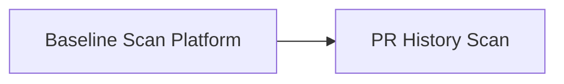

# Coach API Platform Groundwork — Spec Index

This file is the parent index for the Coach API platform groundwork. The original monolithic spec has been split into smaller, vertical spec chunks that each deliver a complete user-facing capability.

## Splitting strategy

After consulting the `spec-review-agent`, `system-design-expert`, and `product-sme` subagents, we split the groundwork along two large-grain **vertical seams**:

1. **Baseline Scan Platform** — ships the shared platform (auth, async job API, worker lifecycle, model gateway, agent loop, rubrics) plus the `repo_baseline_scan` capability and the local Docker Compose operator stack. This is the fastest path to an end-to-end, demo-able report and validates every load-bearing platform seam before adding the larger GitHub-ingestion surface of PR history.
2. **PR History Scan** — adds the `pr_history_scan` capability on top of the validated platform. It introduces PR listing and changed-file retrieval in `pkg/githubingest` and the strict self-serve author constraint.

Both specs preserve the architecture doc's load-bearing principles: deterministic-before-inference, deterministic/agent provenance separation, model access only through the gateway contract, no developer scoring, and identity separate from repo reads.

**Architecture anchors** (read with the child specs):

| Doc | Role |
|-----|------|
| [system-overview.md](../../docs/architecture/system-overview.md) §1, §9 (groundwork topology), §14 Groundwork | Phase placement, compose topology, deferred webhook/DynamoDB/outbox |
| [ADR-001](../../docs/architecture/ADR-001-coach-api-authentication.md) … [ADR-006](../../docs/architecture/ADR-006-watermill-queue-abstraction.md) | Binding groundwork decisions (auth, credential split, repo authz, job ownership, agent loop, TaskQueue) |
| [prd.md](../../docs/product/prd.md) | Product intent for this era (self-serve, private, pull-only API) |

## Spec files

| Spec | File | What it covers | Read first? |
|------|------|----------------|-------------|
| **Baseline Scan** | [coach-api-platform-baseline.spec.md](coach-api-platform-baseline.spec.md) | Auth (Story 1), baseline scan (Story 3), local operator stack (Story 4), provenance (Story 5), shared platform tasks 1–5, **3a/3b**, 8–10 | **Yes** |
| **PR History Scan** | [coach-api-platform-pr-history.spec.md](coach-api-platform-pr-history.spec.md) | PR history scan (Story 2), provenance applied to PR history (Story 5), tasks **6, 6a, 7** | No — depends on Baseline Scan |

## Dependency graph

- **Baseline Scan Platform** has no inter-spec dependencies. It owns the shared platform contract and the first user-facing capability.
- **PR History Scan** depends on the Baseline Scan Platform for auth, job lifecycle, agent loop, gateway, rubrics, report shape, and the Docker Compose stack.

## Why keep this file?

This index remains the landing page for anyone looking for the overall platform direction. It explains the splitting decision and points to the authoritative child specs. If a future change affects both specs (e.g., a change to the shared report contract), update the Baseline Scan spec first and then reconcile the PR History spec.
