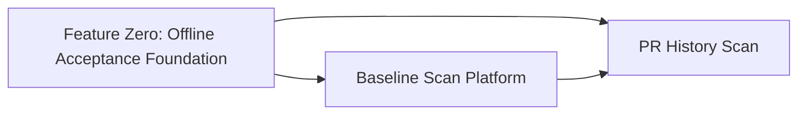

# Coach API Platform Groundwork — Spec Index

This file is the parent index for the Coach API platform groundwork. The original monolithic spec has been split into smaller, vertical spec chunks that each deliver a complete user-facing capability.

## Splitting strategy

After consulting the `spec-review-agent`, `system-design-expert`, and `product-sme` subagents, we first establish the shared offline acceptance foundation, then split product behavior along two large-grain **vertical seams**:

1. **Feature Zero: Offline Acceptance Foundation** — establishes the Coach-owned fake GitHub service, credential/egress guard, deterministic controls, real-provider conformance harness, and thin Compose proof that the later product slices consume. It does not implement the platform.
2. **Baseline Scan Platform** — ships the shared platform (auth, async job API, worker lifecycle, model gateway, agent loop, rubrics) plus the `repo_baseline_scan` capability and the local Docker Compose operator stack. It consumes Feature Zero rather than recreating its test infrastructure.
3. **PR History Scan** — adds the `pr_history_scan` capability on top of the validated platform. It extends Feature Zero's fake-GitHub fixtures for PR listing and changed-file retrieval rather than introducing a second test approach.

Both specs preserve the architecture doc's load-bearing principles: deterministic-before-inference, deterministic/agent provenance separation, model access only through the gateway contract, no developer scoring, and identity separate from repo reads.

**Architecture anchors** (read with the child specs):

| Doc | Role |
|-----|------|
| [system-overview.md](../../docs/architecture/system-overview.md) §1, §9 (groundwork topology), §14 Groundwork | Phase placement, compose topology, deferred webhook/DynamoDB/outbox |
| [ADR-001](../../docs/architecture/ADR-001-coach-api-authentication.md) … [ADR-006](../../docs/architecture/ADR-006-watermill-queue-abstraction.md) | Binding groundwork decisions (auth, credential split, repo authz, job ownership, agent loop, TaskQueue) |
| [prd.md](../../docs/product/prd.md) | Product intent for this era (self-serve, private, pull-only API) |

## Spec files

| Spec | File | What it covers | Read first? |
|------|------|----------------|-------------|
| **Feature Zero: Offline Acceptance Foundation** | [coach-api-platform-acceptance-foundation.spec.md](coach-api-platform-acceptance-foundation.spec.md) | Offline/no-real-credentials contract, fake GitHub, deterministic test controls, Compose proof, queue conformance harness | **Yes** |
| **Baseline Scan** | [coach-api-platform-baseline.spec.md](coach-api-platform-baseline.spec.md) | Auth (Story 1), baseline scan (Story 3), local operator stack (Story 4), provenance (Story 5), shared platform tasks 1–5, **3a/3b**, 8–10 | After Feature Zero |
| **PR History Scan** | [coach-api-platform-pr-history.spec.md](coach-api-platform-pr-history.spec.md) | PR history scan (Story 2), provenance applied to PR history (Story 5), tasks **6, 6a, 7** | No — depends on Feature Zero and Baseline Scan |

## Dependency graph

- **Feature Zero** has no platform-spec dependency. It owns the shared fake GitHub, offline Compose runner, deterministic test controls, task categories, and real-provider conformance harness; its thin proof uses existing `pkg/githubingest` and CodeSignal capabilities only.
- **Baseline Scan Platform** depends on Feature Zero for fake GitHub, offline Compose acceptance, deterministic clocks/durations, report-golden conventions, and acceptance task categories. It owns the shared platform contract and the first user-facing capability.
- **PR History Scan** depends on the Baseline Scan Platform for auth, job lifecycle, agent loop, gateway, rubrics, report shape, and the Docker Compose stack; it also depends directly on Feature Zero's shared fake-GitHub fixture surface and harness.

## Why keep this file?

This index remains the landing page for anyone looking for the overall platform direction. It explains the splitting decision and points to the authoritative child specs. If a future change affects both specs (e.g., a change to the shared report contract), update the Baseline Scan spec first and then reconcile the PR History spec.
