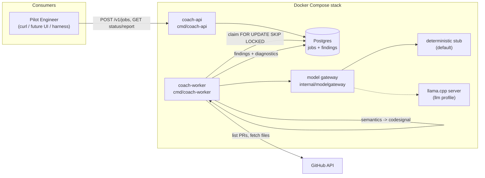
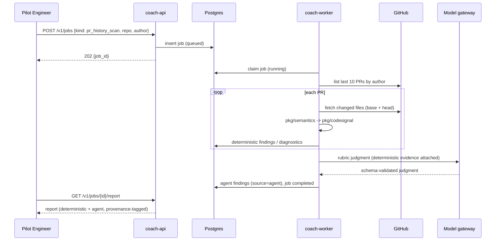

# Feature: Coach API Platform Groundwork

## Problem Statement

Coach's analysis capabilities (`pkg/semantics`, `pkg/codesignal`) are only reachable through a local CLI against a local git checkout, so nobody can consume Coach feedback without cloning the repo and running Go tooling themselves. There is no remote surface that can run asynchronous code-quality analysis — deterministic signals combined with LLM-as-judge rubric evaluation — over a person's recent pull requests or a whole repository. Before investing in SGLang serving and an AWS deployment, the platform's end-to-end flow (API → job queue → agent tool loop → local LLM → report) must be validated entirely locally.

## Personas

| Persona | Impact | Notes |
| ------- | ------ | ----- |
| Pilot Engineer | Positive | Submits scans of their own last 10 PRs or a repo baseline; receives async code-quality reports without installing Go tooling |
| Platform Operator | Positive | Runs the whole stack with one `docker compose` invocation; validates the flow before paying for GPUs/AWS |
| Future Harness Integrator | Neutral | Not served yet, but the versioned HTTP API is the seam harness hooks and a web UI will later consume |
| Human Reviewer | Positive (secondary) | Benefits indirectly when pilot engineers act on findings before requesting review |

## Value Assessment

- **Primary value**: Future — lays the platform seam (API contract, job model, model-gateway interface, agent tool loop) that harness hooks, a web UI, and the SGLang/AWS deployment will build on without rework.
- **Secondary value**: Customer — gives the pilot-engineer pool a working feedback loop (self-serve PR-history and baseline scans) that generates the product feedback needed to prioritize further investment.

## User Stories

### Story 1: Submit and retrieve an async analysis job

As a **Pilot Engineer**,
I want **to submit an analysis job over HTTP and poll for its result**,
so that I can **get Coach feedback without running any local tooling**.

#### Acceptance Criteria

- When a client POSTs a valid job request to `/v1/jobs`, the coach-api shall persist the job with status `queued` and respond `202` with the job id.
- When a client GETs `/v1/jobs/{id}`, the coach-api shall return the job's current status (`queued`, `running`, `completed`, `failed`) and, when completed, a link to its report.
- If a job request names an unsupported job kind or fails schema validation, then the coach-api shall respond `400` with a machine-readable error and persist nothing.
- If a requested job id does not exist, then the coach-api shall respond `404`.
- The coach-api shall serve all endpoints under a versioned `/v1` prefix.

#### Notes

Async submit/poll only in v1 — no webhooks, no streaming. Report retrieval is `GET /v1/jobs/{id}/report`.

### Story 2: Scan my last 10 pull requests

As a **Pilot Engineer**,
I want **a scan of the last 10 merged/open PRs I authored in a given repository**,
so that I can **see recurring code-quality signals across my recent work**.

#### Acceptance Criteria

- When a `pr_history_scan` job runs, the system shall list at most the 10 most recent pull requests authored by the requested GitHub login in the requested repository and analyze each PR's changed files (base and head sides) through the `pkg/semantics` → `pkg/codesignal` pipeline.
- When per-PR deterministic analysis completes, the system shall evaluate the results against the configured LLM-as-judge rubrics and record the judgments alongside — never in place of — the deterministic findings.
- The system shall accept a `pr_history_scan` only for the author login declared in the job request itself (self-serve scans); the API shall provide no endpoint to enumerate or scan arbitrary third-party authors in bulk.
- If GitHub returns fewer than 10 matching pull requests, then the system shall analyze the available set and note the actual count in the report.
- If an individual PR's analysis fails (fetch error, unsupported language, oversized file), then the system shall record a per-PR diagnostic and continue with the remaining PRs rather than failing the whole job.

#### Notes

The self-serve constraint encodes the no-surveillance principle (PRD §11, architecture doc §11 "no developer scoring") into the API shape itself. Pilot-phase identity is declared, not verified — see Open Questions.

### Story 3: Baseline-scan a repository

As a **Pilot Engineer**,
I want **a baseline scan of a whole repository at its default branch**,
so that I can **see the repo's current code-quality signal surface before making changes**.

#### Acceptance Criteria

- When a `repo_baseline_scan` job runs, the system shall obtain the repository's tree at the requested (or default) ref and produce a baseline report over all supported source files, reusing the existing baseline analysis path.
- When baseline deterministic analysis completes, the system shall run the configured rubric judgments over the aggregated signals and include them in the report with `source=agent` provenance.
- If the repository cannot be fetched (not found, auth failure, too large per configured budget), then the system shall fail the job with a sentinel-mapped, actionable error message.

### Story 4: Run the whole platform locally

As a **Platform Operator**,
I want **one Docker Compose stack that runs coach-api, the worker, Postgres, and a local LLM**,
so that I can **validate the entire flow on a laptop before investing in SGLang or AWS**.

#### Acceptance Criteria

- When the operator runs the core compose profile, the system shall start coach-api, coach-worker, and Postgres with no model weights required, using the deterministic model stub.
- Where the `llm` profile is enabled, the system shall route agent judgments through a llama.cpp server speaking its OpenAI-compatible API, selected purely by configuration — no code change.
- When the end-to-end smoke task runs against the core profile, the system shall complete a submitted job through the full API → queue → worker → report path and exit non-zero on any failure.
- The system shall expose all compose lifecycle and smoke commands as `mise` tasks (the repo's single command interface).

### Story 5: Trustworthy provenance

As a **Platform Operator**,
I want **deterministic findings and agent judgments kept structurally distinct**,
so that I can **always tell reproducible evidence apart from model opinion**.

#### Acceptance Criteria

- The system shall tag every stored finding with `source=deterministic` or `source=agent`, and agent output shall never modify or suppress a deterministic finding.
- The system shall record, for every agent judgment: the rubric id and version, the model identity reported by the gateway, and schema-validation status.
- If a model response fails rubric schema validation after bounded retries, then the system shall store the failure as a diagnostic and deliver the deterministic portion of the report anyway.

---

## Design

> Engineering standards: `AGENTS.md` (inlined into `CLAUDE.md`). Binding constraints respected here: `pkg/semantics` never imports `pkg/githubingest` (or any GitHub client) and vice versa; acceptance-test-first policy applies to every task; all commands are `mise` tasks.

### Alignment with `docs/architecture/system-overview.md`

This groundwork deliberately trims the architecture doc's v1 platform to what an API-triggered local pilot needs, while preserving its load-bearing principles:

- **Kept**: deterministic-before-inference; deterministic/agent provenance separation (§2, §6.3C); model access only through a gateway contract so llama.cpp → SGLang is a backend swap (§6.3E); no developer scoring (§11); advisory-only, no repo mutation.
- **Deferred, not contradicted**: GitHub webhook ingestion, SQS/DynamoDB/outbox machinery, snapshot service, adk-go agent runtime, AWS deployment. The trigger here is an authenticated API call, so the ingestion plane is unnecessary for validation. Postgres (already in the doc's local stack) doubles as the job queue via `FOR UPDATE SKIP LOCKED`.
- **Changed**: consumption is decoupled from the feedback platform — v1 consumers poll the API; harness hooks and a web UI come later against the same contract.

### Components Affected

- `cmd/coach-api/` — **new**: HTTP API binary (job submit/status/report).
- `cmd/coach-worker/` — **new**: job-claiming worker binary running the analysis pipeline and agent loop.
- `internal/coachapi/` — **new**: domain types, HTTP handlers, `JobStore` seam with Postgres and in-memory implementations, migrations.
- `internal/modelgateway/` — **new**: gateway interface, deterministic stub (default), llama.cpp OpenAI-compatible client.
- `internal/agentloop/` — **new**: minimal bounded tool loop + typed tool registry (semantics/codesignal/github tools).
- `internal/rubrics/` — **new**: versioned rubric definitions, judge prompt assembly, output JSON schemas.
- `pkg/githubingest/` — **extended**: PR listing by author and PR changed-file content retrieval, same GitHub App auth and sentinel-error conventions as `ReadFile`.
- `internal/codesignalcli/` — **reused**: baseline and diff analysis paths invoked by the worker (import is allowed; both live in this module).
- `compose.yaml`, `mise.toml`, `.github/workflows/ci.yml` — **new/extended**: compose stack, lifecycle/smoke tasks, CI job for the new packages.

### Dependencies

- llama.cpp server image (OpenAI-compatible `/v1/chat/completions`), model configurable; stub used everywhere models are unavailable (tests, CI, core profile).
- Postgres 16 (jobs, results); `database/sql` + `pgx` driver.
- Existing `go-github`/`ghinstallation` (already dependencies of `pkg/githubingest`).
- Quantized Qwen-family GGUF for the optional `llm` profile (exact variant: Open Question).

### Data Model Changes

New Postgres schema (owned by `internal/coachapi`):

- `jobs`: `id (uuid pk)`, `kind (pr_history_scan | repo_baseline_scan)`, `params (jsonb)`, `status`, `error`, `created_at`, `started_at`, `finished_at`, `claimed_by`, `heartbeat_at`.
- `job_findings`: `id`, `job_id (fk)`, `source (deterministic | agent)`, `rubric_id`, `rubric_version`, `model_identity`, `payload (jsonb, frozen snake_case)`, `created_at`.
- `job_diagnostics`: `id`, `job_id (fk)`, `scope` (e.g., `pr:123`, `file:path`), `message`, `created_at`.

Report JSON reuses the frozen snake_case convention and is locked by a golden-file test, mirroring `pkg/semantics/result_test.go`.

### Diagrams

### Open Questions

- [ ] **GitHub credential mode for the pilot**: reuse the GitHub App installation auth from `pkg/githubingest`, or also accept a plain PAT for lower setup friction? (Spec assumes the App path works; a PAT `http.RoundTripper` fallback is a small addition.)
- [ ] **Identity for self-serve scans**: pilot phase trusts the declared author login plus a static API bearer token per pilot user; when does verified identity (OAuth) become required?
- [ ] **Qwen GGUF variant and license review** for the `llm` profile (architecture doc requires provenance recording before adoption).
- [ ] **Rubric seed set**: this spec assumes two seed rubrics (hidden-mutation contextualization; change-cohesion). Confirm or replace before Task 9.
- [ ] **Report retention**: pilot keeps everything; define retention before any multi-tenant use.
- [ ] Should the baseline path in `internal/codesignalcli` be promoted to a neutral `internal/` package now, or imported as-is by the worker until a second consumer appears? (Spec assumes import as-is.)

---

## Tasks

> Each task must start with a failing acceptance test (repo policy — see `AGENTS.md` "Acceptance-test-first"). Verification commands are the repo's `mise` tasks. Tasks 1–5 are the platform core; Tasks 6–10 are capabilities and the compose stack.

### Task 1: Job domain model and API contract

**Objective**: Define job kinds, statuses, request/response types, and the report JSON contract with a golden-file lock.

**Context**: Everything else builds on these types; freezing the JSON first mirrors how `pkg/semantics` locked its contract.

**Affected files**:

- `internal/coachapi/types.go`, `internal/coachapi/types_test.go`
- `internal/coachapi/migrations/0001_init.sql`

**Requirements**:

- Story 1 criteria (job kinds, statuses); Story 5 provenance fields on findings.
- Frozen snake_case JSON locked by a golden-file test.

**Verification**:

- [ ] `mise run test` passes (new golden-file test red first, then green)
- [ ] `mise run gofmt` and `mise run go-vet` clean

**Done when**:

- [ ] All verification steps pass
- [ ] Golden report fixture reviewed and committed
- [ ] Code follows the repo's engineering guidance

---

### Task 2: coach-api HTTP service

**Depends on**: Task 1

**Objective**: Implement `POST /v1/jobs`, `GET /v1/jobs/{id}`, `GET /v1/jobs/{id}/report` over a `JobStore` seam with in-memory and Postgres implementations.

**Context**: The API is the platform's only consumption surface; the store seam keeps handler acceptance tests fast and deterministic.

**Affected files**:

- `internal/coachapi/server.go`, `server_test.go`, `store.go`, `store_memory.go`, `store_postgres.go`
- `cmd/coach-api/main.go`

**Requirements**:

- Story 1 acceptance criteria, exercised at the HTTP boundary with `httptest` against the in-memory store.
- Postgres store covered by an integration test gated on a `COACH_PG_DSN` env var (runs in compose CI job, skipped otherwise).

**Verification**:

- [ ] `mise run test` passes; new handler acceptance tests were red first
- [ ] `400`/`404` paths asserted per Story 1

**Done when**:

- [ ] All verification steps pass
- [ ] `cmd/coach-api` starts and serves `/v1` locally

---

### Task 3: Worker job claiming and lifecycle

**Depends on**: Task 2

**Objective**: Implement `cmd/coach-worker` claiming queued jobs via `FOR UPDATE SKIP LOCKED`, with heartbeat, bounded retry, and terminal failure recording.

**Context**: Postgres-as-queue avoids SQS/LocalStack for the pilot while keeping at-least-once semantics with idempotent job handlers.

**Affected files**:

- `internal/coachapi/claim.go`, `claim_test.go`
- `cmd/coach-worker/main.go`

**Requirements**:

- While a job is `running`, the worker shall heartbeat it; stale-heartbeat jobs return to `queued` (crash recovery).
- If a job handler fails permanently, then the job records `failed` with the error (Story 3 sentinel mapping).

**Verification**:

- [ ] `mise run test` (in-memory store) and DSN-gated Postgres test pass; red first
- [ ] Two concurrent workers never double-claim a job (race-tested; `go test -race`)

**Done when**:

- [ ] All verification steps pass
- [ ] Crash-recovery behavior covered by a test

---

### Task 4: Model gateway seam with stub and llama.cpp client

**Objective**: Define the `modelgateway.Gateway` interface (structured judgment request → schema-validated response), a deterministic stub, and a llama.cpp OpenAI-compatible client.

**Context**: The architecture doc's core seam: llama.cpp now, SGLang later, no orchestration change. Independent of Tasks 2–3; can proceed in parallel after Task 1.

**Affected files**:

- `internal/modelgateway/gateway.go`, `stub.go`, `llamacpp.go`, plus tests

**Requirements**:

- Story 5: response carries model identity; schema-validation failures are typed errors after bounded retries.
- Stub is the default everywhere; llama.cpp client tested against recorded HTTP fixtures (`httptest`), no live model in CI.

**Verification**:

- [ ] `mise run test` passes; red first
- [ ] Malformed-model-output path returns the typed validation error

**Done when**:

- [ ] All verification steps pass
- [ ] No package outside `internal/modelgateway` imports an LLM HTTP client directly

---

### Task 5: Minimal agent tool loop

**Depends on**: Task 4

**Objective**: Implement a bounded tool-call loop (max iterations, per-job budget) over a typed tool registry: `semantics_analyze`, `codesignal_report`, `github_list_prs`, `github_pr_files`.

**Context**: The "basic agentic capabilities" the platform grows from; tools wrap existing packages, the loop stays dumb and auditable.

**Affected files**:

- `internal/agentloop/loop.go`, `tools.go`, plus tests

**Requirements**:

- The loop shall execute only registered, schema-validated tool calls; unknown tools or over-budget loops end the run with a typed error (model text never becomes an arbitrary action — architecture doc §6.3D).
- Acceptance tests drive the loop with a scripted stub gateway (tool-call sequences), no live model.

**Verification**:

- [ ] `mise run test` passes; red first
- [ ] Budget-exhaustion and unknown-tool paths covered

**Done when**:

- [ ] All verification steps pass
- [ ] Tool registry is the only path from model output to code execution

---

### Task 6: PR listing and PR file retrieval in `pkg/githubingest`

**Objective**: Add `ListRecentPullRequestsByAuthor(owner, repo, login, limit)` and per-PR changed-file content retrieval (base and head), following the package's existing auth and sentinel-error conventions.

**Context**: The largest missing ingestion capability; unblocks Story 2. Independent of Tasks 2–5.

**Affected files**:

- `pkg/githubingest/pulls.go`, `pulls_test.go`, `acceptance_test.go` (extended)

**Requirements**:

- Story 2: at most `limit` most recent PRs by the given author; fewer available → return what exists.
- Errors map to the package's existing sentinels (`ErrNotFound`, `ErrAuth`, `ErrTooLarge`, …); no import of `pkg/semantics` (dependency rule).

**Verification**:

- [ ] `mise run test` and `mise run test-examples` pass; red first against an `httptest` GitHub fake
- [ ] `mise run tidy-check` clean

**Done when**:

- [ ] All verification steps pass
- [ ] Doc comment updates reflect the widened package scope

---

### Task 7: `pr_history_scan` job handler

**Depends on**: Tasks 3, 5, 6

**Objective**: Orchestrate list-PRs → fetch changed files → per-PR semantics/codesignal analysis → rubric judgment → persisted provenance-tagged report.

**Context**: The first end-user capability; proves the whole platform loop.

**Affected files**:

- `internal/coachapi/handler_pr_history.go`, plus tests

**Requirements**:

- Story 2 acceptance criteria end-to-end with fake GitHub + stub gateway, including per-PR diagnostic-and-continue and the self-serve author constraint.

**Verification**:

- [ ] `mise run test` passes; the full-flow acceptance test was red first
- [ ] Report golden fixture shows deterministic and agent findings side by side

**Done when**:

- [ ] All verification steps pass
- [ ] Job completes with partial results when one PR fails

---

### Task 8: `repo_baseline_scan` job handler

**Depends on**: Tasks 3, 5

**Objective**: Fetch a repository tree at a ref (shallow clone in a disposable worker directory), run the existing baseline analysis path, then rubric judgments.

**Context**: Second capability; reuses `internal/codesignalcli`'s baseline mode rather than reimplementing it.

**Affected files**:

- `internal/coachapi/handler_baseline.go`, plus tests

**Requirements**:

- Story 3 acceptance criteria; clone failures map to actionable sentinel errors; configurable size budget.

**Verification**:

- [ ] `mise run test` passes; red first against a local fixture repo
- [ ] Oversized-repo budget path covered

**Done when**:

- [ ] All verification steps pass
- [ ] No duplication of baseline logic (imports `internal/codesignalcli`)

---

### Task 9: Seed LLM-as-judge rubrics

**Depends on**: Tasks 4, 5

**Objective**: Define two versioned rubrics (hidden-mutation contextualization; change-cohesion) with output JSON schemas, prompt assembly that attaches deterministic evidence, and golden stub-driven outputs.

**Context**: Makes "static analysis + LLM-as-judge" concrete; rubric versioning enables later comparison across models (llama.cpp vs SGLang).

**Affected files**:

- `internal/rubrics/rubrics.go`, `schemas/`, plus tests

**Requirements**:

- Story 5: judgments carry rubric id/version and model identity; validation failure degrades to deterministic-only report (Unwanted-path test).

**Verification**:

- [ ] `mise run test` passes; red first
- [ ] Rubric schemas validate golden outputs byte-identically

**Done when**:

- [ ] All verification steps pass
- [ ] Rubric set matches the Open-Questions decision (or the assumption is re-confirmed)

---

### Task 10: Docker Compose stack, mise tasks, and E2E smoke

**Depends on**: Tasks 2, 3, 7 (Task 8 optional for smoke)

**Objective**: Ship `compose.yaml` (profiles: `core` = api + worker + postgres + stub; `llm` adds llama.cpp), `mise` lifecycle tasks, and an end-to-end smoke task; wire a CI job running the smoke against the core profile.

**Context**: Story 4 — the operator's acceptance surface and the gate for the SGLang/AWS investment decision.

**Affected files**:

- `compose.yaml`, `mise.toml`, `.github/workflows/ci.yml`, `docs/development/local-platform.md`

**Requirements**:

- Story 4 acceptance criteria; smoke submits a job, polls to completion, asserts a provenance-tagged report, exits non-zero on failure.
- Core profile requires no model weights and no GitHub credentials (uses the baseline scan of a bundled fixture repo or a fake-GitHub-backed PR scan).

**Verification**:

- [ ] `mise run platform-up && mise run platform-smoke` passes locally; smoke was red first (stack absent)
- [ ] New CI job green; existing `verify`/`js-verify`/`wasm-build` jobs untouched and green

**Done when**:

- [ ] All verification steps pass
- [ ] `docs/development/local-platform.md` documents the two profiles and mise tasks

---

## Out of Scope

- Review-readiness verdicts and the five-section digest (explicitly parked by product direction).
- Web UI, harness hooks/MCP surface (future consumers of this same API).
- SGLang, AWS deployment, GitHub webhook ingestion, SQS/DynamoDB/outbox machinery (return when the local flow is validated).
- Private-digest delivery channels and any GitHub write (comments/checks) — the platform stays read-only toward GitHub.
- Developer scoring, cross-author analytics, or any scan of a person other than the self-declared requester.
- New `pkg/semantics` languages or new deterministic rules (tracked separately).

## Future Considerations

- Swap the gateway backend to SGLang/Qwen per the architecture doc once compose-validated; rubric versions enable model-quality comparison.
- Promote the agent loop to `adk-go` behind the same seam if tool orchestration outgrows the minimal loop.
- Surface the currently-unemitted `pkg/semantics` findings (`tight_coupling`, branching/nesting metrics, constructor patterns) as additional `pkg/codesignal` rules — cheap rubric evidence.
- Harness hooks (MCP server wrapping the API) and a web UI for viewing feedback.
- Reconcile `docs/architecture/system-overview.md` and the PRD with this decoupled consumption/platform split once validated.
