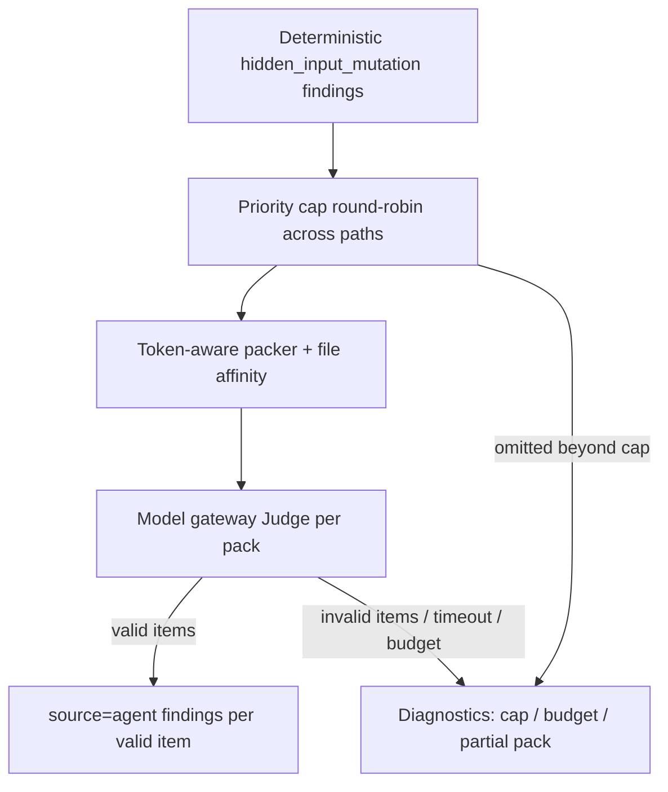
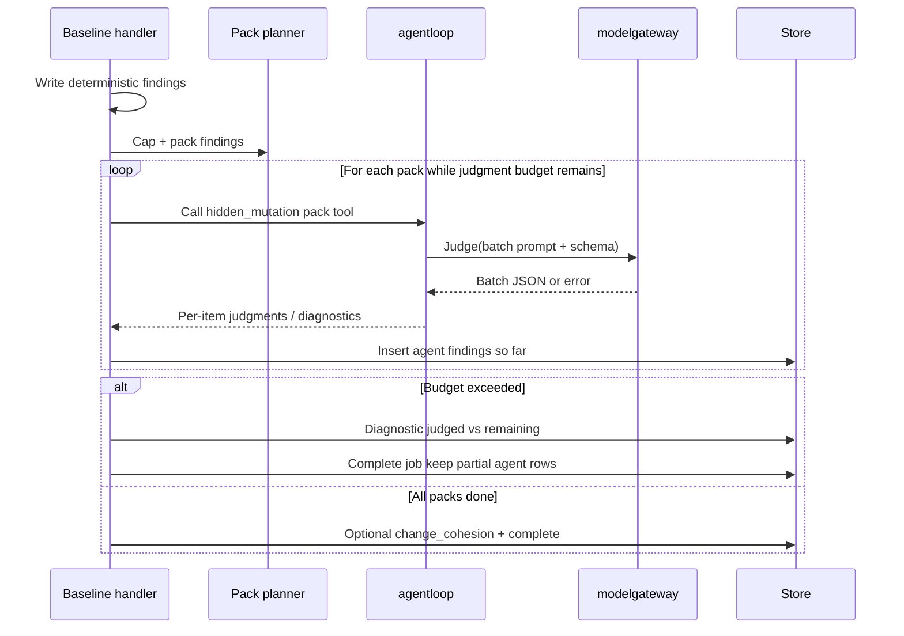

# Feature: Coach API Platform — Local-LLM Judgment Effectiveness

## Problem Statement

Baseline `repo_baseline_scan` runs one `hidden_mutation_contextualization` model call per deterministic `hidden_input_mutation` finding, shares a fixed 5-minute agent-loop wall budget with the entire analyze phase, and drops all agent findings when that budget is exceeded. On small local models (Qwen 3.5 4B-class, Gemma 4 12B-class via Ollama/MLX/llama.cpp), even modest repos with dozens of signals exhaust the wall budget before producing meaningful `source=agent` insights—despite the repository not being “large.” Pilot engineers therefore get deterministic-only reports precisely when they most need model judgment on a laptop.

This spec is a **minimal delta** to [Baseline Scan](coach-api-platform-baseline.spec.md): it changes how hidden-mutation judgments are packed, budgeted, evidenced, and degraded under local-LLM constraints. It does not redesign auth, queueing, GitHub ingest, or deterministic analysis.

## Personas

| Persona | Impact | Notes |
| ------- | ------ | ----- |
| Pilot Engineer | Positive | Completes Path B/C baseline scans on a laptop with local Qwen/Gemma and still receives useful `source=agent` rows |
| Platform Operator | Positive | Has explicit knobs and docs for local-model judgment (timeouts, pack size, caps) without rewriting compose topology |
| Human Reviewer | Positive (secondary) | Benefits when pilots get ranked, file-scoped rationales instead of empty agent sections |
| Future Harness Integrator | Neutral | Report shape gains optional batch provenance fields only where additive under `report_version` "1" freeze policy |

## Value Assessment

- **Primary value**: Customer — makes the local pilot loop (Path B + real repos) produce agent insights on commodity laptop models instead of silent judgment-phase timeouts.
- **Secondary value**: Future — judgment packing, separate wall budget, and partial agent persistence are the same controls cloud/SGLang serving will need under cost and latency caps.

## User Stories

### Story 1: Pack hidden-mutation judgments for small local models

As a **Pilot Engineer**,
I want **hidden-mutation rubric calls batched under a token- and density-aware packer instead of one HTTP generation per finding**,
so that I can **finish judgment on a local 4B–12B model within a practical wall budget on repos like a small TypeScript service**.

#### Acceptance Criteria

- When the worker runs `hidden_mutation_contextualization` over two or more deterministic `hidden_input_mutation` findings in one baseline job, the system shall invoke the model gateway in **packs** rather than strictly one gateway `Judge` call per finding, unless a pack naturally contains only one finding.
- The system shall form packs with **token-aware packing** as the hard constraint: estimated prompt size shall not exceed a configured `max_judgment_prompt_tokens` (operator-configurable; default sized for local 4B–12B OpenAI-compatible servers).
- While packing, the system shall apply **file affinity**: findings that share the same path and meet or exceed a configured density threshold `judgment_file_affinity_min_findings` (default 5) shall stay in path-dedicated packs and shall not be merged with other paths, except when a single path itself must split to satisfy the token or max-findings caps.
- When packing findings that fall below the density threshold, the system shall allow **cross-file merge** into the same pack only while under both the token budget and `max_findings_per_judgment_pack` (default 4 for local-llm-oriented defaults).
- The system shall include **span-local evidence** for each finding in a pack (configurable line window around the finding’s start row; default ±15 lines with line numbers), and shall not require embedding each file’s full source text in every judgment prompt.
- When a pack contains multiple findings, the model output schema shall be a **batch envelope** that maps each input finding to exactly one item via a stable `finding_ref` (the deterministic finding id or `payload_hash` already used for uniqueness). Per-item fields remain `{ judgment, rationale, confidence, suggested_focus }` with the same enums as baseline seed rubric v1.
- When a pack contains exactly one finding, the system may use either the existing singular schema or the batch envelope with one item; report `source=agent` rows shall remain one agent finding per judged deterministic signal (no loss of 1:1 provenance in storage).
- If a batch response is missing items, duplicates `finding_ref`s, or fails per-item schema validation, then the system shall accept valid items as `source=agent` findings and record diagnostics only for invalid/missing items (partial pack success)—not fail the entire pack unless the gateway call itself is unavailable or the parent context is canceled.
- The system shall sort findings deterministically before packing (at minimum by path, start_row, then finding id/hash) so pack boundaries are reproducible for the same inputs and Coach version.
- Acceptance tests shall prove, against a fixture with ≥12 hidden-mutation signals across ≥3 paths including one hot path (≥6 signals), that gateway `Judge` call count is **strictly less than** finding count and that at least one multi-finding pack is issued.

#### Notes

Empirical pilot measurement (offline sim, `qwen3.5:4b-mlx`, `think:false`, span windows, 42 signals / 5 paths on a small TS repo):

| Strategy | Calls (approx) | Wall (approx) | Valid JSON items |
| --- | ---: | ---: | --- |
| 1:1 full-file (sample→project) | 42 | ~26 min | high on sample |
| Batch-by-file, no split | 5 | ~10 min | ~48% (hot pack timeout) |
| Pack max **4** + file splits | 12 | ~13 min | ~83% |
| Pack max **2** + file splits | ~22 | ~16 min | ~92% on completed |

**Interpretation:** smaller packs improve per-pack reliability slightly but **increase round-trips**, so full-coverage wall gets **worse** at max 2 than max 4 on this model. Packing is necessary and **insufficient alone**—Stories 2–3 (judgment-scoped budget, partial persist, **priority cap**) are what make laptop runs finish with meaningful agent rows. Prefer default pack size **4**; lower to 2 only if batch validity is poor on a given model.

---

### Story 2: Judgment budget and partial agent results

As a **Pilot Engineer**,
I want **judgment wall time separated from deterministic analysis, and partial agent findings kept when time runs out**,
so that I can **always receive some model insight instead of a deterministic-only report after a timeout**.

#### Acceptance Criteria

- When a baseline job constructs its agent loop, the system shall apply a **judgment-phase wall budget** that does not treat pre-judgment deterministic analysis time as already consumed judgment budget. (Implementation may use a distinct judgment clock/budget, reset wall at judgment start, or an equivalent measurable separation; tests must prove analyze duration does not alone exhaust judgment budget.)
- The system shall expose operator configuration for judgment wall time (e.g. env on worker) with a default **at least 10 minutes** for the local `llm` profile path, without removing overall job safety limits.
- When the judgment wall budget or max judgment packs/calls is exhausted mid-phase, the system shall **persist all `source=agent` findings already produced**, record a diagnostic describing the budget exhaustion (including counts: judged vs remaining), and still complete the job with deterministic findings intact—rather than discarding accumulated agent findings.
- If the parent context is canceled, then the system shall still abort without treating cancellation as a successful partial judgment complete (preserve baseline Story 5 cancel semantics).
- Hard gateway unavailability for a pack shall degrade that pack to diagnostics without failing the job; already-persisted or in-hand valid agent findings from earlier packs shall be kept.
- Acceptance tests shall inject a slow fake gateway and prove: (a) with N successful packs then budget exceed, report contains N packs’ worth of agent findings plus a budget diagnostic; (b) deterministic findings remain complete.

---

### Story 3: Prefer high-value judgments on small models

As a **Pilot Engineer**,
I want **the system to prioritize which hidden-mutation signals get model judgment when a cap is needed**,
so that I can **get fewer but more meaningful rationales from a small local model instead of thrashing until timeout**.

#### Acceptance Criteria

- The system shall support a configured **`max_hidden_mutation_judgments` per baseline job** (operator-configurable; default chosen for local 4B–12B viability—recommended starting default **16**). When deterministic hidden-mutation signals exceed the cap, the system shall judge only a prioritized subset and record a diagnostic with `selected` / `omitted` counts.
- When prioritizing under the cap, the system shall apply a deterministic policy that **spreads coverage across files** before exhausting the budget on a single hot file. Binding v1 policy:
  1. Sort paths by finding count descending, then path ascending.
  2. Round-robin one finding per path (findings within a path ordered by severity if present, else start_row, else id) until the cap is reached.
  - Rationale: avoids spending the entire local-model budget on one dense file while leaving other modules unjudged.
- Where severity or deterministic confidence is available on the signal, the system shall break ties within a path by higher severity, then higher confidence, then stable id (document exact field names in implementation notes).
- The system shall keep per-item rationales **bounded for small models**: the judgment prompt shall instruct short rationales (e.g. ≤2 sentences / ≤400 characters guidance), and acceptance shall not require long essays.
- Where the upstream OpenAI-compatible server supports disabling “thinking”/reasoning-only channels via a request field commonly used by local servers (e.g. Ollama `think: false`), the worker gateway client shall **pass through an operator-configurable option** defaulting to **disabled thinking** on the local `llm` profile documentation path. If the server ignores the field, behavior remains best-effort (no hard failure).
- The model gateway shall treat empty assistant `content` as schema failure (existing behavior) and shall not silently accept reasoning-only payloads as judgments. Optional future: extract JSON from reasoning—**out of scope** here unless needed for a named supported server; prefer disable-thinking + structured content.
- Acceptance tests with a recording gateway shall prove cap+round-robin selection on a fixture with one hot path and several cold paths (e.g. 20 + 3 + 3 + 2) selects across paths rather than 16 from the hot path only.

#### Notes

Quality on small models is a product of **selection + packing + short structured output**, not maximum coverage. Deterministic findings remain complete regardless of cap; agent rows are additive insight.

---

### Story 4: Operator path for Qwen / Gemma local servers

As a **Platform Operator**,
I want **documented, tested configuration for local Qwen 3.5 and Gemma 4 OpenAI-compatible servers**,
so that I can **run Path B without rediscovering timeout and model-id pitfalls**.

#### Acceptance Criteria

- The pilot/local platform docs shall document at least two local model examples: a **Qwen 3.5** id and a **Gemma 4** id, including `AIGW_OPENAI_BASE_URL`, `MODEL_GATEWAY_MODEL`, recommended `MODEL_GATEWAY_TIMEOUT`, and the new judgment packing/budget env vars from this spec.
- The docs shall state that containers must be **recreated** after changing those env vars (compose does not hot-reload gateway upstream).
- Where `mise` tasks exist for platform up/smoke, the system shall either document or provide a task path that prints effective judgment-related env (model id, pack caps, judgment wall) for debugging.
- Core profile smoke (stub gateway) shall continue to require `source=agent` findings and shall not depend on a live local model.
- Optional: a non-CI operator checklist for “local model judgment smoke” that asserts ≥1 non-stub `source=agent` finding and absence of `max_wall_time` judgment diagnostics on the fixture repo—or explicitly records expected caps/diagnostics if the fixture exceeds caps.

---

## Design

> Amends baseline judgment only. Follow `AGENTS.md`, ADR-005 (handler-driven rubrics), and baseline Story 5 (determinism before inference; degrade not fail-closed on judgment errors).

### Components Affected

- `internal/coachapi/handler_baseline_judge.go` — replace per-finding serial `Call` loop with pack planner + pack execute; partial persist on budget exceed
- `internal/coachapi/handler_baseline.go` — judgment budget separation; wire config; optional cap before judge
- `internal/rubrics/` — batch args assembly, batch output schema (v1 batch envelope or version bump if freeze requires), span window helpers, prompt text for short rationales
- `internal/modelgateway/` — optional think-disable / extra body fields; ensure empty content still validates failed; timeout docs aligned with judgment wall
- `internal/agentloop/` — only if budget API needs judgment-scoped wall reset or separate budget counters (prefer minimal change)
- `cmd/coach-worker/` + compose — env for pack/budget/cap/think
- `docs/pilot-local-quickstart.md`, `docs/development/local-platform.md` — Qwen/Gemma + new knobs
- Acceptance tests under `internal/coachapi/`, `internal/rubrics/` (Ginkgo), fake gateway with per-call latency

### Dependencies

- Baseline seed rubric `hidden_mutation_contextualization` (v1 enums unchanged per item)
- Existing `modelgateway.Gateway.Judge` (packs are still Judge calls; batch is prompt/schema shape)
- Local OpenAI-compatible servers (Ollama / llama.cpp); no new vendor SDKs

### Data Model Changes

- **No** new Postgres tables required.
- `source=agent` rows remain one row per judged finding; `payload` may include `finding_ref` echoing the deterministic id/hash for traceability.
- Report `summary.finding_counts` unchanged in structure; agent counts reflect judged subset when capped.
- Diagnostics: new stable message substrings or scopes for `judgment_budget_exceeded`, `judgment_cap_omitted`, `judgment_pack_partial` (exact strings locked by tests).

### Binding defaults (local-llm oriented)

| Knob | Default | Role |
| ---- | ------- | ---- |
| `max_findings_per_judgment_pack` | **4** | Caps items per generation; sim showed max **2** slower end-to-end on full sets (more RTTs) despite slightly higher validity |
| `max_judgment_prompt_tokens` | 3500 (est.) | Hard pack split; estimator may be chars/4 with tests tolerating ±band |
| `judgment_file_affinity_min_findings` | 5 | Density → path-dedicated packs |
| `judgment_evidence_window_lines` | 15 | ±N lines around start_row |
| `max_hidden_mutation_judgments` | **16** | **Primary** laptop lever: ~8 packs at size 2 or ~4 packs at size 4; sim projects **under ~5 min** generation time on Qwen 3.5 4B-class when capped, vs ~13–16 min uncapped |
| Judgment wall budget | **10m** default (configurable; minimum allowed config 5m) | Separate from analyze; must exceed expected capped pack×latency |
| Think/reasoning disable | on for documented local path | Best-effort request field |

**Tuning guide (operators):**

1. If jobs hit judgment wall with few/no agent rows → lower `max_hidden_mutation_judgments` or raise judgment wall; do **not** only shrink pack size.
2. If packs return partial/invalid JSON often → try `max_findings_per_judgment_pack=2` and shorter windows.
3. If validity is fine but wall is high with a high cap → prefer pack size 4 (fewer RTTs) over 2.
4. Cloud/SGLang profiles may raise or remove the judgment cap without schema change.

### Diagrams

### Open Questions

- [ ] Exact token estimator: chars/4 vs optional tiktoken-class dependency—default chars/4 unless acceptance needs tighter parity.
- [ ] Whether batch envelope requires `rubric_version` bump vs additive schema under same version "1" with dual accept in validator during transition.
- [ ] Whether `change_cohesion` should run when hidden-mutation judgment was capped/partial (recommend: still run once; out of critical path for this delta if time-boxed).
- [ ] Re-measure defaults on **Gemma 4 12B** (same fixture): may allow higher `max_hidden_mutation_judgments` or pack size 4-only without a 16 cap; keep 16 until measured.

**Resolved (Qwen 3.5 4B-class sim, 2026-07-25):** default pack size stays **4**, not 2—max 2 improved validity slightly (~92% vs ~83%) but worsened full-set wall (~16m vs ~13m) via extra round-trips. Cap 16 remains the primary under-5m lever.

### Relationship to baseline

| Baseline behavior | This delta |
| ----------------- | ---------- |
| 1 Judge call per hidden-mutation finding | Packed Judge calls with affinity + token splits |
| Full file content in prompt | Span windows default |
| Singular judgment schema only | Batch envelope for multi-finding packs; 1:1 agent rows retained |
| 5m loop wall includes analyze; discard agent on exceed | Judgment-scoped budget; **keep** partial agent findings |
| Judge all signals | Optional/default cap with cross-file round-robin |
| Docs: Qwen example only | Qwen + Gemma + packing env |

---

## Tasks

> Each task is one coding-agent session. Acceptance-test-first per `AGENTS.md` (Ginkgo).

### Task 1: Pack planner unit + acceptance (no gateway)

**Objective**: Deterministic pack planner implements affinity, token split, max findings/pack, and stable ordering.

**Context**: Unblocks handler wiring with pure functions and goldens.

**Affected files**:

- `internal/rubrics/` or `internal/coachapi/` pack planner package (prefer `internal/rubrics/pack_` or `internal/coachapi/judgment_pack.go`)
- `*_acceptance_test.go`

**Requirements**:

- Story 1 packing rules and deterministic sort
- Fixture matching hot-path + cold-path distribution

**Verification**:

- [ ] Ginkgo table tests: pack count & boundaries stable
- [ ] Hot path never merges with other paths when above affinity threshold
- [ ] Oversized single path splits by max findings/tokens

**Done when**:

- [ ] Planner API documented; no production handler change required yet

---

### Task 2: Batch rubric schema + span evidence + tool handler

**Objective**: Hidden-mutation tool accepts a pack of findings with windows; validates batch output; emits per-item ToolResults/findings.

**Context**: Schema and prompt shape for small models.

**Affected files**:

- `internal/rubrics/*`
- Gateway stub canned batch response
- Acceptance tests

**Requirements**:

- Story 1 batch envelope + partial item validation
- Story 3 short rationale instruction
- Span window helper

**Verification**:

- [ ] Stub gateway batch happy path → N agent-equivalent results
- [ ] Missing/invalid item → diagnostic for that ref only
- [ ] Singular one-item pack still works

**Done when**:

- [ ] RegisterTools path supports pack args without breaking change_cohesion

---

### Task 3: Handler integration — packed judgment + partial persist

**Objective**: Baseline handler uses planner; persists agent findings incrementally; budget exceed keeps partials.

**Context**: Fixes empty agent section after wall timeout.

**Affected files**:

- `internal/coachapi/handler_baseline_judge.go`
- `internal/coachapi/handler_baseline.go`
- Handler acceptance tests with slow/fake gateway

**Requirements**:

- Stories 1–2 end-to-end in handler
- Call count &lt; finding count on multi-finding fixture
- Partial agent rows on injected budget exceed

**Verification**:

- [ ] Red-then-green Ginkgo acceptance
- [ ] `mise run test-acceptance-fast` subset for coachapi/rubrics

**Done when**:

- [ ] Baseline Story 5 degrade paths still pass

---

### Task 4: Priority cap (round-robin across paths)

**Objective**: Implement `max_hidden_mutation_judgments` with binding cross-file round-robin policy.

**Context**: Quality over exhaustive coverage on local models.

**Affected files**:

- Pack/prioritize helper + handler wire + worker env
- Acceptance tests

**Requirements**:

- Story 3 cap + selection policy + diagnostic counts

**Verification**:

- [ ] Hot-path-heavy fixture does not consume entire cap from one path
- [ ] Omitted count diagnostic present

**Done when**:

- [ ] Defaults match Design table; overridable via env

---

### Task 5: Gateway local-model knobs + worker/compose/docs

**Objective**: Env-config for pack/budget/cap/think-disable; document Qwen 3.5 and Gemma 4 Path B.

**Context**: Operators can reproduce pilot success without tribal knowledge.

**Affected files**:

- `internal/modelgateway/*` (optional body fields)
- `cmd/coach-worker/*`, `compose.yaml` comments or env defaults
- `docs/pilot-local-quickstart.md`, `docs/development/local-platform.md`

**Requirements**:

- Story 2 configurable judgment wall
- Story 3 think-disable pass-through
- Story 4 docs

**Verification**:

- [ ] Config acceptance tests for env parsing
- [ ] Docs list both model families and recreate warning
- [ ] Core stub smoke still green

**Done when**:

- [ ] Operator can set Gemma 4 model id and packing defaults from docs alone

---

### Task 6: Local-model judgment acceptance harness (fake clock / slow gateway)

**Objective**: Lock the lousy-iam-class failure mode out of the tree with an in-process acceptance test (no live Ollama in CI).

**Context**: Prevents regressions to 1:1 unbounded judgment.

**Affected files**:

- `internal/coachapi/*_acceptance_test.go`
- Optional shared fixture JSON of 42-signal distribution (synthetic)

**Requirements**:

- Synthetic distribution: 22+7+6+4+3 style counts
- Slow gateway: each Judge sleeps enough that old 1:1 would exceed short judgment budget
- Assert packed path completes with ≥1 agent finding under short budget where 1:1 would yield zero

**Verification**:

- [ ] Test fails on intentional revert to pure 1:1 loop
- [ ] No live network; Ginkgo acceptance form

**Done when**:

- [ ] Named in CI via existing `test-acceptance-fast` / package tests

---

## Out of Scope

- Changing deterministic rules or `pkg/semantics` signals
- Parallel multi-GPU judgment fan-out (single worker stream remains v1)
- SGLang/cloud autoscaling
- Extracting judgments from model `reasoning` fields as primary path
- UI for pack diagnostics
- Replacing Envoy AI Gateway
- PR-history scan packing (follow the same planner later)
- Guaranteeing all 42 judgments on 4B models within 5 minutes without caps

## Future Considerations

- Adaptive pack size from measured p50 generation latency
- KV-cache-aware ordering (same file packs back-to-back—already affinity-biased)
- Learned prioritization beyond round-robin
- Shared planner for PR-history rubric judgments
- Optional second-pass “deep dive” on concern judgments only
- Gemma/Qwen-specific JSON grammar / llama.cpp constrained decoding hooks

---

## Cross-Reference

- Parent: [coach-api-platform-baseline.spec.md](coach-api-platform-baseline.spec.md) (Stories 3, 5; seed rubric `hidden_mutation_contextualization`)
- ADR: [ADR-005-agent-loop-orchestration-split.md](../../docs/architecture/ADR-005-agent-loop-orchestration-split.md)
- Pilot docs: [docs/pilot-local-quickstart.md](../../docs/pilot-local-quickstart.md) Path B
- Empirical basis: offline local sim against `qwen3.5:4b-mlx` on `zpratt/lousy-iam` (42 hidden-mutation signals, 5 paths)—pack max4 ≈13m / 83% valid; pack max2 ≈16m / ~92% valid; **cap 16** is what projects under ~5m generation time; packing alone does not
