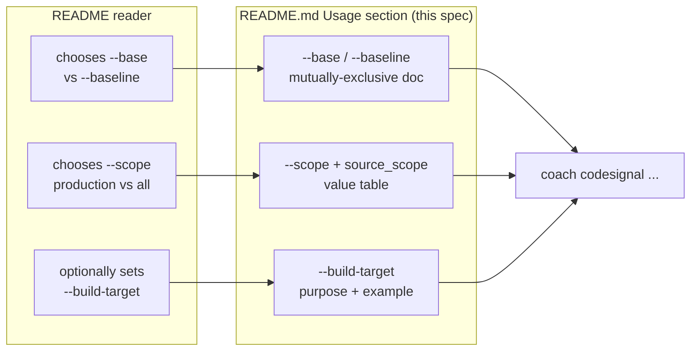
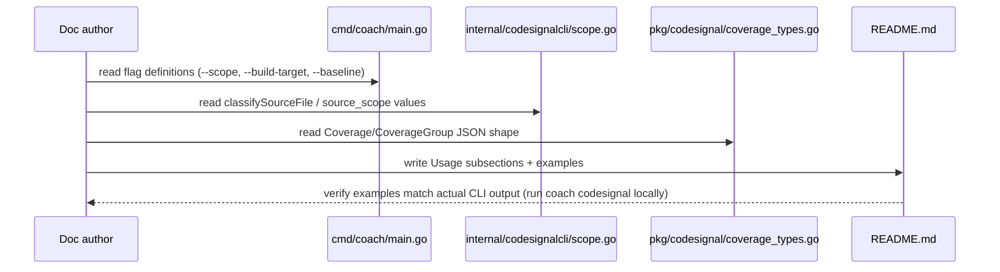

# Feature: Document `coach codesignal` Scope, Build-Target, and Baseline Flags

## Problem Statement

`coach codesignal` defaults to `--scope production` and supports `--build-target`, `--scope=all`, and a separate `--baseline` mode with its own Coverage output, but `README.md`'s Usage section documents only `--base` and `--format`. A customer reading the README cannot predict what gets filtered by default, when Go build-target reachability applies, what `source_scope` values mean, or how `--baseline` differs from the default diff flow — undermining trust in a tool whose core promise is a dependable default scope.

## Personas

| Persona | Impact | Notes |
| ------- | ------ | ----- |
| New `coach codesignal` adopter | Negative (today) | Runs the tool without knowing it's already filtering their diff by default |
| Engineer evaluating the tool for CI adoption | Negative (today) | Can't predict output shape or filtering behavior from the README alone, undermining trust before first use |
| Coach product owner | Negative (today) | Documentation gap flagged explicitly as a ship blocker in the original review (issue #26) |

## Value Assessment

- **Primary value**: Customer — predictable, trustworthy behavior starts with being able to read what the tool does before running it.
- **Secondary value**: Efficiency — fewer "why did my finding disappear" support questions once scope/filtering is documented.

## User Stories

### Story 1: Document `--scope` and its filtering behavior

As a **new adopter reading the README**,
I want **`--scope production`/`--scope=all` documented, including what `source_scope` values mean**,
so that **I understand what gets filtered by default and how to see everything if I need to**.

#### Acceptance Criteria

- The README shall document `--scope`'s two valid values (`production`, `all`) and the default (`production`).
- The README shall document each `source_scope` value a signal or coverage entry can carry (`production`, `test_only`, `excluded`, `unknown`) and what each means for whether a finding appears in the default report.
- The README shall state explicitly that `unknown`-scoped files are retained (not filtered) even under `--scope production`, and why (an incomplete or unparseable project configuration should not silently hide a finding).

### Story 2: Document `--build-target` and Go reachability filtering

As a **adopter targeting a Go repository**,
I want **`--build-target` documented with a usage example**,
so that **I know how to get accurate Go production-file reachability instead of relying on the `_test.go`-suffix heuristic alone**.

#### Acceptance Criteria

- The README shall document `--build-target`'s purpose (Go package pattern used with `go list -deps` to determine reachability) and that it is optional.
- The README shall state what happens when `--build-target` is omitted for Go files (non-test files fall to `source_scope: "unknown"` rather than `production`, per current `classifySourceFile` behavior).
- The README shall include a runnable example invoking `coach codesignal --base <ref> --build-target ./cmd/...` (or an equivalent realistic pattern).

### Story 3: Document `--baseline` mode and its Coverage output

As a **adopter deciding between a diff scan and a full-repository scan**,
I want **`--baseline` documented alongside `--base`, including its distinct output shape**,
so that **I can choose the right mode and interpret the Coverage section it prints**.

#### Acceptance Criteria

- The README shall document that `--baseline` and `--base` are mutually exclusive, and describe when to use each (diff-since-a-ref vs. full-repository-at-HEAD).
- The README shall document the Repository Baseline text summary line (tracked/analyzed/unsupported/excluded/unanalyzable counts) and the Coverage section format (`unsupported: N <language> files`, `excluded: N <reason> <language> files`).
- The README shall include a JSON example for `--baseline --format=json` showing the `coverage` object shape (`tracked_files_discovered`, `files_analyzed`, `files_unanalyzable`, `unsupported`, `excluded`), matching the existing style of the current `--base --format=json` example already in the README.

#### Notes

`--baseline` (PR #40) shipped after issue #26 was filed but has the same documentation gap the review flagged for `--scope`/`--build-target` — bundled here since it's the same fix applied to the same Usage section.

---

## Design

> Refer to `AGENTS.md` for engineering standards. This is a documentation-only spec — no production code changes.

### Components Affected

- `README.md` — Usage section (currently `README.md:93-160`): add `--scope`/`--build-target`/`source_scope` documentation after the existing `--base`/`--format` bullets, and a new `--baseline` subsection with its own text/JSON examples, following the existing example style (fenced ` ``` ` blocks with a one-line caption).

### Dependencies

- None.

### Data Model Changes

- None — this spec documents existing, already-shipped behavior (`cmd/coach/main.go`, `internal/codesignalcli/scope.go`, `pkg/codesignal/coverage_types.go`); it does not change it.

### Diagrams





### Open Questions

- [ ] None outstanding — this spec documents already-shipped, stable behavior. Flag any wording ambiguity found while drafting rather than guessing at intent.

---

## Tasks

> Each task should be completable in a single coding agent session.
> Tasks are sequenced by dependency. Complete in order unless noted.

### Task 1: Document `--scope` and `--build-target` in the README Usage section

**Objective**: Add `--scope`/`--build-target`/`source_scope` documentation to `README.md`'s Usage section, immediately after the existing `--base`/`--format` bullets.

**Context**: This is the direct fix for the "customer documentation does not describe the new feature" blocker — the README documents only `--base` and `--format` today, while the CLI has defaulted to `--scope production` and supported `--build-target` since the CodeSignal CLI Preview shipped.

**Affected files**:

- `README.md`

**Requirements**:

- Story 1, all three acceptance criteria
- Story 2, all three acceptance criteria

**Verification**:

- [ ] `coach codesignal --help` output (run locally: `go run ./cmd/coach codesignal --help`) matches what the README claims about `--scope`/`--build-target` defaults and valid values
- [ ] The `--build-target` example in the README runs successfully against this repository (`go run ./cmd/coach codesignal --base <ref> --build-target ./cmd/...`) and produces output consistent with what's documented
- [ ] Markdown renders correctly (no broken fences/tables) — spot-check in a Markdown preview

**Done when**:

- [ ] All verification steps pass
- [ ] Story 1 and Story 2 acceptance criteria satisfied
- [ ] Code follows `AGENTS.md`

---

### Task 2: Document `--baseline` mode and its Coverage output

**Depends on**: Task 1 (same section of the same file; sequencing avoids merge conflicts)

**Objective**: Add a `--baseline` subsection to the README, including a text-mode example and a `--format=json` example showing the `coverage` object.

**Context**: `--baseline` shipped after issue #26 was filed and shares the same undocumented-flag gap the review flagged.

**Affected files**:

- `README.md`

**Requirements**:

- Story 3, all three acceptance criteria

**Verification**:

- [ ] `go run ./cmd/coach codesignal --baseline` (run against this repository) produces text output matching the README's documented summary-line and Coverage-section format
- [ ] `go run ./cmd/coach codesignal --baseline --format=json` produces a `coverage` object matching the shape shown in the README's JSON example
- [ ] Markdown renders correctly

**Done when**:

- [ ] All verification steps pass
- [ ] Story 3 acceptance criteria satisfied
- [ ] Code follows `AGENTS.md`

---

## Out of Scope

- Changing `cmd/coach/main.go`'s `--help` usage strings or flag descriptions — this spec documents existing behavior in the README, not the CLI's own `--help` text.
- Any behavior change to scope filtering, `--build-target` reachability, or `--baseline` — pure documentation.

## Future Considerations

- If `codesignal-text-output-scope-disclosure` (sibling spec) changes text output to show scope/filtered-file counts for the diff flow, the README's `--base` example output block will need a follow-up update to match — call this out when that spec's PR lands.

---

## Cross-Reference

- GitHub Issue: #26 (original "agent as customer feedback" review)
- Triage comment: https://github.com/lousy-agents/coach/issues/26#issuecomment-5005978780 — Blocker 2 ("The customer documentation does not describe the new feature")
