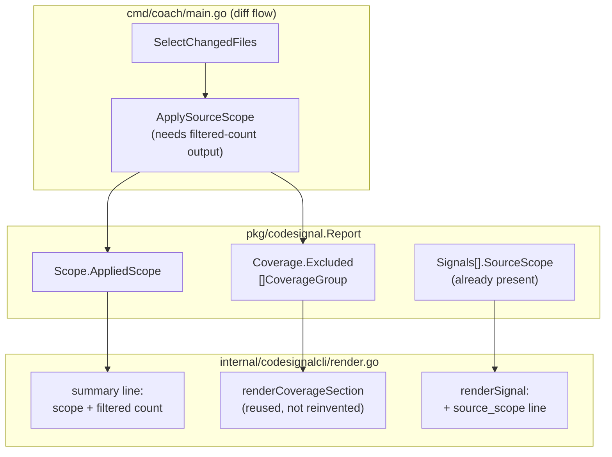
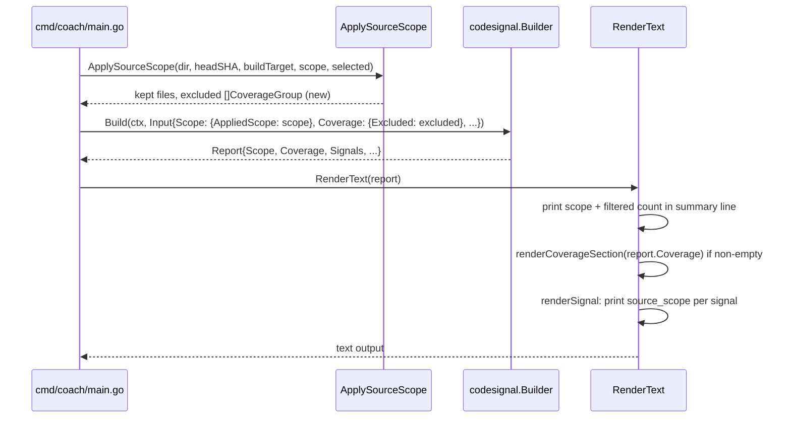

# Feature: Disclose Scope and Filtering in `coach codesignal` Diff-Mode Text Output

## Problem Statement

For the default `coach codesignal --base <ref>` diff flow, `RenderText` prints only a files-analyzed/active-signals/diagnostics summary line and, per signal, path/line/lifecycle/evidence — it never shows which `--scope` was applied, each signal's `source_scope`, or how many files were filtered out of the report. A customer can see "No active CodeSignal findings." with no indication that findings might have been excluded by scope filtering, which is a trust risk for a coaching product whose value depends on customers believing a quiet report means "nothing to see" rather than "something was hidden." The Repository Baseline mode (`--baseline`, shipped after the original review) already solved a version of this for its own text output via a Coverage section, but the original `--base` diff flow this issue was about still has the gap.

## Personas

| Persona | Impact | Notes |
| ------- | ------ | ----- |
| CLI user reading text output in a terminal or CI log | Negative (today) | Can't tell a clean report from a filtered one without switching to `--format=json` and reading `source_scope` manually |
| Coach product owner | Negative (today) | Silent filtering in the default output format is a named trust risk in the original review (issue #26) |

## Value Assessment

- **Primary value**: Customer — transparency about filtering is core to trusting a "nothing found" result.
- **Secondary value**: Commercial — avoids the reputational risk of a customer discovering post-hoc that a real issue was silently filtered out of a report they trusted.

## User Stories

### Story 1: Show the applied scope and filtered-file count in the summary line

As a **CLI user running the default diff flow**,
I want **the text summary line to show which `--scope` was applied and how many files were filtered out**,
so that **a clean report doesn't read as "nothing to see" when filtering was actually active**.

#### Acceptance Criteria

- When `coach codesignal --base <ref>` runs with `--scope production` (the default) and one or more files were excluded (`source_scope: "test_only"` or `"excluded"`), the system shall print the applied scope and a filtered-file count in the text summary line.
- When `--scope=all` is used, the system shall state in the summary line that no scope filtering was applied, so a user comparing runs can tell the two modes apart at a glance.
- While zero files were filtered under `--scope production`, the system shall still show `scope: production` in the summary line but shall not imply filtering occurred where none did (e.g., a `filtered: 0` or equivalent, not a misleading "no scope" statement).

### Story 2: Break down filtered files by reason and language

As a **CLI user investigating why a file didn't appear in the report**,
I want **filtered files broken down by reason (`test_only`/`excluded`) and language, similar to the Repository Baseline mode's Coverage section**,
so that **I can distinguish "my test file was correctly excluded" from "an unrecognized production file was excluded"**.

#### Acceptance Criteria

- When one or more files were filtered in the diff flow, the system shall print a breakdown by (reason, language) pair, reusing the same rendering approach already used for Repository Baseline's Coverage section (`internal/codesignalcli/render.go`'s `renderCoverageSection`) rather than inventing a second format.
- If no files were filtered, then the system shall omit the breakdown section entirely (matching `renderCoverageSection`'s existing empty-case behavior), so a genuinely unfiltered run's output doesn't grow noisier.

### Story 3: Show each signal's source_scope in text output

As a **CLI user reading an individual signal block**,
I want **the signal's `source_scope` printed in text output**,
so that **text-mode parity with JSON output means I don't have to switch formats to see how a signal was classified**.

#### Acceptance Criteria

- When rendering a signal in text mode, the system shall print its `source_scope` value alongside the existing `path`/`line`/`lifecycle`/`changed`/`evidence`/`why it matters`/`recommendation` fields.

---

## Design

> Refer to `AGENTS.md` for engineering standards.

### Components Affected

- `internal/codesignalcli/render.go` — `RenderText` (non-baseline summary line), `renderSignal`, reuse of `renderCoverageSection`
- `internal/codesignalcli/scope.go` — `ApplySourceScope` currently drops filtered files silently, unlike `ApplyBaselineSourceScope`, which already tallies them into `[]codesignal.CoverageGroup`. This spec needs the diff flow to produce the same tally.
- `cmd/coach/main.go` — the non-baseline branch (currently calling `ApplySourceScope`) needs to obtain filtered-file counts and populate `report.Coverage`, and needs to pass the applied `--scope` value through to the report for the summary line.
- `pkg/codesignal/coverage_types.go`, `pkg/codesignal/input.go` (`Scope` struct) — likely need the applied scope value threaded through so `RenderText` can read it without new parameters; a `Report`-shaped change here is expected, not incidental.

> **Note**: The sibling spec `codesignal-tsconfig-robust-parsing.spec.md` also touches `internal/codesignalcli/scope.go` (it changes `loadTSConfig`/`classifySourceFile`). The two specs touch different functions in the same file — low conflict risk, but land one before starting the other to avoid an awkward rebase.

### Dependencies

- None new.

### Data Model Changes

- `pkg/codesignal.Scope` gains a field carrying the applied `--scope` value (e.g. `AppliedScope string`, values `"production"`/`"all"`) so `RenderText` can read it from `report.Scope` without a new function parameter. This also happens to close a related gap noticed during triage — the JSON `scope` object doesn't currently carry the `--scope`/`--build-target` values either — but that JSON exposure is a side effect of this change, not this spec's primary target (this spec's acceptance criteria are about text output).
- The diff flow (non-baseline) starts populating `report.Coverage` (previously `nil` outside `--baseline`), reusing the existing `codesignal.Coverage`/`CoverageGroup` types.

### Diagrams

### Open Questions

- [ ] `ApplySourceScope`'s current signature (`(dir, headSHA, buildTarget, scope string, files []SelectedFile) ([]SelectedFile, error)`) has existing callers; decide during implementation whether to change its return type to match `ApplyBaselineSourceScope`'s `(kept, excluded, err)` shape (breaking its one caller in `cmd/coach/main.go`, which is in-repo and easy to update) versus adding a new function. Default assumption: align the two functions' shapes for consistency, since `ApplySourceScope` has no external callers outside this repository (`internal/` package).
- [ ] Exact wording for the summary line addition (e.g. `scope: production, filtered: 3` vs. a separate line) — keep it a single added clause on the existing summary line rather than a new line, matching the diff flow's existing single-line-summary style (contrast with baseline mode's already-multi-line summary).

---

## Tasks

> Each task should be completable in a single coding agent session.
> Tasks are sequenced by dependency. Complete in order unless noted.

### Task 1: Tally filtered files by reason/language in the diff flow

**Objective**: Make the diff flow (`ApplySourceScope` or a new variant) return a filtered-file tally shaped like `ApplyBaselineSourceScope`'s `[]codesignal.CoverageGroup`, and populate `report.Coverage` for non-baseline reports in `cmd/coach/main.go`.

**Context**: Today only baseline reports populate `Coverage`; the diff flow drops filtered files with no record of what was excluded or why. This task supplies the data the remaining tasks render.

**Affected files**:

- `internal/codesignalcli/scope.go`
- `cmd/coach/main.go`
- `internal/codesignalcli/scope_test.go`

**Requirements**:

- Supports Story 1 and Story 2 (data prerequisite; no user-visible text change yet)

**Verification**:

- [ ] `go test ./internal/codesignalcli/... -run TestApplySourceScope -v` passes, including a new case asserting the excluded tally's shape/counts
- [ ] `go test -race ./...` passes
- [ ] `go vet ./...` passes

**Done when**:

- [ ] All verification steps pass
- [ ] `report.Coverage` is non-nil for a diff-flow run that filtered at least one file
- [ ] Code follows `AGENTS.md` (acceptance-test-first)

---

### Task 2: Show applied scope and filtered count in the text summary line

**Depends on**: Task 1

**Objective**: Extend `RenderText`'s non-baseline summary line to include the applied `--scope` value and total filtered-file count.

**Context**: Direct fix for Story 1 — the specific "customer can see 'No active CodeSignal findings' without knowing findings were excluded" risk named in the original review.

**Affected files**:

- `internal/codesignalcli/render.go`
- `pkg/codesignal/input.go` (`Scope` struct — add `AppliedScope`)
- `internal/codesignalcli/render_test.go`

**Requirements**:

- Story 1, all three acceptance criteria

**Verification**:

- [ ] `go test ./internal/codesignalcli/... -run TestRenderText -v` passes, including cases for `--scope production` with filtering, `--scope production` with zero filtered, and `--scope=all`
- [ ] `go test -race ./...` passes

**Done when**:

- [ ] All verification steps pass
- [ ] Story 1 acceptance criteria satisfied
- [ ] Code follows `AGENTS.md` (acceptance-test-first)

---

### Task 3: Reuse the Coverage section for diff-mode filtered-file breakdown

**Depends on**: Task 1

**Objective**: Make `RenderText` print the existing `renderCoverageSection` output for non-baseline reports too, when `report.Coverage` is non-nil and non-empty.

**Context**: Direct fix for Story 2 — reuses the Repository Baseline mode's already-shipped, already-tested rendering rather than inventing a second format.

**Affected files**:

- `internal/codesignalcli/render.go`
- `internal/codesignalcli/render_test.go`

**Requirements**:

- Story 2, both acceptance criteria

**Verification**:

- [ ] `go test ./internal/codesignalcli/... -run TestRenderText -v` passes, including a diff-flow case with filtered files showing the Coverage section and a case with zero filtered files showing no section
- [ ] `go test -race ./...` passes

**Done when**:

- [ ] All verification steps pass
- [ ] Story 2 acceptance criteria satisfied
- [ ] Code follows `AGENTS.md` (acceptance-test-first)

---

### Task 4: Print `source_scope` per signal in text output

**Objective**: Add a `source_scope: <value>` line to `renderSignal`'s output.

**Context**: Direct fix for Story 3 — text/JSON parity for per-signal scope classification. Independent of Tasks 1-3 (touches `renderSignal`, not the summary line or Coverage section).

**Affected files**:

- `internal/codesignalcli/render.go`
- `internal/codesignalcli/render_test.go`

**Requirements**:

- Story 3's acceptance criterion

**Verification**:

- [ ] `go test ./internal/codesignalcli/... -run TestRenderText -v` passes, including a case asserting `source_scope:` appears in a rendered signal block
- [ ] `go test -race ./...` passes

**Done when**:

- [ ] All verification steps pass
- [ ] Story 3's acceptance criterion satisfied
- [ ] Code follows `AGENTS.md` (acceptance-test-first)

---

## Out of Scope

- Changing JSON output shape beyond the `Scope.AppliedScope` addition noted in Design — `Signal.SourceScope` is already present in JSON today.
- Changing Repository Baseline mode's existing text output — this spec only extends the diff (`--base`) flow to match it.

## Future Considerations

- If a future change reworks the summary-line format for both flows simultaneously, consider unifying `RenderText`'s baseline and non-baseline summary rendering into one shared helper rather than the two parallel code paths that will exist after this spec.

---

## Cross-Reference

- GitHub Issue: #26 (original "agent as customer feedback" review)
- Triage comment: https://github.com/lousy-agents/coach/issues/26#issuecomment-5005978780 — Blocker 3 ("Text output hides filtering and uncertainty")
