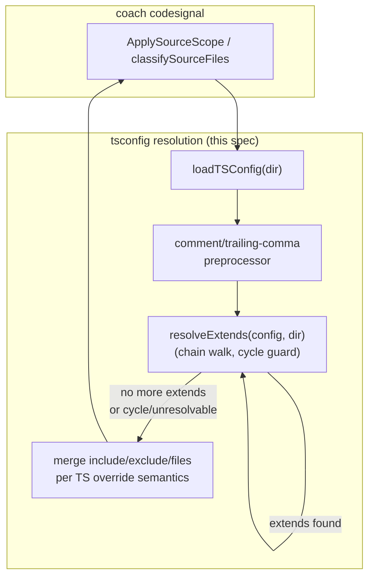
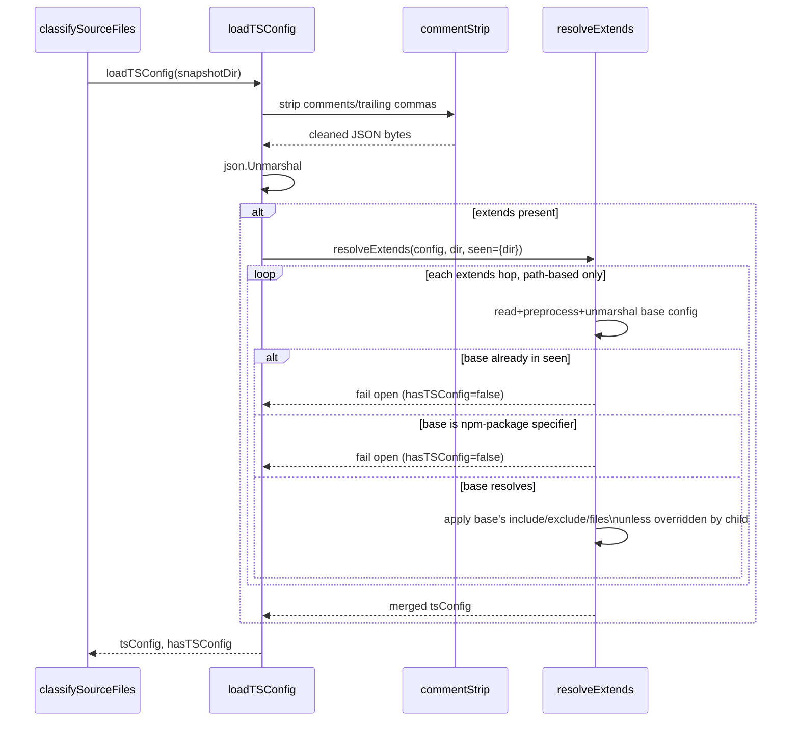

# Feature: Robust tsconfig.json Parsing for CodeSignal Source Scoping

## Problem Statement

`coach codesignal`'s production/all source-scope classification (`internal/codesignalcli/scope.go`) reads a repository's root `tsconfig.json` to decide whether a TypeScript/TSX file counts as production source. Two real-world config shapes defeat this today: a `tsconfig.json` containing `//` or `/* */` comments (a common, valid TypeScript authoring convention) fails strict `encoding/json` parsing and silently falls back to treating the whole file as unconfigured, so every TS/TSX file — including tests that should be excluded — is classified `source_scope: "unknown"` and stays in the default `--scope production` report; and even a config that parses cleanly is read in isolation, ignoring an `extends` reference to a shared base config, so a typical monorepo package tsconfig loses its actual include/exclude rules. Both defects independently reproduce the same customer-visible symptom: noisy or misleading production-scope classification that undermines the noise-reduction value `--scope production` is supposed to deliver.

## Personas

| Persona | Impact | Notes |
| ------- | ------ | ----- |
| Platform/Tooling engineer running `coach codesignal` in CI | Negative (today) | Sees test files leak into a "production" report whenever the repo's `tsconfig.json` has comments |
| Monorepo maintainer | Negative (today) | A package-level `tsconfig.json` that extends a shared base config is effectively treated as absent |
| Coach product owner | Negative (today) | Undermines the "you can trust the default scope" promise raised in the original CodeSignal CLI Preview review (issue #26) |

## Value Assessment

- **Primary value**: Customer — correct, trustworthy filtering for two realistic tsconfig shapes (commented configs, extends-based monorepos) that the current implementation silently mishandles.
- **Secondary value**: Market — monorepos with shared base tsconfigs are a common structure among the TypeScript teams this tool targets.

## User Stories

### Story 1: Parse tsconfig.json files that contain comments

As a **tooling engineer running `coach codesignal --scope production`**,
I want **a `tsconfig.json` with `//` or `/* */` comments to still parse successfully**,
so that I can **trust that test-only files are excluded instead of leaking into the production report as `unknown`**.

#### Acceptance Criteria

- When `tsconfig.json` contains `//` line comments and/or `/* */` block comments, the system shall parse the remaining JSON structure and apply its `include`/`exclude`/`files` exactly as it would for a comment-free config.
- When `tsconfig.json` contains a trailing comma after the last member of an array or object, the system shall still parse it successfully.
- If `tsconfig.json` is malformed for a reason other than comments or trailing commas (e.g. genuinely invalid JSON), then the system shall fall back to `hasTSConfig=false` (`source_scope: "unknown"` for TS/TSX files) exactly as it does today — it shall not crash and shall not silently misclassify files as production.

#### Notes

Comment/trailing-comma tolerance is the direct fix for the "TS config comments leak test findings into the default production report" blocker raised in the original review (see Cross-Reference).

### Story 2: Resolve `extends` chains for relative-path base configs

As a **monorepo maintainer whose package `tsconfig.json` extends a shared base config by relative path**,
I want **`coach codesignal` to resolve the full `extends` chain**,
so that **scope classification reflects my project's actual include/exclude rules instead of the package config's rules in isolation**.

#### Acceptance Criteria

- When a `tsconfig.json`'s `extends` field is a relative or absolute file path, the system shall resolve that base config and apply TypeScript's documented `extends` field-resolution semantics for `include`/`exclude`/`files` before classifying files.
- While an `extends` chain has more than one level (a config extends a config that itself extends another), the system shall resolve the full chain.
- If an `extends` chain is circular, then the system shall fail open to `hasTSConfig=false` (`source_scope: "unknown"`) rather than looping indefinitely or crashing.
- If `extends` refers to an npm package specifier (not a relative/absolute file path, e.g. `"@tsconfig/node18/tsconfig.json"`), then the system shall treat that config the same as an unresolvable `extends` target — fail open to `unknown` — since npm-package resolution is out of scope for this spec (see Out of Scope).
- If a resolved `extends` path (after following `..` segments or an absolute path) falls outside the snapshot directory being analyzed, then the system shall fail open to `hasTSConfig=false` (`source_scope: "unknown"`) rather than reading the file — `coach codesignal` analyzes potentially untrusted repository content (e.g. a fork's PR diff in CI), and a `tsconfig.json` is attacker-influenced input, so `extends` must not become an arbitrary host file read. Apply the same boundary check `extractTar` already uses for archive entries (`internal/codesignalcli/scope.go`'s `rel == ".."`/`strings.HasPrefix(rel, "..")` pattern).

#### Notes

This is the direct fix for the "TS scope is a partial approximation... does not handle extends" blocker raised in the original review (see Cross-Reference).

---

## Design

> Refer to `AGENTS.md` for engineering standards (Go conventions, acceptance-test-first policy, validation suite).

### Components Affected

- `internal/codesignalcli/scope.go` — `loadTSConfig`, `tsConfig` struct, `classifySourceFile`, `classifySourceFiles`
- `internal/codesignalcli/scope_test.go` — new fixtures: commented tsconfig, trailing-comma tsconfig, two-level extends chain, circular extends, npm-package-specifier extends

> **Note**: The sibling spec `codesignal-text-output-scope-disclosure.spec.md` also touches `internal/codesignalcli/scope.go` (it changes `ApplySourceScope`'s return signature). The two specs touch different functions in the same file — low conflict risk, but land one before starting the other to avoid an awkward rebase.

### Dependencies

- None new by default — see Open Questions on the preprocessor-vs-library decision.

### Data Model Changes

- `tsConfig` struct gains an `Extends` field (`string` in v1; see Open Questions on array-form `extends`).

### Diagrams

### Open Questions

- [ ] **Security boundary**: `extends` resolution must reject any path (relative or absolute) that resolves outside the snapshot directory, mirroring `extractTar`'s existing traversal guard, since `tsconfig.json` content comes from the (potentially untrusted) repository being analyzed. This is a hard requirement, not a nice-to-have — do not implement chain resolution without it.
- [ ] Comment/trailing-comma tolerance: implement as a small stdlib-only preprocessor (strip comments/trailing commas before `encoding/json.Unmarshal`) rather than adding a third-party JSON5/JSONC dependency — `go.mod` currently carries no JSON5 library and the codebase favors standard-library-first design. Confirm this default during implementation rather than reaching for a dependency by habit.
- [ ] TypeScript's actual `extends` merge semantics must be verified against current TypeScript documentation before implementing: `include`/`exclude`/`files` are override-not-merge across an `extends` chain (a child's value, if present, replaces the parent's for that field entirely rather than concatenating with it). Getting this wrong reproduces the same "misleading classification" bug for a different reason — verify against TypeScript's docs, not assumption, before writing the merge logic.
- [ ] Support `extends` as an array (TypeScript 5.0+ multi-base `extends`) or scope to string-only for v1? Default assumption: string-only for v1 (the original review's monorepo repro is single-base); array form is listed under Future Considerations.

---

## Tasks

> Each task should be completable in a single coding agent session.
> Tasks are sequenced by dependency. Complete in order unless noted.

### Task 1: Comment- and trailing-comma-tolerant tsconfig parsing

**Objective**: Make `loadTSConfig` parse a `tsconfig.json` containing `//`/`/* */` comments and trailing commas instead of failing open to `hasTSConfig=false`.

**Context**: This is the direct fix for the original review's reproduced bug: a repo with a commented `tsconfig.json` excluding `test/**/*.ts` still had both `src/app.ts` and `test/app.test.ts` show up in the production report, both `source_scope: "unknown"`.

**Affected files**:

- `internal/codesignalcli/scope.go`
- `internal/codesignalcli/scope_test.go`

**Requirements**:

- Story 1, all three acceptance criteria

**Verification**:

- [ ] `go test ./internal/codesignalcli/... -run TestLoadTSConfig -v` passes
- [ ] `go test -race ./...` passes
- [ ] A new acceptance test reproducing the original reviewer's exact repro (commented `tsconfig.json`, `exclude: ["test/**/*.ts"]`, one `src` file + one `test` file) shows only the `src` file classified `production` and kept, matching `TestApplySourceScopeExcludesGoTestFilesWithoutBuildTarget`'s style for the Go case
- [ ] A genuinely invalid (non-comment-related) `tsconfig.json` still falls back to `hasTSConfig=false` per existing behavior — add a regression test alongside the new ones

**Done when**:

- [ ] All verification steps pass
- [ ] No new errors in affected files
- [ ] Story 1 acceptance criteria satisfied
- [ ] Code follows `AGENTS.md` (acceptance-test-first: the failing acceptance test must be written and confirmed red before the parsing fix lands)

---

### Task 2: Add `Extends` field and single-level relative-path resolution

**Depends on**: Task 1 (shares `loadTSConfig`; sequencing avoids merge conflicts, not a hard technical dependency)

**Objective**: Add an `Extends` field to `tsConfig` and resolve one level of relative/absolute-path `extends`, applying TypeScript's override (not merge) semantics for `include`/`exclude`/`files`.

**Context**: Fixes the "TS scope is a partial approximation... does not handle extends" blocker for the common single-level monorepo case (package tsconfig extends one shared base).

**Affected files**:

- `internal/codesignalcli/scope.go`
- `internal/codesignalcli/scope_test.go`

**Requirements**:

- Story 2, first acceptance criterion (single-level relative/absolute extends)

**Verification**:

- [ ] `go test ./internal/codesignalcli/... -run TestExtends -v` passes
- [ ] `go test -race ./...` passes
- [ ] A fixture where a package `tsconfig.json` has no `include`/`exclude` of its own but extends a base config that does verifies the base's rules apply
- [ ] A fixture where the package `tsconfig.json` overrides `include` verifies the child's value wins outright (no merging with the base)
- [ ] A fixture with `extends: "../../../../../../etc/passwd"` (or an equivalent out-of-snapshot absolute path) resolves to `hasTSConfig=false` and does not attempt to read the target path

**Done when**:

- [ ] All verification steps pass
- [ ] No new errors in affected files
- [ ] Story 2's first acceptance criterion and the snapshot-boundary security criterion satisfied
- [ ] Code follows `AGENTS.md` (acceptance-test-first)

---

### Task 3: Multi-level chain resolution with a cycle guard

**Depends on**: Task 2

**Objective**: Extend `extends` resolution to walk chains of more than one level, failing open to `unknown` on a circular reference instead of looping or crashing.

**Context**: Real monorepos sometimes chain a package config through more than one shared base (e.g. package → team base → root defaults).

**Affected files**:

- `internal/codesignalcli/scope.go`
- `internal/codesignalcli/scope_test.go`

**Requirements**:

- Story 2, second and third acceptance criteria

**Verification**:

- [ ] `go test ./internal/codesignalcli/... -run TestExtends -v` passes, including a two-level chain fixture reproducing the reviewer's "typical monorepo" scenario
- [ ] A circular-extends fixture (A extends B, B extends A) resolves to `hasTSConfig=false` rather than hanging or panicking
- [ ] `go test -race ./...` passes

**Done when**:

- [ ] All verification steps pass
- [ ] No new errors in affected files
- [ ] Story 2's second and third acceptance criteria satisfied
- [ ] Code follows `AGENTS.md` (acceptance-test-first)

---

### Task 4: Fail open for npm-package-specifier `extends`

**Depends on**: Task 2

**Objective**: Ensure an `extends` value that is not a relative/absolute file path (an npm package specifier) is treated as an unresolvable target, falling open to `hasTSConfig=false` rather than attempting `node_modules` resolution.

**Context**: Keeps this spec's scope bounded to path-based `extends`; package-based `extends` is explicitly Out of Scope (see below) and Future Considerations.

**Affected files**:

- `internal/codesignalcli/scope.go`
- `internal/codesignalcli/scope_test.go`

**Requirements**:

- Story 2, fourth acceptance criterion

**Verification**:

- [ ] `go test ./internal/codesignalcli/... -run TestExtends -v` passes, including an `extends: "@tsconfig/node18/tsconfig.json"` fixture that resolves to `hasTSConfig=false`
- [ ] `go test -race ./...` passes

**Done when**:

- [ ] All verification steps pass
- [ ] No new errors in affected files
- [ ] Story 2's fourth acceptance criterion satisfied
- [ ] Code follows `AGENTS.md` (acceptance-test-first)

---

## Out of Scope

- Resolving `extends` values that are npm package specifiers (`@tsconfig/*`, bare package names) via `node_modules` traversal — these fail open to `unknown` per Task 4.
- Any tsconfig field other than `extends`/`include`/`exclude`/`files` (e.g. `compilerOptions.paths`, TypeScript project references).
- Changes to Go-side scope classification (`goProductionFiles`, build-target reachability) — unaffected by this spec.

## Future Considerations

- Array-form `extends` (TypeScript 5.0+ multi-base `extends`).
- npm-package-based `extends` resolution.
- `compilerOptions.paths`-aware classification.

---

## Cross-Reference

- GitHub Issue: #26 (original "agent as customer feedback" review)
- Triage comment: https://github.com/lousy-agents/coach/issues/26#issuecomment-5005978780 — Blocker 1 ("Common valid TS configs leak test findings into the default production report") and Blocker 4 ("TS scope is a partial approximation... does not handle extends")
