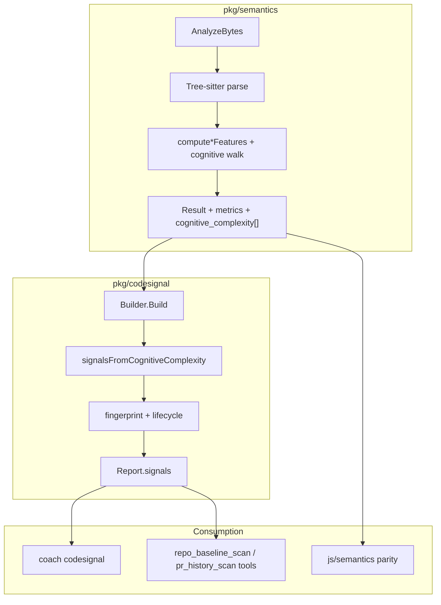
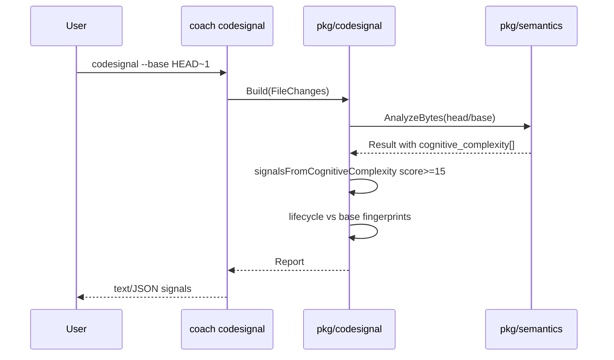

# Feature: Cognitive Complexity (Deterministic Understandability Metric)

## Problem Statement

Coach already emits crude complexity proxies (`complexity.max_nesting_depth`, `complexity.branch_density`) derived from file-level branch counts and max nesting. Those signals do not measure **understandability of control flow** the way engineers reason about it: nested conditionals cost more than sequential ones, `else`/`else if` are hybrid, an entire `switch` is one structural break, logical-operator sequences and labeled jumps break linear reading, and function literals raise nesting without a structural charge. Without a Sonar-style Cognitive Complexity score in `pkg/semantics` → `pkg/codesignal`, pilots cannot get deterministic, rule-versioned feedback on methods that are hard to hold in mind — the exact class of AI-generated tangles the PRD calls out — and rubrics lack a strong, reproducible complexity evidence signal.

## Personas

| Persona | Impact | Notes |
| ------- | ------ | ----- |
| Pilot Engineer | Positive | Sees high-cognitive-complexity methods in `coach codesignal` and async scan reports with clear evidence (score + location + coaching text) |
| Human Reviewer | Positive (secondary) | Benefits when authors flatten hard-to-review control flow before asking for review |
| Future Harness Integrator | Neutral | Consumes the same frozen JSON / codesignal signals; no new API surface required this slice |
| Platform Operator | Neutral | No new runtime deps; same local CLI and worker path |

## Value Assessment

- **Primary value**: Customer — turns an already-planned “more deterministic complexity rules” PRD item into a high-signal, evidence-grounded finding engineers can act on, improving voluntary repeat use.
- **Secondary value**: Future — richer deterministic evidence for LLM-as-judge rubrics and later review-readiness work without inventing a new analysis language or pipeline.

## User Stories

### Story 1: Compute Cognitive Complexity per function in `pkg/semantics`

As a **Pilot Engineer**,
I want **each analyzed Go/TS/TSX file to carry deterministic per-function Cognitive Complexity scores**,
so that I can **trust a reproducible understandability metric grounded in published scoring rules**.

#### Acceptance Criteria

- When `AnalyzeBytes` succeeds for a supported language (Go, TypeScript, TSX), the system shall attach one Cognitive Complexity record for every scored function body discovered in that file (see Design — Function discovery), including functions whose total score is 0.
- The analyzer shall score each function body using the Scoring Contract in this spec (structural + nesting, hybrid, fundamental, ignored structures, nesting mechanics, nested-function attribution, Go `else if` normalization, logical-sequence algorithm).
- The analyzer shall start every scored function body at nesting depth 0 and at score 0 (no floor of 1).
- When scoring completes for a file with `ParseStatus == "ok"`, the system shall expose `Result.cognitive_complexity` as the ordered per-function records (ascending `location.start_byte`, then ascending `name`) each with `name`, `kind`, `location`, and `score`, and shall expose `metrics.max_cognitive_complexity` (max `score` over **all** records, or 0 if none) and `metrics.sum_cognitive_complexity` (sum of `score` over **top-level only** records, or 0 if none — see Design — Aggregates).
- When two independent `AnalyzeBytes` calls receive identical bytes and language, the system shall produce byte-identical Cognitive Complexity JSON (field presence, values, and per-function order).
- If the input has syntax errors (`ParseStatus == "syntax_errors"`), then the system shall leave `cognitive_complexity` absent/empty (omitempty), set `metrics.max_cognitive_complexity` and `metrics.sum_cognitive_complexity` to 0, and leave other findings/metrics zeroed — matching the existing partial-result contract (no invented scores on invalid trees).
- The system shall keep `pkg/semantics` free of any `pkg/codesignal` or GitHub client imports, and shall not embed the codesignal emission threshold inside `pkg/semantics`.
- The system shall populate `Result.CognitiveComplexity` through the existing `AnalyzeBytes` → language `computeFeatures` pipeline (see Design — Analyzer wiring) without a second full-tree parse.

#### Notes

Reference draft: repo-root `cognative-complexity-draft.md` (SonarSource whitepaper v1.7, 29 Aug 2023). Spelling of the draft filename is historical; the feature name is **Cognitive Complexity**. The Scoring Contract and worked examples in **this** spec are normative; the draft is non-normative background.

---

### Story 2: Surface high Cognitive Complexity as a codesignal rule

As a **Pilot Engineer**,
I want **functions whose Cognitive Complexity exceeds a fixed threshold to appear as deterministic codesignal signals**,
so that I can **see introduced/existing/resolved lifecycle on the same report surface as other rules**.

#### Acceptance Criteria

- When a head (or baseline) `semantics.Result` with `ParseStatus == "ok"` contains one or more `cognitive_complexity` records with `score >= 15`, the system shall emit exactly one `Signal` per such record with:
  - `rule_id`: `complexity.cognitive_complexity`
  - `rule_version`: `1`
  - `kind`: `cognitive_complexity`
  - `category`: `complexity`
  - `severity`: `medium`
  - `confidence`: `high` (fully deterministic rule application)
  - `path`: the file path passed into codesignal for that `FileChange`
  - `subject`: the record’s `name`
  - `location`: the record’s `location` (function span)
  - `evidence`: exactly `cognitive_complexity=<score>` where `<score>` is the decimal integer score (no spaces)
  - `why_it_matters` and `recommendation`: the deterministic rule-owned strings defined in Design — CodeSignal rule copy
  - `provenance.producer`: `codesignal`
- When no record in the file meets the threshold, the system shall emit no `complexity.cognitive_complexity` signal for that file.
- When building a diff-aware report, the system shall apply the existing fingerprint/lifecycle machinery so that:
  - a function that is under threshold on base and `score >= 15` on head is `introduced`;
  - a function that is `score >= 15` on both sides with the same lifecycle key is `existing`;
  - a function that is `score >= 15` on base and under threshold (or absent) on head is `resolved`.
- Lifecycle keying shall use the existing `keyOf` inputs (`rule_id`, path, `subject`, `evidence`). Because `evidence` includes the numeric score, a score change while still `>= 15` yields distinct keys (resolved prior score + introduced new score), matching existing metrics rules such as `complexity.branch_density`. This is accepted v1 behavior.
- The system shall dispatch this rule through a dedicated `signalsFromCognitiveComplexity` path invoked from `processHeadResult` / `extractBaseSignals` (same structural pattern as `signalsFromImports`), **not** by overloading `metricsRuleRegistry` (file-level `StructuralMetrics` only) and **not** by requiring `pkg/semantics` to emit threshold-gated `Finding` values.
- If `cognitive_complexity` is absent or empty on a `Result` (older fixture / partial / pre-feature analyzer), then the system shall emit no cognitive-complexity signals and shall not fail the build.

#### Notes

Threshold **15** matches common Sonar defaults for method-level Cognitive Complexity; it is a product constant for v1 (not user-configurable this slice). Threshold lives only in `pkg/codesignal`.

---

### Story 3: CLI and JS parity surfaces

As a **Pilot Engineer**,
I want **`coach codesignal` and `js/semantics` to reflect the new metric without separate product work**,
so that I can **use the local preview path and any Node consumers against the same contract**.

#### Acceptance Criteria

- When a user runs `coach codesignal --base <ref>` or `--baseline` on a tree containing an over-threshold function, the system shall include `complexity.cognitive_complexity` signals in text and JSON output via the existing report path (no new CLI flags required).
- When `js/semantics` analyzes the same fixtures as Go `AnalyzeBytes`, the system shall keep Go and JS outputs byte-identical for Cognitive Complexity fields (extend `parity.test.ts`).
- The system shall update the frozen JSON golden(s) in `pkg/semantics` so new fields are locked as stable pre-1.0 surface under the existing golden-file discipline.

---

### Story 4: Acceptance-test-first verification of scoring examples

As a **Platform Operator / maintainer**,
I want **Ginkgo acceptance coverage that locks the worked Go examples and TS analogs from the scoring contract**,
so that **scoring regressions fail CI before product code drifts**.

#### Acceptance Criteria

- Before production scoring logic lands, the suite shall include a failing Ginkgo acceptance spec that asserts every locked total in Design — Worked Examples (Go) and Design — TS/TSX minimum analogs (including both outer and nested records where an example defines both).
- When implementation is complete, those same acceptance examples shall pass under `mise run test-acceptance-fast` / package acceptance entrypoints.
- Unit table tests may refine edge cases, but shall not substitute for the acceptance examples above (AGENTS.md acceptance-test-first policy).

---

## Design

> Refer to `AGENTS.md`, `docs/product/prd.md`, and `docs/architecture/system-overview.md`.

### Components Affected

- `pkg/semantics/` — compute Cognitive Complexity during `compute*Features` (or a helper invoked from those functions / analyzer wiring below); extend `Result` / `StructuralMetrics`; golden + acceptance tests.
- `pkg/semantics/result.go` — additive JSON fields (file aggregates on metrics + top-level `cognitive_complexity` slice).
- `pkg/semantics/language.go` / `pkg/semantics/analyzer.go` — wiring so `AnalyzeBytes` copies the new slice onto `Result` (see Analyzer wiring).
- `pkg/semantics/features.go`, `pkg/semantics/ts_features.go`, and/or new `pkg/semantics/cognitive_complexity.go` — language-specific AST walks.
- `pkg/codesignal/` — new rule file + `signalsFromCognitiveComplexity` dispatch from `processHeadResult` / `extractBaseSignals`; lifecycle/fingerprint tests.
- `js/semantics/test/parity.test.ts` (+ protocol/types if mirrored) — parity lock.
- `cognative-complexity-draft.md` — **non-normative reference only** (not shipped product docs).

### Dependencies

- Existing pure-Go Tree-sitter backend (`pkg/semantics/internal/engine`) — no new CGO, no new parser library.
- SonarSource Cognitive Complexity whitepaper v1.7 rules (human-encoded in this spec; no runtime dependency on Sonar).
- Existing `pkg/codesignal` Builder / lifecycle / fingerprint stack.

### Analyzer wiring (normative)

Today `languageSpec.computeFeatures` returns `(StructuralMetrics, []Finding)` and `AnalyzeBytes` assigns those onto `Result`. Cognitive Complexity must reach `Result` without a second parse and without `pkg/semantics` importing codesignal.

**Required shape (pick one; both are acceptable):**

1. **Preferred**: extend the computeFeatures contract to return a third value:
   `(StructuralMetrics, []Finding, []FunctionCognitiveComplexity)` and set aggregates on `StructuralMetrics` inside the compute path; `AnalyzeBytes` assigns the slice to `Result.CognitiveComplexity`.
2. **Alternative**: keep the two-value computeFeatures signature and have `AnalyzeBytes` call a package-local `computeCognitiveComplexity(lang, root, source)` after/beside computeFeatures, merging max/sum into `Result.Metrics` before return.

Do **not** stash the slice on a global, on `Finding`, or behind a hidden field of `StructuralMetrics`. The public JSON field is top-level `cognitive_complexity` on `Result`.

### Data Model Changes

Additive only on `pkg/semantics.Result` (frozen snake_case JSON):

```text
// On StructuralMetrics (always present when metrics is present):
metrics.max_cognitive_complexity: int   // max score over ALL cognitive_complexity records; 0 if none
metrics.sum_cognitive_complexity: int   // sum of scores over TOP-LEVEL records only; 0 if none

// On Result (top-level, parallel to findings — NOT inside metrics):
cognitive_complexity: []FunctionCognitiveComplexity  // omitempty when empty/nil

FunctionCognitiveComplexity:
  name: string                 // see Naming rules
  kind: string                 // exact enum below
  location: Location           // full declaration / literal node span (see Location rule)
  score: int                   // total Cognitive Complexity for this function body
```

**Location rule**: `location` is the span of the full function/method/literal AST node (signature + body), using the same `locationFromNode(decl)` convention other semantics findings use — not the body block alone.

**`kind` enum (closed set for v1)**

| Language | Allowed `kind` values |
| -------- | --------------------- |
| Go | `function`, `method`, `func_lit` |
| TypeScript / TSX | `function`, `method`, `func_lit`, `arrow` |

No other `kind` strings in v1. Generators use `function`. Class methods use `method`. Go methods (with receivers) use `method`. Assignable/inline function expressions use `func_lit` (Go) or `func_lit` / `arrow` (TS/TSX).

**v1 does not require `contributions` breakdown.** Optional future field; do not implement contribution arrays in this slice unless needed for debugging tests (must not appear in frozen public golden unless omitted via omitempty and left empty).

**codesignal signal** (existing `Signal` shape; no schema version bump beyond normal report evolution):

- One signal per over-threshold **function record** (not one per file).
- `subject` = record `name`; `location` = record `location`; `evidence` = `cognitive_complexity=<score>`.
- Rule copy (deterministic constants in codesignal):

**WhyItMatters**: `High cognitive complexity means the control flow takes more mental effort to follow: nested branches, mixed logical sequences, and jumps compound so reviewers and authors miss paths.`

**Recommendation**: `Extract nested branches into named helpers, replace nested conditionals with early returns or lookup tables, and simplify boolean expressions so each function stays linearly readable.`

**Threshold constant** (codesignal only): `cognitiveComplexityThreshold = 15` with emission when `score >= 15`.

**Analyzer versioning**: bumping semantics metrics/JSON is a deterministic contract change; codesignal `rule_version` starts at `"1"`. Report `analyzer` version strings used by the API worker remain whatever the platform already pins — this feature does not require a new job kind.

### Function discovery

Emit one `FunctionCognitiveComplexity` record for each of:

**Go**

- each `function_declaration`
- each `method_declaration`
- each `func_literal`

**TypeScript / TSX**

- each `function_declaration` / `generator_function_declaration`
- each method-like declaration on classes/objects that introduces a callable body (constructor, method_definition, etc. that owns a statement block or expression body)
- each `function` expression / `func_lit` equivalent
- each `arrow_function`

Do **not** emit records for type-only declarations or overload signatures without bodies.

### Naming rules (deterministic)

1. **Go `function_declaration` / `method_declaration`**: `name` = the declaration’s name identifier text. Receiver type is **not** part of `name` in v1 (duplicate method names across types rely on location + lifecycle ordinals).
2. **TS function declaration / method**: `name` = syntactic name identifier when present.
3. **Named function expression** (`const f = function name() {}` or `function name() {}` expression with name): prefer the function’s own name identifier.
4. **Anonymous func lit / arrow assigned to a single identifier** via short var decl or assignment (`process := func...`, `const process = () => ...`, `let process = function() {}`): `name` = that identifier (`process`).
5. **Otherwise** (immediately-invoked, free-standing anonymous, multi-assign, property assignment without a simple identifier binding in v1 scope): `name` = `<func lit>` exactly.
6. Multiple records may share the same `name`; stable ordering is by `location.start_byte`, then `name`. Lifecycle ordinals disambiguate identical keys.

### Nested-function score attribution (normative)

Cognitive Complexity is computed **per scored function record** with a **parent-inclusive** walk:

1. To score function **F**, walk **F**’s body starting at nesting depth 0 and score 0.
2. When the walk encounters a nested scored function/lit **G** inside **F**:
   - **G** itself costs **+0 structural** to **F**.
   - Nesting depth for **F** increases by 1 before walking **G**’s body as part of **F**’s score, and decreases when leaving **G**.
   - Structural/hybrid/fundamental increments **inside G’s body count toward F’s score** (with the elevated nesting). This matches Sonar-style “nested functions raise nesting” and locks Worked Example 4’s outer total of **5**.
3. **G** also receives its **own** independent record, scored by the same rules with **G** as root (G’s body starts at depth 0). Example 4 therefore yields **two** records: outer `score = 5`, nested lit `score = 3`.
4. Do not treat a function’s own declaration as raising nesting for its own body (own body always starts at 0).

### Aggregates

- `max_cognitive_complexity` = maximum `score` among **all** records (top-level and nested, including zeros). `0` if there are no records.
- `sum_cognitive_complexity` = sum of `score` among **top-level only** records. Nested records are **excluded** from the sum so parent-inclusive scoring does not double-count aggregates.

**Top-level record (for sum) definition**

- **Go**: `kind` is `function` or `method` (i.e. `function_declaration` / `method_declaration`). All `func_lit` records are non-top-level for sum, including package-scope `var f = func() { ... }` bindings.
- **TS/TSX**: a record whose function body is **not lexically nested inside another scored function/method/arrow/func_lit body**. Class/`method_definition` methods count as top-level for sum (the class is not a scored function). Arrow/func_lit nested inside another scored body do not.

### CodeSignal dispatch (normative)

Mirror the imports rule pattern, not the file-level metrics registry:

```text
processHeadResult / extractBaseSignals (ParseStatus == "ok"):
  signalsFromFindings(...)
  signalsFromMetrics(...)                  // unchanged: max_nesting_depth, branch_density
  signalsFromImports(...)                  // unchanged
  signalsFromCognitiveComplexity(path, result.CognitiveComplexity)
```

`signalsFromCognitiveComplexity`:

- For each record with `score >= cognitiveComplexityThreshold` (15), append one `Signal` as specified in Story 2.
- No registry entry in `metricsRuleRegistry` (wrong cardinality: one file-level metrics struct cannot name per-function subjects/locations).
- No dependency on `Finding` conversion inside semantics for threshold gating.

### Scoring Contract (normative for v1)

Source of truth for implementers: this section (derived from SonarSource *Cognitive Complexity* v1.7). Where language constructs do not exist, they score +0 / are N/A.

#### Three basic rules

1. **Ignore** structures that shorthand multiple statements into one (+0).
2. **Increment (+1)** for each break in linear flow.
3. **Increment further** when flow-breaking structures are nested.

#### Increment types

| Type | Effect |
| ---- | ------ |
| Nesting | When a nesting-subject structure is entered at depth N: add N (in addition to structural +1) |
| Structural | +1 and increases nesting for its body; subject to nesting increment when nested |
| Fundamental | +1; never receives nesting increment |
| Hybrid | +1; never receives nesting increment itself. For `else` / `else if`, bodies share the leading `if`’s single nesting increment (see If/else-chain nesting) — hybrids do not stack an extra depth on top of that `if`. |

#### Ignored / +0 (do not raise score; some raise nesting)

- Method/function/method declarations themselves (outermost and nested declarations: **+0 structural**)
- Nested functions / function literals / arrow functions / methods-as-values: **+0 structural**, **do increase nesting** for their bodies when attributed to an enclosing function’s walk (see Nested-function score attribution)
- Nullish coalescing / optional chaining (`??`, `?.`) when present
- `try` / `finally` (no Go `try`; TS `try`/`finally` ignored; see `catch` under structural)
- Individual `case` / `default` labels
- Unlabeled `break` / `continue`
- Early `return` (including bare returns) — **not** a fundamental increment in v1

#### Hybrid (+1, never nesting penalty on the hybrid node)

- `else`
- `else if` / `elif` / TS `else if`
- **Go `else if` normalization (mandatory)**: Go has no dedicated `else if` node. When an `else` branch’s alternative is a single `if_statement` (possibly with its own else chain), treat that construct as **one hybrid `else if`** (+1 hybrid) and **do not** also charge a structural + nesting increment for that inner `if` head. Apply the same chain rule for longer `else if` / `else if` / `else` sequences.
- **If/else-chain nesting (mandatory — locks Example 2)**: A leading `if` plus its `else if` / `else` chain share **one** nesting increment. Bodies of `then`, each `else if`, and `else` all run at depth `D+1` where `D` is the depth before the leading `if`. Hybrid branches do **not** each add a further `depth++` on top of that shared increment (otherwise Example 2 becomes 7 instead of 5).

#### Structural (+1 + nesting when nested; raise nesting)

- `if` (the `if` itself, not each `else if` after hybrid normalization)
- Ternary / conditional expression (`cond ? a : b`; Go has no ternary — N/A)
- `switch` / type switch / TS `switch` — **entire switch is one structural increment** (cases free)
- `for` / `for range` / `while` / `do-while` / TS loops
- `catch` / Go has no catch — N/A for Go; TS `catch` is structural
- Go `select`: treat like `switch` — **one structural increment** for the whole `select` (comms cases free) — documented Go extension
- Preprocessor conditionals: N/A for Go/TS/TSX

#### Fundamental (+1, never nesting)

- Binary boolean operator **sequences** anywhere in the scored function body (conditions, assignments, return expressions, etc.) — see **Logical-sequence algorithm** below. Unary `!` does not increment. `??` does not increment.
- Labeled `break` / `continue` (Go `break Label`; TS labeled statements if present)
- `goto` (Go only)
- **Recursion (v1 scope decision)**: **direct recursion only** — a call whose callee is a simple identifier equal to the enclosing scored function’s `name` (string match on that simple identifier only; no type-resolution; `pkg.Foo` / `obj.Foo` / method expressions are **not** direct recursion in v1). Indirect recursion / mutual recursion is **out of scope for v1**. Each directly recursive call site: +1 fundamental.

#### Logical-sequence algorithm (normative)

Boolean `&&` / `||` sequences are fundamental increments. Implementers must flatten tree-sitter binary-expression trees into operator runs:

1. Consider only binary operators `&&` and `||` (TS/Go). Other operators break a sequence and are not walked as part of the boolean chain.
2. For a topmost boolean binary expression (parent is not also `&&`/`||`), flatten the contiguous boolean chain into a left-to-right list of operators (standard left-associative nesting: `a && b || c && d` → operators `&&`, `||`, `&&`).
3. Charge **+1 fundamental for each maximal run of identical operators** in that list. Examples:
   - `a && b` → operators `[&&]` → **+1**
   - `a && b && c` → `[&&, &&]` → **+1** (one run)
   - `a && b || c && d` → `[&&, ||, &&]` → **+3**
   - `a || b || c && d` → `[||, ||, &&]` → **+2**
4. Nested boolean subexpressions under non-boolean parents are separate chains (each topmost boolean binary root is scored once). Do not double-count an inner node already included in an outer chain’s flattening.
5. Parentheses do not add increments; they only affect AST shape, which flattening removes.

#### Nesting mechanics

- Structures that **increase nesting**: Structural nodes (and nested functions/func lits/arrow funcs during an enclosing walk). Hybrid `else` / `else if` do **not** add a second nesting level beyond their leading `if` (see If/else-chain nesting).
- Structures that **receive nesting increment** when nested: structural list above (`if`, ternary, switch/select, loops, catch).
- Cost of nested structural node = `1 + N` where N is depth **before** entering the node.
- Outermost body of the function being scored starts at depth 0.

**Walk order (normative — prevents condition/body depth drift)**

Let `D` be the current nesting depth when a node is entered.

1. **`if` / `else if` / `else` chain** (special structural+hybrid form):
   1. Score the leading `if` as structural: add `1 + D`.
   2. Set `depth = D + 1` once for the whole chain.
   3. Recurse into the leading `if` condition and then-body at `depth = D + 1`.
   4. For each `else if` (including Go-normalized): add `+1` hybrid only; recurse into its condition and then-body at the **same** `depth = D + 1` (no extra `depth++`); do **not** structural-score the normalized `if` head.
   5. For a final `else`: add `+1` hybrid only; recurse into its body at `depth = D + 1` (no extra `depth++`).
   6. Restore `depth = D` after the full chain.
   7. Example 2 check: `D=0` → if +1, else-if +1, else +1, inner if at depth 1 → +2; total **5**.
2. **Other structural** (ternary, switch/select, loops, catch): add `1 + D`; set `depth = D + 1`; recurse into **all children** (condition/initializer and body) at the elevated depth; restore `depth = D`. Structures inside a `for`/`switch` condition therefore receive nesting relative to that parent.
3. **Nested scored function/lit** during an enclosing walk: add `0`; set `depth = D + 1`; recurse into the nested body (increments accrue to the **enclosing** function being scored); restore `depth = D`. Separately ensure the nested function also gets its own root walk (`depth = 0`) for its independent record.
4. **Fundamental** (boolean sequences, labeled break/continue, goto, direct recursion): add `1`; do not change depth. Boolean sequences use the Logical-sequence algorithm (evaluate once at the topmost boolean binary root; do not re-charge child binary nodes already flattened).
5. Other nodes: recurse without scoring or depth change.

#### Worked Examples (Go) — acceptance locks (normative)

Fixtures below are normative. Totals must match exactly.

##### Example 1 — Basic nesting + logical sequence → top-level **7**

```go
func processNumbers(numbers []int) {
	for _, num := range numbers { // +1 structural (depth → 1)
		if num > 1 { // +1 structural +1 nesting = +2 (depth → 2)
			if isOdd(num) && isValid(num) { // +1 structural +2 nesting = +3; +1 fundamental (&&)
				fmt.Println(num)
			}
		}
	}
}
// Records: processNumbers=7
// metrics: max=7, sum=7
```

##### Example 2 — Hybrid else if / else → top-level **5**

```go
func classify(n int) string {
	if n < 0 { // +1 structural
		return "negative"
	} else if n == 0 { // +1 hybrid (Go else-if normalization; no nesting penalty)
		return "zero"
	} else { // +1 hybrid
		if n%2 == 0 { // +1 structural +1 nesting = +2
			return "even"
		}
		return "odd"
	}
}
// Records: classify=5
// metrics: max=5, sum=5
```

##### Example 3 — switch single structural + nested if → top-level **3**

```go
func describe(code int) string {
	switch code { // +1 structural (covers all cases)
	case 200:
		return "ok"
	case 404:
		return "not found"
	case 500:
		if isRetryable(code) { // +1 structural +1 nesting = +2
			return "retry"
		}
		return "error"
	default:
		return "unknown"
	}
}
// Records: describe=3
// metrics: max=3, sum=3
```

##### Example 4 — Function literal raises nesting → outer **5**, lit **3**

```go
func outer(items []string) {
	process := func(s string) { // +0 structural to outer; depth→1 for outer's walk
		if len(s) > 0 { // outer walk: +1+1=+2; lit-as-root: +1
			for _, c := range s { // outer walk: +1+2=+3; lit-as-root: +1+1=+2
				fmt.Print(c)
			}
		}
	}
	process("hello")
}
// Records: outer=5, process=3 (name from short-decl LHS; kind=func_lit)
// metrics: max=5, sum=5 (sum is top-level only; lit excluded from sum)
```

##### Example 5 — Logical sequences + labeled break → top-level **9**

```go
func search(matrix [][]int, target int) bool {
OUTER:
	for i, row := range matrix { // +1 structural (depth → 1)
		for j, v := range row { // +1 structural +1 nesting = +2 (depth → 2)
			if v == target && i > 0 || j > 0 { // +1+2=+3; +1 (&&); +1 (|| new sequence)
				break OUTER // +1 fundamental (labeled break)
			}
		}
	}
	return false
}
// Records: search=9
// metrics: max=9, sum=9
```

##### Example 6 — Direct recursion factorial → top-level **2**

```go
func factorial(n int) int {
	if n <= 1 { // +1 structural
		return 1
	}
	return n * factorial(n-1) // +1 fundamental (direct recursion)
}
// Records: factorial=2
// metrics: max=2, sum=2
```

#### TS/TSX minimum analogs (acceptance locks)

Fixtures below are normative. Totals must match exactly.

##### TS-1 — Nested `if` inside `for` with `&&` sequence → top-level **7**

```ts
function processNumbers(numbers: number[]) {
  for (const num of numbers) {
    // +1 structural (depth → 1)
    if (num > 1) {
      // +1 structural +1 nesting = +2 (depth → 2)
      if (isOdd(num) && isValid(num)) {
        // +1 structural +2 nesting = +3; +1 fundamental (&&)
        console.log(num);
      }
    }
  }
}
// Records: processNumbers=7
// metrics: max=7, sum=7
```

##### TS-2 — `if` / `else if` / `else` with nested `if` in else → top-level **5**

```ts
function classify(n: number): string {
  if (n < 0) {
    // +1 structural
    return "negative";
  } else if (n === 0) {
    // +1 hybrid (no nesting penalty)
    return "zero";
  } else {
    // +1 hybrid
    if (n % 2 === 0) {
      // +1 structural +1 nesting = +2
      return "even";
    }
    return "odd";
  }
}
// Records: classify=5
// metrics: max=5, sum=5
```

##### TS-3 — Arrow function assigned to const raises nesting → outer **5**, arrow **3**

```ts
function outer(items: string[]) {
  const process = (s: string) => {
    // +0 to outer; depth→1 for outer walk; name=process, kind=arrow
    if (s.length > 0) {
      for (const c of s) {
        console.log(c);
      }
    }
  };
  process("hello");
}
// Records: outer=5, process=3
// metrics: max=5, sum=5
```

### Diagrams





### Open Questions / Deferred

- [x] **Per-function vs file-only metric?** — **Decided**: per-function scores + file max/sum aggregates (sum = top-level only).
- [x] **Threshold?** — **Decided**: 15 for v1 codesignal emission (`score >= 15`).
- [x] **Indirect recursion?** — **Decided**: out of scope v1; direct only (simple-name match).
- [x] **Go `select`?** — **Decided**: one structural increment (switch-like).
- [x] **Anonymous function naming?** — **Decided**: prefer simple assignment/short-decl LHS or function name; else `"<func lit>"` (see Naming rules).
- [x] **Nested score attribution?** — **Decided**: parent-inclusive walk per record; nested get independent records; sum excludes nested.
- [x] **CodeSignal dispatch?** — **Decided**: `signalsFromCognitiveComplexity` third path; threshold only in codesignal.
- [x] **Contribution breakdown in v1?** — **Decided**: not required; omit from public contract for this slice.
- [ ] Whether file-level `branch_density` / `max_nesting_depth` rules should later be demoted or retuned once Cognitive Complexity ships (not blocking; leave both active in v1).
- [ ] Whether method `name` should later include Go receiver type text for disambiguation (v1 uses bare method name + location ordinals).
- [ ] Whether v2 should count direct method recursion via selector/call expressions (`t.Foo()`, `this.foo()`) — v1 only matches simple-identifier callees.

---

## Tasks

> Each task is one coding-agent session. Acceptance-test-first per AGENTS.md.

### Task 1: Ginkgo acceptance skeleton + scoring fixtures (red)

**Objective**: Add failing acceptance coverage for the six Go worked examples (including Example 4’s dual records) and three TS analogs before any production scoring code.

**Context**: Locks the scoring contract so implementation cannot “pass” with wrong arithmetic.

**Affected files**:

- `pkg/semantics/cognitive_complexity_acceptance_test.go` (new)
- `pkg/semantics/acceptance_suite_test.go` (existing entrypoint reuse)
- `pkg/semantics/testdata/cognitive_complexity/` (fixtures optional)

**Requirements**:

- Story 4 acceptance criteria (failing before implementation)
- Assert Example 4 records: `outer=5` and nested `process=3` (or the TS-3 pair)

**Verification**:

- [ ] `go test ./pkg/semantics/ -run Acceptance -count=1` fails on missing Cognitive Complexity scores / wrong totals
- [ ] `mise run acceptance-style-check` passes for new `*_acceptance_test.go`

**Done when**:

- [ ] Red failure messages name expected totals (Go: 7, 5, 3, outer5/lit3, 9, 2; TS analogs)
- [ ] No production scoring implementation yet (or only stubs that keep tests red)

---

### Task 2: Go Cognitive Complexity walk + Result JSON fields

**Depends on**: Task 1

**Objective**: Implement Go AST scoring and additive Result/metrics JSON; make Go acceptance examples green.

**Context**: Core deterministic metric inside `pkg/semantics` only. No threshold logic.

**Affected files**:

- `pkg/semantics/result.go`
- `pkg/semantics/language.go` / `pkg/semantics/analyzer.go` (wiring per Design — Analyzer wiring)
- `pkg/semantics/features.go` and/or new `pkg/semantics/cognitive_complexity.go`
- `pkg/semantics/result_test.go` (golden update)
- `pkg/semantics/*_test.go` for edge cases (else-if normalization, naming, recursion, logical sequences)

**Requirements**:

- Story 1 (Go path), Story 4 Go examples
- Go `else if` hybrid normalization
- Logical-sequence algorithm
- Naming rules; nested attribution; aggregates
- Analyzer wiring so `Result.CognitiveComplexity` is populated

**Verification**:

- [ ] Go acceptance examples pass
- [ ] `go test ./pkg/semantics/ -race` passes
- [ ] Golden JSON updated and stable
- [ ] `gofmt -l .` clean for touched files

**Done when**:

- [ ] Per-function scores + max/sum metrics present on successful Go analyzes
- [ ] Syntax-error contract preserved (`cognitive_complexity` empty; max/sum 0)

---

### Task 3: TypeScript/TSX Cognitive Complexity walk

**Depends on**: Task 2

**Objective**: Implement TS/TSX scoring parity with the same contract; green TS acceptance analogs.

**Affected files**:

- `pkg/semantics/ts_features.go` and/or shared helper used by both
- `pkg/semantics/ts_*_test.go`
- acceptance fixtures for TS

**Requirements**:

- Story 1 (TS/TSX), Story 4 TS analogs
- `kind` values from the closed enum (`function` / `method` / `func_lit` / `arrow`)

**Verification**:

- [ ] TS acceptance examples pass
- [ ] `go test ./pkg/semantics/ -race` passes

**Done when**:

- [ ] TS/TSX files emit `cognitive_complexity` entries consistent with the scoring contract

---

### Task 4: codesignal rule + lifecycle

**Depends on**: Task 2 (Task 3 preferred before merge, not a hard blocker for Go-only rule tests)

**Objective**: Emit `complexity.cognitive_complexity` signals for function records with `score >= 15` via `signalsFromCognitiveComplexity`; integrate lifecycle/fingerprints.

**Affected files**:

- `pkg/codesignal/rule_cognitive_complexity.go` (new)
- `pkg/codesignal/codesignal.go` (`processHeadResult` / `extractBaseSignals` wiring)
- `pkg/codesignal/*_test.go` / acceptance as needed

**Requirements**:

- Story 2 (dispatch path, threshold, copy, lifecycle cases)

**Verification**:

- [ ] Unit/acceptance tests: below-threshold silent; at/above emits one signal per record
- [ ] Diff lifecycle: introduced when head crosses threshold and base did not
- [ ] Absent `cognitive_complexity` slice does not fail Build
- [ ] `go test ./pkg/codesignal/ -race` passes

**Done when**:

- [ ] Dedicated dispatch path; threshold 15; evidence carries score; why/recommendation set

---

### Task 5: js/semantics parity + CLI smoke evidence

**Depends on**: Tasks 2–4

**Objective**: Lock JS parity and confirm CLI report path surfaces the new rule without new flags.

**Affected files**:

- `js/semantics/test/parity.test.ts`
- `js/semantics` types/protocol if required for mirrored fields
- optional codesignalcli golden if one exists for signals

**Requirements**:

- Story 3

**Verification**:

- [ ] `mise run js-ci` passes
- [ ] Manual or test-level: fixture with score ≥ 15 appears in codesignal JSON as `complexity.cognitive_complexity`
- [ ] `mise run ci` (or at least `go test -race ./pkg/semantics/ ./pkg/codesignal/`) green

**Done when**:

- [ ] Go/JS byte-identical on shared fixtures including new fields
- [ ] Rule visible on existing consumption path

---

## Out of Scope

- Indirect / mutual recursion detection and call-graph cycles across files
- User-configurable thresholds, per-repo policy, or severity tuning UI
- New Coach API job kinds or report schema redesign
- Demoting/removing `complexity.branch_density` / `complexity.max_nesting_depth`
- Languages beyond Go/TS/TSX
- Cyclomatic complexity
- Contribution/breakdown arrays as a required public contract
- LLM/rubric changes (may *consume* the new signal later; not required here)
- GitHub writes, CI gating, or developer scoring
- Publishing or vendoring SonarSource code (rules are re-specified here)
- Type-aware recursion resolution (selectors, qualified calls, interface dispatch)

## Future Considerations

- Indirect recursion / package-local call graph fundamental increments
- Retune or deprecate crude branch-density / max-nesting rules once Cognitive Complexity is trusted in pilot feedback
- Rubric(s) that cite `complexity.cognitive_complexity` evidence explicitly
- Optional contribution breakdown always-on in CLI text mode for coaching
- Align threshold with pilot feedback (keep rule_version bump if threshold changes)
- Richer method naming (e.g. include Go receiver type) if pilot feedback shows subject collisions
- Lifecycle keying that ignores numeric score churn while still over threshold (would need a deliberate fingerprint contract change)

---

## Cross-Reference

- Calculation draft (non-normative): `cognative-complexity-draft.md`
- PRD planned item: more deterministic complexity rules (`docs/product/prd.md` §8)
- Architecture: deterministic `pkg/semantics` → `pkg/codesignal` before inference (`docs/architecture/system-overview.md`)
- Related existing rules: `complexity.max_nesting_depth`, `complexity.branch_density`
- Dispatch pattern peer: `coupling.deep_relative_import` via `signalsFromImports`
