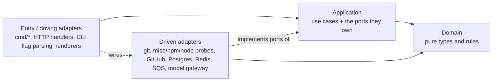

# ADR-007: Layered Ports-and-Adapters Architecture and Responsibility-Named Source Files

| Field | Value |
| --- | --- |
| Status | Accepted |
| Date | 2026-10-05 |
| Deciders | Repository maintainers |
| Supersedes | The ordinal `_partN` / `_body` / `_sigfixN` file split introduced while clearing self-scan findings |

## Context

`coach codesignal` scans this repository with the same thresholds it applies to customers: a file whose branch points (`if`, `for`, `switch`, type switch, `select`) reach 12 raises `complexity.branch_density`; a file with two or more pointer-returning functions, or two or more `New*` constructors, raises a density signal; a function nested 4 deep (function literals included) raises `complexity.max_nesting_depth`; and a function scoring 15 raises cognitive complexity. Clearing those findings across the repository split 747 Go files into ordinal fragments (`main_part2.go` … `main_part10.go`, `*_test_body_test.go`, `*_sigfix1_test.go`) and extracted nested test blocks into helpers named by position (`body_mainPart2Test_44`, `sigstartRecordingProxyListener39957725`).

The thresholds were met, but the split followed byte budgets rather than seams. One type's methods were scattered across three files, a file name no longer said what the file held, and a reader had to open every fragment to find a function. That is worse for humans and agents than the dense files it replaced: an agent locates code by file and package name, and an ordinal name carries none.

The density gate is per file and is the correct pressure. The missing piece was an architectural rule that says *where* a responsibility goes once a file is too dense to hold it.

## Options considered

All four options are layered; they differ in which way the dependencies between layers point, and that decides how much of the system can be tested without real I/O.

| Option | Shape | Testability | Verdict |
| --- | --- | --- | --- |
| Strict n-tier | presentation → business → data access; each tier calls only the one below it, concretely | Business logic imports the data tier, so a use-case test needs a real git repo, Postgres, or GitHub, or a mock of a concrete type. Test cost grows with every adapter | Feasible, least testable |
| Relaxed n-tier | as above, but a tier may skip down | Same coupling, plus presentation reaching data directly | Rejected |
| Vertical slices only | one package per feature, each owning its own I/O | Slices are small, but each slice mixes parsing, policy, and process execution, so the same coupling recurs inside each one | Rejected as the primary rule; kept as the grouping rule *within* a layer |
| Layered ports and adapters (dependency-inverted n-tier, "hexagonal") | domain ← application ← adapters; the application layer owns the interfaces (ports) adapters implement | Domain is pure (table tests over values); use cases run against in-memory fakes of their ports; each adapter is tested once against its real dependency. No test needs more than one real dependency | Chosen |

A layered architecture is feasible here because the repository already has the inner rings in place: `pkg/semantics` and `pkg/codesignal` are pure functions over bytes and values, `pkg/domain` holds the shared project facts, and the platform side already uses application-owned ports (`TaskQueue`, ADR-006; `CredentialResolver`, ADR-002; the `js/semantics` `Backend` seam). The work is to make the remaining packages follow the same direction and to name files and packages by the responsibility they hold.

## Decision

Organize Go code as **layered ports and adapters**: four layers with dependencies pointing inward only, grouped into capability packages within each layer.

### Layer map

| Layer | Packages | May import |
| --- | --- | --- |
| Domain | `pkg/domain`, `pkg/semantics`, `pkg/codesignal`, `pkg/projectmodel` analysis | Domain only (`pkg/semantics/internal/engine` is semantics' private parser adapter) |
| Application | `internal/codesignalcli` scan, readiness, setup, and config-authoring use cases; `internal/coachapi` job service; `internal/coachapi/worker`; `internal/agentloop`; `internal/rubrics` | Domain, and ports it declares itself |
| Driven adapters | `internal/codesignalcli` git and toolchain adapters; `internal/coachapi` stores and queue adapters (`queue/redisstream`, `queue/sqs`); `pkg/githubingest`; `internal/modelgateway`; `internal/authn`, `internal/authz` | Domain and the port they implement; never another adapter's internals |
| Entry | `cmd/*`, HTTP handlers, flag parsing, text/JSON rendering | Any inner layer; it is the only place that wires adapters into use cases |

The existing dependency rule still holds: `pkg/semantics` and `pkg/githubingest` never import each other.

### Rules

1. **Dependencies point inward.** A use case receives its I/O through an interface it declares (a port), not by constructing an adapter. Entry code constructs adapters and passes them in.
2. **A port lives with its consumer.** Declare the interface in the package that calls it, sized to what that caller uses. Adapters satisfy it implicitly.
3. **Group by capability inside a layer.** A package is named for what it does (`readiness`, `tstoolchain`, `gitrepo`, `store/postgres`), not for the layer (`services`, `utils`, `helpers`).
4. **One file, one named responsibility.** A file name states what the file holds: `flags_validate.go`, `catfile_reader.go`, `store_postgres_findings.go`. A type's methods live in the type's file unless a density gate forbids it; then the extra method or constructor gets its own file sharing the type's stem and named for what it does (`reader.go`, `reader_from_token.go`). Ordinal suffixes (`_part2`, `_body`, `_sigfix1`) are not responsibilities and are rejected by `mise run source-layout-check`.
5. **When the density gate fires, split along a seam.** Splitting a file means naming the two responsibilities it held. When a family of files in one package grows a shared prefix (`project_ts_compiler_*`), that prefix is a capability and becomes a package at the right layer.
6. **Tests mirror what they test.** A unit test file shares its production file's stem (`flags_validate.go` ↔ `flags_validate_test.go`). An acceptance spec is named for the behavior it specifies (`*_acceptance_test.go`); shared spec fixtures go in `*_fixtures_test.go` or `*_helpers_test.go`, never in a name the acceptance-style guard treats as a spec.
7. **Extracted helpers are named for their behavior.** A test helper pulled out to flatten nesting says what it asserts or builds (`expectSetupNeverContinues`, `serveRecordedProxyLines`), never where it came from (`body_mainPart2Test_44`) or a hash.

## Consequences

- A reader finds code by package and file name; no file needs to be opened to learn that it is not the one wanted.
- Use cases are testable with fakes of the ports they declare. Adapters carry their own tests against the real dependency (a temp git repo, Postgres in Compose, a recorded HTTP server).
- More packages, and some identifiers become exported to cross a package boundary. That is the price of a boundary the compiler enforces instead of one a file name implies.
- The density thresholds are unchanged. A future finding is resolved by naming a seam, not by appending a fragment, and `source-layout-check` makes the fragment route fail CI.
