# AI Coach System Design

## 1. Executive summary

AI Coach is a GitHub-native, policy-driven workflow and trust layer for AI-assisted software development. Its central abstraction is a versioned governed workflow contract, not a general-purpose agent runtime.

The architecture separates reliable GitHub event handling, a Go state machine that owns product policy, deterministic `pkg/semantics` and `pkg/codesignal` analysis, bounded `adk-go` agents and tools, and provider-neutral inference. SGLang with Qwen3.5-4B is the intended production inference path after evaluation; llama.cpp provides a lightweight local path behind the same model-gateway contract.

The recommended AWS v1 uses ECS/Fargate for the Go control plane and task-per-job isolated execution, ECS on EC2 GPU capacity for SGLang, SQS for work notification, DynamoDB plus transactional outboxes for idempotency/dispatch intent, Aurora PostgreSQL for workflow state, and S3 for immutable payloads/evidence. EKS is a later inference-plane option, not a co-equal v1 target. For proof of value, the self-hosted inference cell may scale to zero between scheduled pilot windows; the webhook/control plane never does. Docker Compose is the daily local default; the default core profile needs no model weights, while optional llama.cpp runs natively on macOS to use Metal/unified memory.

An intermediate **platform groundwork phase** (see `.github/specs/coach-api-platform-groundwork.spec.md` and `docs/product/prd.md`) precedes the webhook-driven platform above. It decouples end-user consumption from the feedback platform: an authenticated, versioned Coach HTTP API triggers asynchronous analysis jobs (self-serve PR-history scans, repository baseline scans) executed by a worker through an application-owned `TaskQueue` port over Watermill, with adapters for Redis Streams (local Docker Compose and Redis-first customer deployments) and SQS (AWS-leaning customer deployments). Agent judgment sits behind the same model-gateway contract served locally by llama.cpp. Job state, findings, diagnostics, and the JWT `jti` denylist remain in Postgres. This phase validates the deterministic-plus-rubric flow end to end in Docker Compose before any SGLang or AWS investment; the webhook ingestion plane, DynamoDB/outbox machinery, and GitHub feedback writes remain deferred until it succeeds. Groundwork-phase reports are retrieved only by the requesting user through the API — there are no GitHub writes at all in that phase.

## 2. Goals, non-goals, constraints, and principles

### Goals

- Put a trustworthy engineering workflow inside GitHub issues and pull requests.
- Enforce issue understanding, planning, subagent choice, requirement-linked tests, failing-test evidence, minimal implementation, adversarial review, and evidence-backed closure.
- Run deterministic analysis before expensive probabilistic reasoning.
- Scale toward 14,000 engineers and 80,000 repositories.
- Make duplicate, delayed, reordered, and retried events safe.
- Keep every developer-facing claim traceable to evidence.
- Provide a fast, realistic local environment without a GPU.

### Non-goals for v1

- General-purpose agent hosting.
- Developer scoring, surveillance, manager analytics, automatic approval, merging, or CI blocking.
- Unbounded model-initiated repository mutation.
- Training foundation models or reproducing GPU-serving performance locally.

### Constraints and principles

- The control plane and product authority are Go-first; `adk-go` orchestrates bounded agents and custom Go tools.
- SGLang is an inference backend behind a gateway, never the central orchestrator. vLLM is not the default.
- Verify `X-Hub-Signature-256` over the raw body, reserve `X-GitHub-Delivery`, durably enqueue, and return `202` well inside ten seconds.
- Policy before agency; evidence before completion; determinism before inference.
- Use at-least-once delivery with idempotent commands and effects.
- Fail open for advisory developer flow but fail closed for credentials and mutation.
- Preserve tenant context at every boundary.
- Keep deterministic findings and agent judgments distinct in schemas, storage, metrics, and UI.

## 3. Critical assumptions and open decisions

| Assumption | Recommendation | Tradeoff and validation |
|---|---|---|
| Event load | Initially design for 100 webhook requests/s sustained and 1,000/s burst | Replay measured GitHub event distributions; numbers are assumptions |
| v1 behavior | Advisory checks/comments only | Validate trust and noise with pilots |
| Repository mutation | Read-only by default; require authorized slash command, label, or explicit repository opt-in | Safer, but reduces autonomy; validate pilot demand |
| AWS compute | ECS/Fargate control plane and isolated task-per-job execution; ECS on EC2 GPU capacity providers for SGLang | Fargate has no GPU; EKS is a later ADR trigger |
| Product storage | Aurora PostgreSQL for workflows; DynamoDB for delivery/effect keys | Two data stores add operations but simplify transactional state and burst idempotency |
| Initial model | Adopt Qwen3.5-4B only after task evaluation | Measure structured-output validity, review precision, test quality, latency, and cost |
| Prefix reuse | Canonicalize stable policy, workflow, and tool-schema prefixes | Measure cacheable-prefix length and cache-hit rate without logging private prompts |
| Local model | Quantized 4B-class GGUF with llama.cpp | Benchmark memory, time to first token, and schema compliance on M4/16 GB |
| Pilot inference | One private SGLang/Qwen3.5-4B ECS-on-EC2 Spot cell may scale to zero; scheduled warm windows reduce cold-start disruption | Benchmark GPU fit, warm latency, Spot availability/interruption recovery, and pilot feedback delay before expanding tenants |

Still requiring validation: retention periods, exact GitHub permissions for system-owned advisory feedback, pilot tenancy, hosted-provider fallback policy, regional recovery targets, and the complete incremental cost of the pilot environment. Repository-content mutation is explicitly out of v1.

One open product tension must be resolved before adopting advisory check/comment delivery: GitHub checks and PR comments are visible to everyone with repository read access, so they cannot carry feedback promised as "private" to the author. During the groundwork phase, privacy holds by construction (authenticated API pull only, no GitHub writes). Any later "private digest" delivered through GitHub needs either an author-only channel or an explicit downgrade of the privacy promise — this is a product decision, not an implementation detail.

## 4. C4 Level 1: System Context

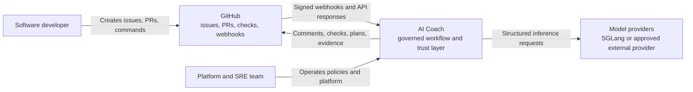

AI Coach receives GitHub events, applies installation and repository policy, analyzes immutable source snapshots, runs authorized workflow steps, and returns evidence-backed advisory feedback. Trust boundaries exist at public webhook ingress, GitHub API egress, model-provider egress, and operator access.

## 5. C4 Level 2: Container diagram

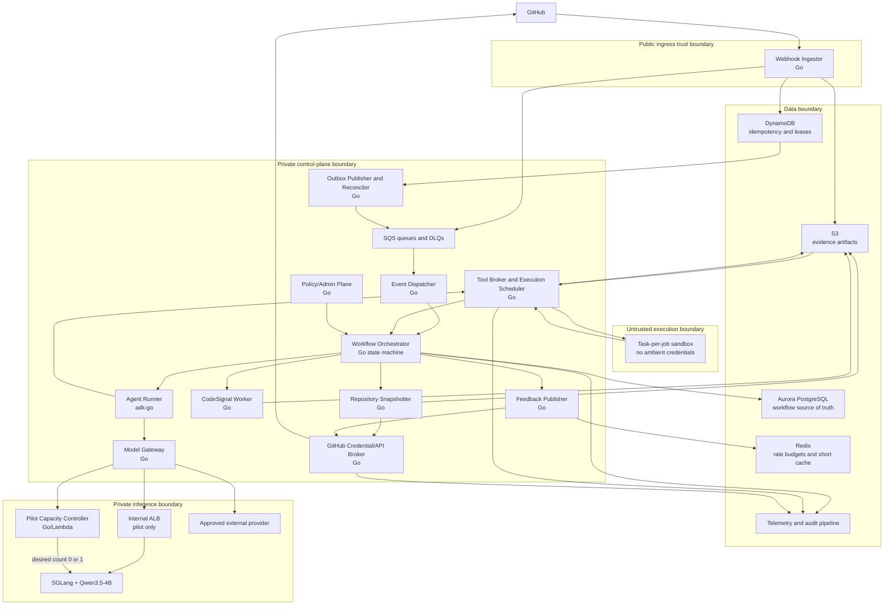

| Container | Responsibility and interface | Persistence | Scaling |
|---|---|---|---|
| Webhook Ingestor | HTTPS validation and durable payload/dispatch-intent creation before `202` | Content-addressed S3 payload + DynamoDB delivery state | Stateless on request rate |
| Outbox Publisher/Reconciler | Publish durable intents to SQS, recover partial failure, reconcile uncertain effects | DDB stream/outbox and PostgreSQL outbox | Partitioned consumers; lag/age scaling |
| Dispatcher | Normalize supported events and resolve tenant/repository policy | PostgreSQL commands | Queue depth and age |
| Workflow Orchestrator | Own contracts, transitions, authorization, budgets, timeouts, and evidence gates | Aurora PostgreSQL | Workflow-ID partitioning, optimistic locks |
| Repository Snapshotter | Resolve installation grants, fetch exact SHA safely, create immutable snapshots | Content-addressed S3 | Repository-fetch queue, tenant concurrency |
| CodeSignal Worker | Checkout immutable snapshot and run deterministic diff/semantic analysis | S3 artifacts, PostgreSQL metadata | CPU queue workers |
| Agent Runner | Execute bounded ADK jobs and typed Go tools | Evidence and receipts | Active jobs and token demand |
| Model Gateway | Provider policy, schema validation, budgets, timeouts, cache metadata | Non-authoritative cache/metrics | Concurrent requests |
| Pilot Capacity Controller | Idempotently request or observe inference-cell readiness; report `WARMING` without holding a client request | Short-lived readiness lease and ECS desired-state audit | One active wake per model cell |
| Pilot inference cell | One SGLang/Qwen3.5-4B task behind an internal ALB on ECS/EC2 GPU Spot capacity | Immutable serving image and ephemeral runtime cache | Zero or one task during proof of value |
| Feedback Publisher | Render and deduplicate checks/comments while coordinating GitHub limits | Effect records | Delivery queue/rate budget |
| Tool Broker/Execution Scheduler | Validate typed job intents, schedule isolated tasks, and broker content-addressed artifacts/receipts | PostgreSQL receipts/leases; S3 artifacts | Tenant-aware job pools |
| GitHub Credential/API Broker | Sole holder of App signing key and sole caller using installation tokens; resolve grants and execute fenced reads/effects | Secrets Manager key; grant/effect metadata | Installation-aware quotas |
| Execution Plane | Run hostile tests/builds in disposable credential-free task-per-job isolation | Disposable encrypted workspace; brokered artifact exchange | ECS task concurrency and tenant quotas |
| Policy/Admin Plane | Version and approve tenant/repository policies; no developer scoring | PostgreSQL policy snapshots | Low-volume, separately authorized |

Only webhook ingress is public. All GitHub API traffic from Snapshotter and Feedback Publisher traverses the GitHub Credential/API Broker; those callers never hold installation tokens. Agents cannot directly call GitHub, AWS, the model backend, or sandboxes: they produce structured recommendations or invoke typed read/proposal tools, while the Go orchestrator authorizes jobs and feedback effects. Inference and execution receive no GitHub/control-plane credentials. Tenant identifiers scope every data, cache, trace, queue, prompt-cache, and effect key. Pilot scale-to-zero is confined to the private inference cell; ingress, queues, workflow persistence, and deterministic analysis remain continuously available.

## 6. C4 Level 3: Critical components

### C4 Level 3A: Webhook ingestion and durable processing

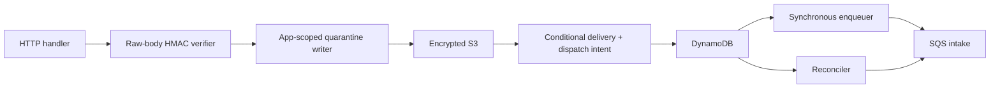

Require TLS, size/content-type limits, accepted event types, and `X-GitHub-Delivery`. Verify HMAC before parsing; invalid-signature bodies are never persisted. Operational request handling before durable state may fail and leave only an orphan object, so the persisted delivery state machine intentionally begins `DURABLE -> DISPATCHED`; request failures are metrics/log outcomes, not fictitious `RECEIVING` or `FAILED` records. Write the verified raw body or canonical encrypted envelope to an app-scoped quarantine key `(app_id, delivery_id, payload_hash)` with dedicated KMS context, then conditionally create `(app_id, delivery_id)` with payload hash/ref and durable dispatch intent. Publish a small payload reference to SQS synchronously and return `202` only after the payload, intent, and SQS receipt are durable. If SQS publication fails, return a retriable `5xx`; the retained intent lets the reconciler recover safely. After GitHub grant resolution, all normalized events, snapshots, and derived artifacts use authoritative tenant scope. Keeping large bodies in S3 avoids queue-size coupling, while the durable intent and stable message key close the enqueue/receipt dual-write gap.

For a repeated delivery ID, equal payload hash returns `202`; a different hash is rejected and security-alerted. `DURABLE` records not observed as `DISPATCHED` are republished with a stable message key. Enqueue success followed by state-update failure therefore yields a harmless duplicate. TTL applies only after the configured replay/audit window and never deletes the quarantine object before its delivery record; a replay after TTL is treated under an explicit replay policy, not silently as new. Orphaned quarantine objects are lifecycle-collected without cross-tenant deduplication.

### C4 Level 3B: Governed workflow orchestrator

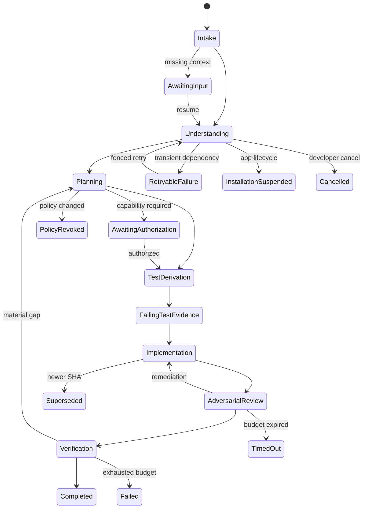

Commands include `StartWorkflow`, `RecordUnderstanding`, `UpsertPlan`, `SelectExecutionTopology`, `DeriveAcceptanceTests`, `RecordFailingTests`, `AuthorizeImplementation`, `RecordImplementation`, `RequestAdversarialReview`, and `VerifyEvidence`. Every transition checks expected workflow version, policy version, actor/capability, evidence, and resource budgets. Subagents are an explicit recorded workflow decision, not an unrestricted agent behavior.

### C4 Level 3C: Deterministic CodeSignal/semantics fast path

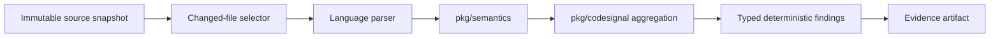

Results include analyzer/rule version, repository and commit identities, file hashes, stable fingerprint, location, reproducible inputs, and `source=deterministic`. An agent may contextualize or propose a governed suppression, but cannot overwrite a deterministic result; its separate record uses `source=agent`.

#### CLI preview

`coach codesignal` (`cmd/coach`, `internal/codesignalcli`) is a local-only, deterministic validation surface over the same `pkg/semantics` -> `pkg/codesignal` pipeline, run directly against a checked-out Git revision instead of through the worker/queue path above. It exists to make this fast path usable and testable before the broader delivery infrastructure (job worker, queue, GitHub App integration) is adopted. It does not replace the CodeSignal Worker described elsewhere in this document, and it never contacts a queue or GitHub: it reads two Git revisions from the local worktree with `git show`/`git diff`, analyzes each changed file, and prints (or emits as JSON) the resulting report.

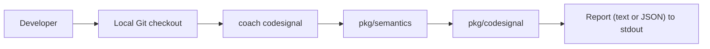

Contrast with the flow above: the worker path consumes an immutable snapshot through a queue and produces a governed evidence artifact as part of a larger workflow; the CLI path is a developer running one command against their own worktree, printing a report to their own terminal. Both share the same deterministic `pkg/semantics`/`pkg/codesignal` core, but the CLI path stays local and advisory — it does not execute code, does not perform cross-file analysis, does not prove a defect, and does not publish GitHub feedback or block CI on its own.

### C4 Level 3D: Agent and tool-execution boundary

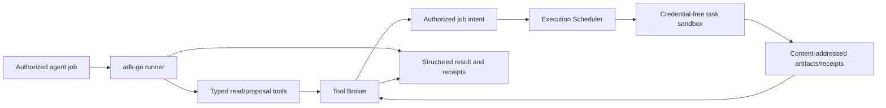

Tools narrowly read snapshots/findings, update plans, propose tests/patches, or request an allowlisted test job. Agents never request or publish GitHub effects: they return structured recommendations, and the Go orchestrator/policy independently decides whether to schedule a system-owned advisory feedback effect. The broker validates state, tenant, policy, capability token, schema, and effect key. Model text never directly becomes a shell command, API call, query, or publication.

Hostile repository execution is a separate security plane, not an ordinary rootless application container. Use Fargate's per-task isolation or a reviewed microVM-equivalent, ideally in separate subnets/account; a security benchmark and architecture review are adoption gates. Jobs have no GitHub/AWS/control-plane credentials, Docker socket, shared volumes, or IMDS; use immutable images, disposable encrypted workspaces, strict CPU/memory/PID/time/output limits, and broker-endpoint-only artifact exchange. Egress is denied except through a policy-controlled dependency proxy. Checkout is by immutable SHA with hooks disabled, submodules/LFS off by default, and symlink/path-traversal validation.

### C4 Level 3E: Model gateway and inference backends

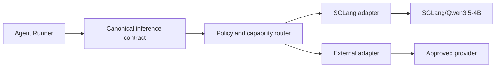

Requests contain task type, stable/cacheable prefix identity, structured-output schema, budgets, data policy, and trace IDs. Responses contain validated output, provider/model identity, usage, finish reason, latency, and cache metadata. Stable workflow/policy/tool-schema content precedes request-specific content. Cache keys include every prompt-affecting version. Fallback is allowed only by tenant data policy. The gateway never decides workflow completion.

#### Pilot scale-to-zero behavior

The pilot uses an internal capacity controller, called only by the Go model gateway, to set the GPU service desired count from `0` to `1` idempotently and to observe its health. A cold cell produces a typed `WARMING` result; the orchestrator checkpoints and requeues the authorized agent job with bounded backoff. It does **not** rewrite an inference request to `202`, and it never changes the GitHub webhook response path. This matches the Coach's asynchronous workflow contract: the developer receives deterministic feedback immediately where available and a clearly deferred private digest when agent reasoning is waiting for the model.

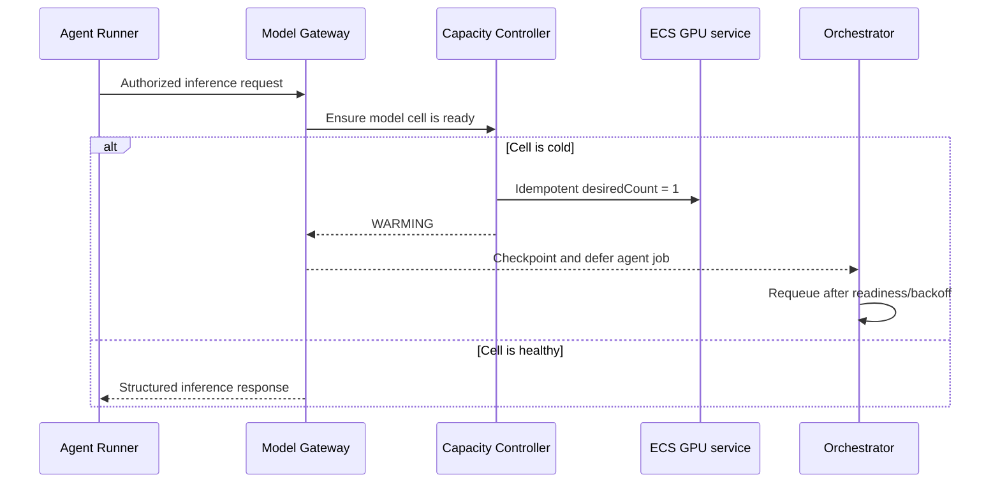

### C4 Level 3F: Developer feedback

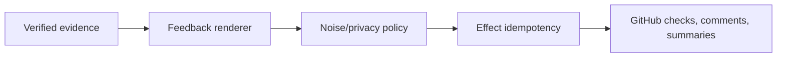

Feedback distinguishes deterministic observations, agent interpretations, missing evidence, performed actions, proposals, and uncertainty. A `feedback_effect` progresses through `PLANNED`, `IN_FLIGHT` (leased with fencing token), `CONFIRMED`, or `UNCERTAIN`; uncertain effects move through `RECONCILING` before `CONFIRMED` or `FAILED`. Embed a stable hidden marker or supported `external_id`, prefer update-in-place, and reconcile by marker/object ID before retry. Never blindly repeat an `UNCERTAIN` write. PostgreSQL transitions create an outbox row in the same transaction; the outbox publisher, not the orchestrator, submits work. v1 remains non-blocking.

## 7. Key workflows

### Event intake

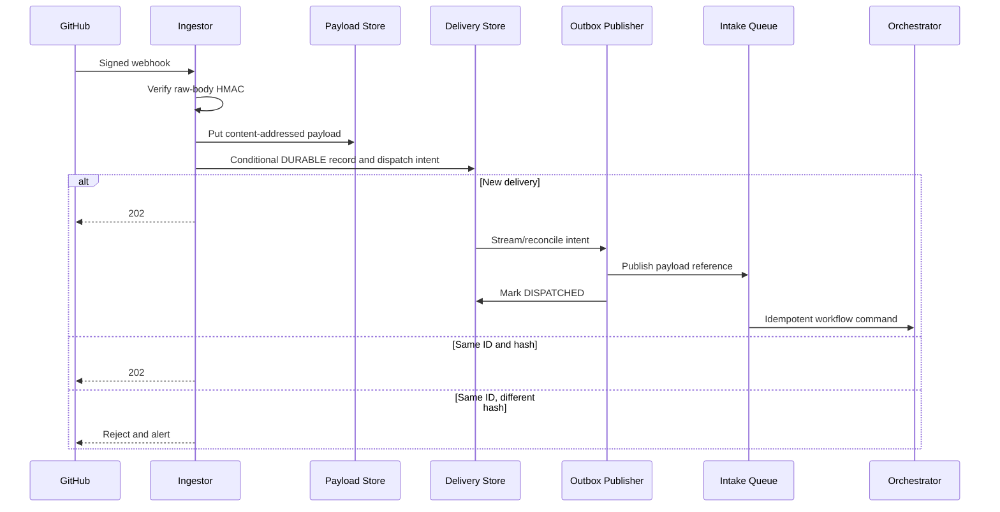

### Governed issue-to-implementation

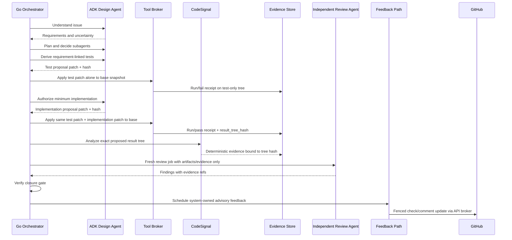

In v1, tests and implementation exist only as sandbox proposals; no branch, commit, or PR content mutation occurs. The test-proposal patch is applied alone to `base_commit_sha` and must fail. The identical `test_patch_hash` plus `implementation_patch_hash` is then applied independently to the same base and must pass, producing a content-addressed `result_tree_hash` because no commit exists. Both receipts bind the same test hash, command digest, environment/execution-image digest, base SHA, attempt, stdout/stderr refs, exit result, and timestamps; post-proposal CodeSignal evidence binds the exact result tree. The adversarial reviewer is a fresh ADK job/context receiving artifacts and evidence, never the implementer's hidden conversation state. GitHub branch/commit/PR-content writes are a Next-phase capability requiring explicit activation.

### Deterministic plus agent reasoning

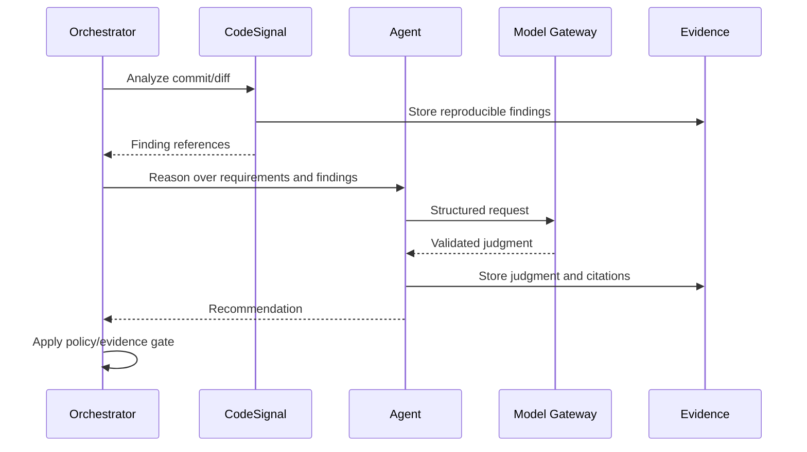

### Retry and recovery

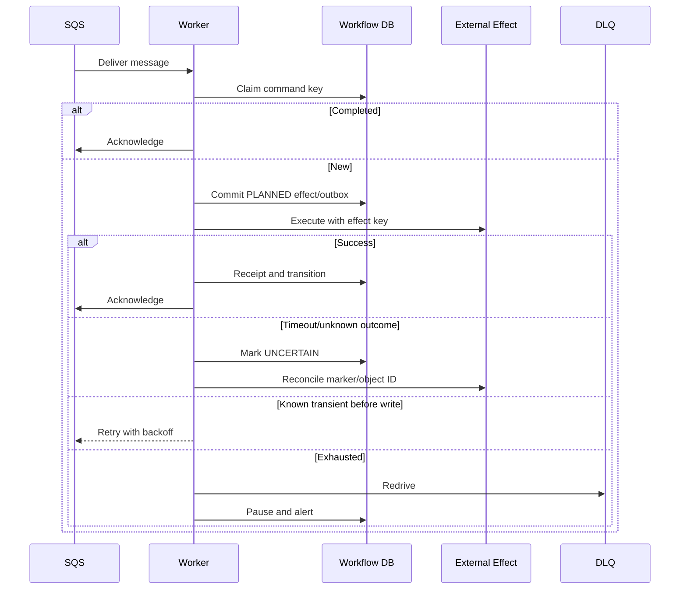

Long work uses fenced leases, bounded heartbeats, and checkpointed commands rather than holding an SQS message indefinitely. Poison messages are classified as schema, policy, unsupported input, or repeated execution failure; DLQ replay requires an operator-authored replay record and preserves the original idempotency key.

## 8. AWS production deployment

- Route 53, WAF, and an ALB expose only ingress and health endpoints.
- ECS/Fargate runs Go services and isolated task-per-job execution in private subnets across at least two AZs; production data services are Multi-AZ. SGLang runs on ECS/EC2 GPU Auto Scaling Groups/capacity providers because Fargate has no GPU. EKS is adopted later only if measured GPU scheduling/multi-model requirements trigger its ADR.
- SQS Standard queues (`github-events`, `workflow-commands`, `codesignal-jobs`, `agent-jobs`, `tool-jobs`, `feedback-jobs`) each have a DLQ. Use FIFO only where ordering is proven necessary.
- Aurora PostgreSQL Multi-AZ is the workflow source of truth; DynamoDB on-demand holds idempotency/leases; versioned KMS-encrypted S3 holds evidence; Redis holds non-authoritative rate budgets/cache.
- The credential broker is the sole holder/user of the GitHub App signing key. It resolves and caches numeric installation-to-repository grants through GitHub before privileged reads, mints short-lived installation tokens, and reauthorizes every effect. Suspension/deletion stops new work, revokes leases, pauses runs, and prevents effects; repository transfer invalidates snapshots/policy and requires grant resolution before resumption.
- Use private security groups and VPC endpoints for managed AWS services. Inference accepts traffic only from the gateway. Sandboxes use a separate deny-by-default egress policy.
- Secrets Manager/KMS stores webhook secrets and the GitHub App key. Support bounded dual-secret rotation. Mint installation tokens just in time; never expose them to prompts or inference.
- Scale ingress by request rate/latency, workers by queue depth and oldest age, agents by active jobs/token demand, and inference by queue delay, token throughput, GPU memory, and cache hits.
- Apply tenant-aware fair scheduling: shard/partition scheduling keys by installation, cap per-installation analysis/agent/token concurrency, isolate hot tenants, coalesce superseded events for the same PR/SHA, and reject/defer work exceeding repository/diff or global admission budgets. Redis coordinates budgets, but loss falls back to conservative per-worker quotas or deferred work—never fail-open API fan-out.
- Coordinate GitHub rate limits per installation from response headers. Secondary limits cause installation-specific backoff. Coalesce feedback and reserve capacity for recovery.
- Enable PITR for Aurora/DynamoDB, S3 versioning/lifecycle, infrastructure as code, restore drills, and idempotent replay. S3 payloads and PG/DDB command/outbox state—not SQS—are recovery sources. **Assumption:** v1 regional-outage recovery is best-effort until measured restore drills and optional S3 cross-region replication/Aurora cross-region backups establish a supported RPO/RTO. Regional replay rebuilds queues from durable undispatched commands and may delay feedback but cannot bypass idempotency.

### Proof-of-value AWS inference profile

This profile incorporates the cost-conscious pilot proposal without promoting pilot shortcuts into platform-wide reliability claims.

- Keep the Go control plane, signed-webhook ingestion, SQS, persistence, and deterministic CodeSignal path available. Only the self-hosted inference cell scales to zero; GitHub deliveries must still receive their durable `202` response on time.
- Run one private SGLang/Qwen3.5-4B task on an ECS EC2 GPU capacity provider with a Spot-first Auto Scaling group whose minimum is zero. Treat `g4dn.xlarge` as a benchmark candidate, not a committed sizing decision: validate model/runtime overhead, supported context length, and cache headroom before adoption. During defined pilot hours, use scheduled warming and an idle timeout; outside those windows, jobs are queued and resume after the cell is healthy. Do not promise a fixed warm-up ETA.
- Use an internal ALB only between the Go model gateway and the private SGLang task. Do not introduce Envoy AI Gateway or a Lua `503`-to-`202` interceptor in the proof-of-value path: it duplicates the existing Go gateway and would blur a deferred model job with a successful synchronous inference response. Reconsider Envoy only after the pilot demonstrates a concrete need for data-plane policy, streaming mediation, or gateway telemetry beyond the Go gateway.
- The capacity controller may be a small Lambda or a Go-owned AWS adapter, but must use a stable model-cell key, a short lease, and audit records so concurrent jobs cause one wake request. It reports readiness through health checks; it never receives GitHub credentials or prompt/source content.
- For the single pilot model, prefer an immutable serving image containing the reviewed model/tokenizer only if its measured pull-and-load time is better than an approved internal artifact cache. Record the model, tokenizer, configuration, serving image, and build provenance digests; disable remote-code execution; scan/sign the image; and use ECR/VPC endpoints. Never download model artifacts dynamically at runtime.
- The proposal's roughly `$25.50/month` is an **inference-only directional estimate** under its stated assumptions: one Spot `g4dn.xlarge`, 40 hours/week, and already-paid shared ALB/NAT infrastructure. It excludes the Coach control plane, data stores, observability, shared-network allocation, Spot unavailability, and regional pricing. Track actual incremental cost per admitted workflow and per useful private digest; set a pilot budget/alert rather than treating that estimate as an all-in platform price.
- If Spot capacity is unavailable or interrupted, the capacity controller marks the model unavailable, the orchestrator pauses/requeues only agent stages, and deterministic feedback continues. Escalate to scheduled On-Demand capacity only if the pilot's measured feedback-delay target requires it; do not silently fall back to an external provider without tenant data-policy approval.

## 9. Local development on M4/16 GB

### Default: Docker Compose; ECS/AWS integration gates

Compose has lower memory/operational overhead, faster rebuild/debug loops, and preserves the important service, API, queue, and state-machine boundaries. Because the production control plane is ECS, its parity gates are ECS task-definition/IaC validation and an AWS integration account—not kind. Retain kind only if/when EKS inference is adopted.

**Two local topologies (do not conflate):**

| Phase | Compose contents | Queue | Auth | When |
|---|---|---|---|---|
| **Groundwork (current)** | `coach-api`, `coach-worker`, Postgres, Redis, model stub; optional llama.cpp | Watermill → Redis Streams (SQS adapter via conformance suite, not required in daily compose) | GitHub OAuth App + Coach-JWT; config-gated test mint for smoke | Daily pilot path; see Baseline Scan spec Story 4 |
| **Webhook platform (v1+)** | Webhook ingestor, control-plane workers, Postgres, LocalStack (SQS/DynamoDB/S3), model stub; optional llama.cpp | SQS (+ DynamoDB delivery/outbox) | GitHub App webhooks + installation broker | After groundwork E2E validation |

The groundwork stack does **not** require LocalStack, DynamoDB, S3 quarantine, or webhook replay. The diagram below is the **v1+ webhook-platform** local topology.

```mermaid
flowchart TB
    Replay["Webhook replay CLI or tunnel"] --> Ingest["Go webhook ingestor"]
    Ingest --> LS["LocalStack<br/>SQS, DynamoDB, S3"]
    LS --> Workers["Go control-plane workers"]
    Workers --> PG["PostgreSQL"]
    Workers --> Gateway["Go model gateway"] --> Stub["Deterministic model stub<br/>default"]
    Gateway -. optional via host.docker.internal .-> Llama["Native macOS llama.cpp<br/>Metal, quantized 4B"]
    Workers --> Fake["GitHub API fake/record-replay"]
```

| Group | Target memory |
|---|---:|
| Default Docker VM cap | 5–6 GB |
| Go services and deterministic model stub | 0.6–1.0 GB |
| PostgreSQL (`512 MB` container limit) | 0.3–0.5 GB |
| LocalStack (`1 GB` limit; SQS/DDB/S3 only) | 0.6–1.0 GB |
| GitHub fake/support | 0.2–0.4 GB |
| Optional native Q4 4B model | approximately 2.5–3.5 GB unified memory |
| Optional native KV/runtime headroom | 0.5–1.5 GB |

`core+agent` works offline without model weights or network using the deterministic stub. Observability is off by default. Optional llama.cpp runs natively to use Metal and avoid Docker overhead, with serial inference, 2–4K context, bounded KV cache, and measured memory-pressure/latency acceptance. Profiles: `core`, `agent`, optional `real-inference`, and optional `observability`.

Use `mise` and versioned `mise.toml` tasks as the developer interface. Tasks encapsulate the Compose profiles and other local commands so the workflow stays consistent across macOS, CI, and future ECS/AWS integration gates.

```text
mise run bootstrap
mise run up-core
mise run up-agent
mise run db-migrate
mise run replay -- testdata/webhooks/pull_request_opened.json
mise run workflow-watch
mise run test-contract
mise run test-integration
mise run test-ecs-iac
```

llama.cpp is used only behind the production gateway contract and supports quantized GGUF loading, constrained/schema-validated output, cancellation, budgets, and prompt/KV caching where available. Tests verify canonical-prefix identity and invalidation when policy, workflow, tools, analyzer, or model changes. They do not claim to reproduce SGLang RadixAttention or GPU batching. Running untrusted repository tests locally is explicit opt-in and must occur in a disposable VM; Compose is not a hostile-code security boundary.

| Fidelity gap | Local coverage | Production coverage |
|---|---|---|
| SGLang/GPU/RadixAttention | llama.cpp cache and canonical-prefix contract tests | GPU staging cache/load benchmark |
| IAM/KMS/VPC | LocalStack/fakes | Isolated AWS integration account |
| Exact SQS/DynamoDB behavior | LocalStack | Managed-service contract tests |
| GitHub secondary limits | Configurable fake | Staging GitHub App |
| ALB/WAF/Multi-AZ | Restart/fault injection | Deployment smoke and chaos tests |
| ARM versus x86/GPU | Multi-arch CI builds | Staging compatibility tests |
| ECS placement/task/IAM | Static IaC/task-definition tests | AWS integration account |
| EKS, only if adopted | kind | EKS staging |

## 10. Data model and state machine

| Entity | Key fields |
|---|---|
| `tenant` | installation/account ID, status, data policy |
| `repository` | tenant, GitHub repository ID, policy reference |
| `delivery` | app/delivery ID, event, payload hash/reference, status/timestamps |
| `workflow_contract` | semantic version, stages, evidence rules, capabilities |
| `workflow_run` | tenant/repository, trigger, contract/policy version, state/version, SHAs, budgets |
| `workflow_transition` | sequence, prior/new state, command, reason, actor, timestamp |
| `requirement` | stable ID, source, statement, uncertainty |
| `feature_plan` | version, requirement links, steps, subagent decision |
| `acceptance_test` | requirement links, expected behavior, implementation ref |
| `evidence` | type/source, artifact URI/hash, producer version, base SHA, test/implementation patch hashes, result tree hash |
| `finding` | fingerprint, deterministic/agent source, rule/model version, status |
| `agent_job` | objective, capabilities, model policy, budget, status |
| `tool_receipt` | effect key, tool version, input/result hashes, authorization |
| `feedback_effect` | target, effect key, GitHub object ID, content hash/status |
| `audit_event` | tenant, actor, action, resource, decision, trace/time |
| `normalized_event` | schema version, delivery/payload hash, installation/repository/action/SHA |
| `snapshot` | immutable commit/tree identity, content-addressed artifact, fetch policy |
| `command_ledger` / `outbox` | command/effect uniqueness key, state, payload ref, attempt |
| `lease` | resource, owner, fencing token, heartbeat/expiry |
| `model_invocation` | prompt/version hashes, model/tokenizer/provider digest, usage/outcome |
| `policy_snapshot` | immutable effective tenant/repository/workflow policy and approval |
| `retention_record` | artifact class, expiry/legal hold/deletion verification |

Idempotency exists at delivery, normalized command, workflow start, transition, tool effect, and GitHub feedback layers. Workflow uniqueness is `(installation_id, repository_id, trigger_kind, trigger_number, head_sha, contract_version)`; newer PR SHAs supersede/coalesce queued older runs unless policy preserves them. A transition transaction verifies expected workflow version, records command ID, evaluates guards, appends transition/outbox records, and increments version. Conflicts reload and reevaluate rather than retrying stale state.

The lifecycle also includes `AwaitingInput`, `AwaitingAuthorization`, `RetryableFailure`, `Cancelled`, `Superseded`, `InstallationSuspended`, `PolicyRevoked`, `TimedOut`, and terminal `Failed`. The subagent decision is a first-class transition with rationale and policy evidence. SHA change, installation lifecycle, or policy revocation invalidates outstanding leases and causes an explicit transition rather than silent continuation.

Evidence is immutable and content-addressed. Closure independently recomputes hashes, validates producer/tool/image versions and required relationships, and checks artifacts are readable; it never trusts a producer-set `verified` flag. Closure requires requirement-linked failing-test evidence against the pre-implementation SHA, passing evidence against the proposed patched workspace, test identity/environment/command/exit status, deterministic findings, review outcome, and unresolved-risk disclosure. Waivers are explicit, authorized, time-stamped, policy-governed, and visible.

## 11. Security and supply chain

- Verify signatures before parsing and use immutable numeric installation/repository IDs as authority keys.
- Request minimum GitHub permissions. V1 permits only system-owned advisory feedback writes (fenced check/comment create/update) scheduled by Go policy; repository-content mutations such as branches, commits, file updates, and PR creation are prohibited. Next-phase content mutation requires explicit developer activation. The GitHub API broker resolves the numeric installation-to-repository grant before privileged reads and again at effect time; webhook-body relationships are untrusted claims.
- Tenant scope is mandatory in repository APIs and PostgreSQL row-level policies, S3 prefixes/KMS encryption context, queue envelopes, caches including prompt-prefix caches, rate budgets, traces, leases, and effect keys. Cross-tenant access is denied even if an application filter is omitted.
- Treat issue text, comments, source, tests, and generated files as hostile prompt-injection inputs.
- Bind capability tokens to tenant, repository, workflow stage, tool, expiry, and budget.
- Use the dedicated task-per-job isolation plane described in 6.4; rootless containers alone are not a sufficient hostile-code boundary. Exclude Docker socket, shared volumes, IMDS and ambient credentials; use immutable images, disposable encrypted workspaces, hard resource/output limits, brokered artifacts, and deny-by-default egress.
- Pin parser grammars, Go/Python toolchains, base images, dependencies, and GitHub Actions by immutable digest/SHA. Use hermetic/reproducible builds where feasible, isolated build credentials, signed SBOM/provenance verified at deployment, protected releases, and approved internal Go/Python/container mirrors. No runtime dependency install is allowed except through the sandbox dependency proxy. Minimize the Python/SGLang surface outside the Go control plane.
- Record compatible model, tokenizer, config, conversion, quantization, serving-image, and GGUF digests; source, license review, evaluation version, and approval. Mirror artifacts internally, verify digest compatibility before load, and test conversion fidelity.
- Maintain emergency deny lists and rollback procedures for analyzer rules, tools, parser grammars, models, tokenizer/configs, and serving images. Policy revocation pauses affected workflows and invalidates their cache keys/leases.
- Never log raw webhooks, source, prompts, patches, tokens, or secrets by default. Store encrypted evidence under explicit retention/access rules and redact before telemetry export.
- Show developers which provider received data. Do not create individual performance analytics.

## 12. SLOs, metrics, alerting, capacity

All initial numbers are assumptions.

| Indicator | Initial objective |
|---|---:|
| Valid webhook durable acceptance | 99.95% monthly |
| Webhook acknowledgment | p95 <1s; p99 <3s |
| Normal event begins processing | 99% within 60s |
| Deterministic-only feedback | 95% within 2 min |
| Bounded full workflow feedback | 95% within 10 min, excluding repository CI |
| Model gateway availability | 99.5%; degradation remains non-blocking |

Duplicate publication, tenant-isolation breach, unauthorized effect, and closure on invalid/missing evidence are correctness invariants with zero known violations, not availability percentages. Any violation pauses the affected pipeline and triggers incident response.

Capacity is modeled as `accepted events/s × eligible fraction × stage fan-out × deterministic CPU-seconds` for CPU workers, and `eligible workflows/s × model calls/workflow × input/output tokens` for inference. The provisional 100/s sustained and 1,000/s target assumes a five-minute burst, but payload p50/p95/p99, repository/diff percentiles, eligible fraction, installation skew, SGLang tokens/s/concurrency, target queue-drain time, and cost per admitted workflow must be measured. Admission budgets cap bytes/files/diff, workflow fan-out, tokens, wall time, and cost. Unsupported or over-budget events receive explicit partial/deferred feedback and are excluded from completion SLOs; queue-start and admitted-work completion are reported separately.

During inference outage, ingestion and deterministic feedback continue. Agent stages enter bounded `RetryableFailure` or publish clearly incomplete advisory results; they never block GitHub or silently use a provider disallowed by policy.

Measure signature failures, duplicates, enqueue/ack latency, queue age/depth/DLQs, workflow dwell/retries/pauses, analyzer latency/errors, agent outcomes/tool denials/schema failures, model TTFT/tokens/cache hits/fallbacks, GitHub rate budgets, duplicate-effect suppression, and evidence integrity.

For the proof-of-value inference profile also measure cold-start p50/p95, time from wake request to healthy target, scheduled-warm hit rate, Spot fulfillment/interruption rate, deferred-agent-job age, model-cell idle hours, ECR/image load time, GPU memory/cache headroom, and incremental cost per admitted workflow and per useful private digest. These measurements—not an assumed monthly price—decide whether to retain Spot-only scale-to-zero, add scheduled On-Demand coverage, or keep inference external.

Page on acceptance-SLO burn, queue age threatening feedback, multi-tenant DLQ growth, database/evidence integrity failure, suspicious signature spikes, or tenant isolation/credential signals. Ticket tenant-specific throttling, model-quality drift, low cache reuse, and oversized repositories. Use multi-window burn-rate alerts.

## 13. Testing and validation

- Behavior tests bind requirements to scenarios: valid webhook acceptance, duplicate suppression, refusal to implement without failing tests, deterministic provenance preservation, unauthorized tool denial, and evidence-complete closure.
- Contract tests cover event envelopes, gateway adapters, structured output, GitHub client, ADK tools, CodeSignal fingerprints, and evidence formats.
- Compose integration tests exercise PostgreSQL, LocalStack, GitHub fake, and llama.cpp or a deterministic model stub.
- Isolated AWS tests cover real SQS visibility, DynamoDB conditions, S3/KMS, IAM, and Secrets Manager. A staging GitHub App covers redelivery, suspension, transfer/rename, token expiry, checks, and limits.
- Load test 1,000 webhook/s bursts, downstream outage/drain, hot installations, large repositories/diffs, repeated-prefix model mixes, and comment coalescing.
- Chaos tests kill workers after effects but before ack, reorder/duplicate messages, expire tokens, degrade/malform models, remove evidence, suspend installations, and restart dependencies.
- Pilot-environment tests verify that a cold inference cell checkpoints and resumes an agent job without affecting webhook acknowledgment, that concurrent requests produce one fenced wake, that a Spot interruption leaves no duplicated effect, and that the immutable serving image/model digests match the approved manifest.
- Promotion gates: unit/behavior tests; supply-chain/provenance checks; Compose integration; contract compatibility; ECS IaC/task-definition validation; AWS staging/migrations; kind only for an adopted EKS path; model-quality gate; canary tenant; human feedback-quality review.

## 14. Phased implementation

### Groundwork (current)

Parent index: `.github/specs/coach-api-platform-groundwork.spec.md`. Vertical slices: [Baseline Scan](../../.github/specs/coach-api-platform-baseline.spec.md) (shared platform + `repo_baseline_scan`) then [PR History Scan](../../.github/specs/coach-api-platform-pr-history.spec.md) (`pr_history_scan`). Sequenced before the v1 platform below; Baseline E2E validation is the investment gate for SGLang and AWS. Binding groundwork ADRs: ADR-001 through ADR-006 in this directory.

1. Coach HTTP API (`/v1`): async job submit/status/report. Authentication is a **GitHub OAuth App** issuing Coach-signed JWTs bound to a verified `Principal` (ADR-001); self-serve enforcement uses principal identity plus repository role checks (ADR-003) and job-ownership isolation (ADR-004). Identity credentials are never used for repository reads (ADR-002). Submit persists the job in Postgres then enqueues on `TaskQueue` (job id idempotency key); full DynamoDB/outbox ingress remains deferred — see Baseline Scan Design — Submit durability.
2. Worker over an application-owned `TaskQueue` port over Watermill, with Redis Streams and SQS adapters, heartbeat/crash recovery, and a black-box provider conformance suite (ADR-006). Job state, findings, diagnostics, and the JWT `jti` denylist remain in Postgres. DynamoDB and transactional outbox machinery stay deferred until the webhook-driven platform.
3. Model gateway seam with deterministic stub (default) and llama.cpp OpenAI-compatible client; SGLang slots in later behind the same contract.
4. Minimal bounded agent tool loop over typed tools (semantics, codesignal; GitHub PR tools when the PR History slice lands); model text never becomes an arbitrary action (ADR-005). `adk-go` remains the later production agent runtime.
5. `repo_baseline_scan` in the Baseline slice requires tree enumeration + file reads in `pkg/githubingest` (beyond today’s single-file `ReadFile`). PR listing/file retrieval and `pr_history_scan` in the PR History slice.
6. Two seed LLM-as-judge rubrics, versioned and schema-validated, with strict deterministic/agent provenance separation.
7. Docker Compose stack for groundwork: `core` = coach-api + coach-worker + Postgres + Redis Streams + deterministic model stub (no weights, no LocalStack required); `llm` profile adds llama.cpp. End-to-end smoke in CI against `core`.

### v1

1. Version the workflow contract, state machine, evidence model, and audit events.
2. Build signed webhook ingestion, delivery deduplication, SQS, and fast acknowledgment.
3. Add installation/repository policy and system-owned, non-blocking advisory feedback writes through the GitHub API broker.
4. Productize `pkg/semantics` through versioned `pkg/codesignal` findings.
5. Add ADK Go agents for understanding, planning, test derivation, adversarial review, and ephemeral sandbox proposals. Agents cannot initiate GitHub writes; Go policy schedules advisory feedback.
6. Build the model gateway/local llama.cpp adapter and evaluate Qwen3.5-4B.
7. Deploy SGLang only after evaluation and publish visible provenance/evidence.
8. Run the proof-of-value inference profile: one private ECS/EC2 Spot cell, scheduled warm windows, scale-to-zero only for inference, and cost/latency/quality measurement tied to private-digest value.
9. Support Compose daily, ECS/IaC integration tests, and kind only if EKS inference is adopted.

### Next

- Explicit command-driven repository-content mutations from already-isolated proposal sandboxes; branches/commits/PR changes remain separately authorized.
- Governed subagent decomposition, richer check-run UI, policy packages, more CodeSignal rules/languages, provider fallback controls, large-repository strategies, and recovery UI.

### Later

- EKS inference if GPU scheduling warrants it, evaluated multi-model routing, stronger regional recovery, and explainable organization workflow templates. Consider optional CI enforcement only after explicit demand, proven precision, transparent policy, and reversible rollout.

## 15. Architecture decision records

| Decision | Recommendation | Rationale | Alternatives / validation |
|---|---|---|---|
| Product authority | Go state machine | Typed, auditable deterministic policy | Agent-led/BPM; validate change velocity |
| Agent orchestration | `adk-go` custom tools | Fits Go and capability boundary | Custom/Python; validate maturity/cancellation/tracing |
| Control plane | ECS/Fargate first | Lower platform overhead | EKS/Lambda; validate scale/cost |
| Inference plane | ECS/EC2 GPU capacity providers; EKS only on measured trigger | Fargate has no GPU; keeps v1 platform unambiguous | EKS day one/managed only |
| Queue (production webhook platform) | SQS Standard plus idempotency | Burst absorption, low operations | Kafka/FIFO/direct RPC; validate ordering |
| Queue (groundwork) | Watermill `TaskQueue`/`EventBus` with Redis Streams + SQS adapters; job state in Postgres | Multi-deployment (Compose/self-hosted Redis and AWS SQS); no DynamoDB/outbox yet | See ADR-006; Postgres-only queue rejected |
| Product DB | Aurora PostgreSQL | Transactional workflow/evidence model | DynamoDB-only; load-test |
| Delivery dedup | DynamoDB conditional put/TTL | Burst-efficient first-writer semantics | PostgreSQL/Redis; validate retention |
| Evidence | S3 plus hashed metadata | Durable/cost-effective | DB blobs; validate access/retention |
| Model interface | Go provider gateway | Provider isolation and policy | Direct provider calls; measure overhead |
| Model | Qwen3.5-4B after evaluation | Intended small footprint | Other open/hosted model |
| Serving | SGLang | Structured repeated-prefix fit | vLLM/llama.cpp/managed; benchmark value |
| Proof-of-value inference | One private ECS/EC2 Spot SGLang cell that can scale to zero | Limits idle GPU burn while retaining the production provider contract | Always-on GPU, external provider; validate warm delay, Spot availability, and incremental cost |
| Pilot wake path | Go gateway/controller returns typed `WARMING` and requeues the agent job | Preserves durable async workflow semantics | Envoy/Lua `503` translation; revisit only for a measured data-plane need |
| Model artifact delivery | Benchmark immutable reviewed serving image versus approved internal artifact cache | One model may justify baked layers, but provenance and cold-start data decide | Runtime internet download; prohibited |
| vLLM | Not default | Smaller supply-chain surface | Add only for measured capability gap |
| Local topology | Compose daily; ECS/IaC and AWS-account integration | Matches ECS control plane within a 5–6 GB VM cap | kind/native default |
| kind | Use only for an adopted EKS path | It is not ECS parity | Always-on kind |
| Local inference | Deterministic stub default; optional native Metal llama.cpp behind gateway | Core works offline; avoids Docker model overhead | Remote/SGLang CPU; benchmark |
| Feedback | Advisory/non-blocking v1 | Earn trust and contain false positives | Blocking/auto-approval |
| Feedback writes | System-owned advisory check/comment updates in v1 | Required delivery path; Go policy owns publication | Agent-initiated or blocking feedback |
| Repository-content mutations | Prohibited in v1; explicit developer activation in Next | Avoid surprise branch/commit/PR changes | Autonomous mutation/read-only forever |
| Findings | Separate deterministic/agent provenance | Reproducibility and clarity | Blended finding |
| Rate limits | Installation-scoped coordinated budgets | Prevent noisy-neighbor exhaustion | Per-worker only |
| Recovery | At-least-once plus outbox/idempotent effects | Matches managed queues | Exactly-once claims |
| Webhook durability | S3 payload + DDB delivery/dispatch intent before `202` | Handles >256 KiB and closes dual writes | Direct SQS enqueue |
| GitHub effects | Fenced effect state machine plus marker reconciliation | API writes are not inherently idempotent | Blind retry |
| Hostile execution | Credential-free task-per-job isolated plane | Rootless app containers are insufficient | Shared worker containers |
| GitHub credentials | Dedicated broker resolves grants and mints tokens | Keeps keys/tokens away from agents/runners | Tokens in workers |

### Groundwork-phase ADRs (detailed)

The platform groundwork phase produced additional load-bearing decisions that are captured as standalone ADRs in this directory. These decisions refine the long-term architecture for the local pilot and will be reconciled with the production doc once validated.

| ADR | Decision | Status |
|---|---|---|
| [ADR-001](ADR-001-coach-api-authentication.md) | Coach API authentication via GitHub OAuth App and Coach-JWT | Accepted |
| [ADR-002](ADR-002-identity-separate-from-repo-reads.md) | Separate user identity from repository-read credentials | Accepted |
| [ADR-003](ADR-003-repository-authorization-policy.md) | Repository authorization policy for self-serve scans | Accepted |
| [ADR-004](ADR-004-job-ownership-isolation.md) | Job ownership and cross-principal read isolation | Accepted |
| [ADR-005](ADR-005-agent-loop-orchestration-split.md) | Agent loop orchestration split | Accepted |
| [ADR-006](ADR-006-watermill-queue-abstraction.md) | Watermill TaskQueue/EventBus ports with Redis Streams and SQS adapters | Accepted for groundwork phase |

## 16. Final adversarial-review summary

Cycle 1 found material durability, security, scale, and parity gaps. It changed webhook acceptance to persist a payload and dispatch intent before `202`; added mismatch alerts and PG/DDB outboxes; introduced fenced `UNCERTAIN` GitHub-effect reconciliation; moved hostile code to a credential-free task-per-job plane; added a dedicated GitHub credential boundary and mandatory tenant scoping; made ECS/Fargate plus ECS/EC2 GPU the unambiguous v1 platform; added fairness/backpressure; made the local core fit a 5–6 GB Docker VM with an offline stub; made S3/PG/DDB the recovery sources; and made v1 code/tests ephemeral proposals.

Cycle 2 removed remaining contradictions. It separated system-owned advisory feedback writes from prohibited v1 repository-content mutations; completed the fail-then-pass proposal chain using separate test/implementation patch hashes and a result-tree hash; required a fresh-context review job; split the tool/execution and GitHub credential/API brokers in every C4 path; made the GitHub broker the sole token user; replaced the over-specific sandbox claim with a reviewed Fargate per-task or microVM-equivalent gate; simplified persisted ingress states to `DURABLE -> DISPATCHED`; required an SQS receipt before `202` while retaining a recoverable dispatch intent; moved verified raw bodies to app-scoped quarantine and prohibited persistence of invalid signatures; routed sandbox artifacts only through the broker; and repaired artifact/trust-boundary diagram paths.

The evolutionary pilot update confines cost optimization to the private inference cell. It adds a Spot-first, scale-to-zero ECS/EC2 profile with scheduled warming, a Go-owned typed `WARMING` path, image/artifact provenance gates, and cost-per-useful-digest measurements. It intentionally does not adopt an Envoy/Lua response rewrite or let any cold-start behavior affect GitHub ingress, durable workflow handling, or deterministic feedback.

No further material P0/P1 contradiction remains after cycle 2. Open validation risks are unmeasured event/payload/repository distributions, unproven Qwen3.5-4B quality, uncertain SGLang cache economics, security benchmarking of the selected execution isolation, GitHub secondary-limit fidelity, managed-store cost, pilot cold-start and Spot availability, unsettled retention/provider privacy policies, and best-effort regional recovery until restore tests establish targets.
