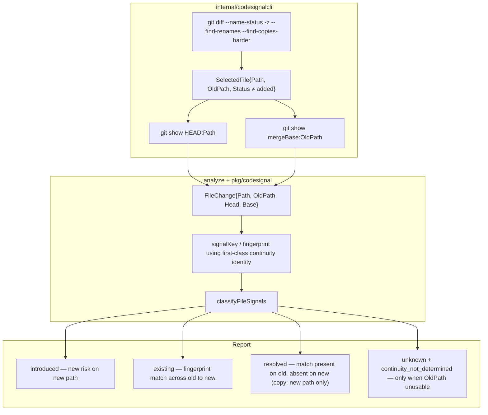
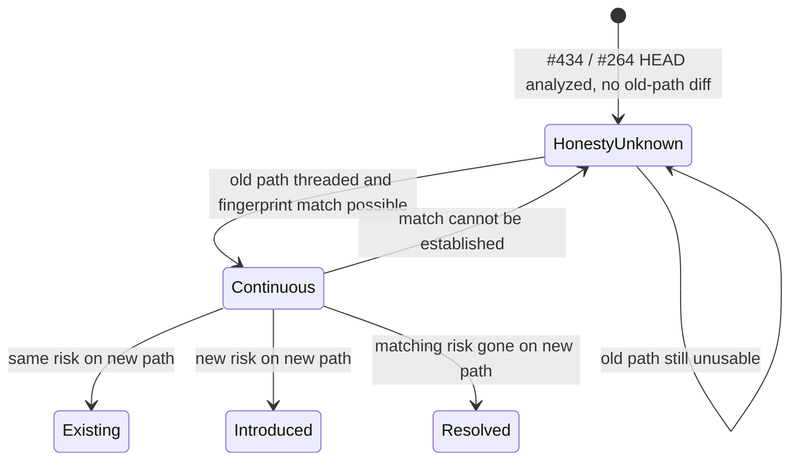

# Feature: Rename/copy lifecycle continuity across old and new paths

Child of #282. Related to #264 and PR #434 (the honesty slice this issue upgrades).

This is the follow-up #264 and PR #434 deliberately deferred. It is **not** a request to re-litigate #434's interim honesty as the product end state.

## Spec Review / System Design reconciliation

- Spec Review: FINDINGS SR-438-01–05 addressed in this body revision (Medium SR-438-06–09 applied where clean; Task 1 focus-string hygiene SR-438-10).
- System Design: seam pins accepted (OldPath, OQ2 option b, R100 empty hunks, OQ1 forbid source resolved). Additive seams (do not weaken those pins): (1) move `continuity_not_determined` from `SelectChangedFiles` selection-time emit to analysis-time fallback only; (2) satisfy `validateFileChange` / `baseUsableForLifecycle` path equality so usable continuity actually classifies; (3) fingerprint churn — continuity identity distinct from display Path; expected `fp_*` churn on rename; no `renamed` lifecycle.

## Problem Statement

PR #434 / #264's honesty fix analyzes git `R`/`C` HEAD content and classifies every signal on the new path as `lifecycle: unknown` plus one `continuity_not_determined` diagnostic. That is an incomplete analysis, not a green result: a pure `git mv` of a signal-bearing file still looks like no new debt, and a rename-with-edit that adds real risk still reports `introduced_signals: 0`. Product treats documenting "treat unknown as incomplete" as **not** resolution. Adopters who gate CI on `introduced_signals` alone can false-green on rename-with-edit, and a pure move of existing risk is incomplete rather than `existing`.

`signalKey` and `computeFingerprint` are path-keyed (`pkg/codesignal/lifecycle.go`, `pkg/codesignal/fingerprint.go`). `SelectedFile` and `FileChange` carry only the new path, and `analyzeAddedOrModifiedFile` loads base bytes only when `Status == "modified"` from that same path. Until the old path is threaded through selection, analysis, fingerprinting, and classification, the report cannot tell inherited risk from new risk on a rename or copy.

## Personas

| Persona | Impact | Notes |
| --- | --- | --- |
| Pilot engineer / project owner | Positive | Sees whether a refactor moved existing debt or added new risk, instead of a blanket `unknown` on every `R`/`C` path |
| CI adopter gating on `introduced_signals` | Positive | Rename-with-edit can fail the gate when new risk is real; a pure `git mv` is no longer misread as new debt or as a silent all-clear |
| Coding agent implementing `coach codesignal` | Neutral | Must keep #434 honesty as the fallback when old-path continuity cannot be established, and must not treat-as-added |

## Value Assessment

- **Primary value**: Customer — a PR check that watches `introduced_signals` can trust rename and copy diffs the same way it trusts `A`/`M`/`D`, which is the shape of change AI-assisted work produces most often (file splits, moves, copies).
- **Secondary value**: Future — closes the known false-green on the #282 G2 residual after #434: documenting incompleteness is not the same as classifying continuity.

## User Stories

### Shared Given (Stories 1–4)

**Given** `coach codesignal --base <merge-base>` on a fixture where `expectCoachStatusPrefix` observes `R` or `C` (not `D`+`A`) for the path under assertion,
**and** R/C selection shall not set Status to `added` and shall not classify via treat-as-added (REV-434-01),
**and** continuity matching shall use a first-class continuity identity consulted by `signalKey` / fingerprinting, distinct from public `Signal.Path` (do not remap by overwriting public Path for matching),
**and** public `Signal.Path` remains the path a human opens (HEAD path for surviving signals; old path for `resolved` signals absent at HEAD).

Shared acceptance (Stories 1–3; SR-438-02 / SR-438-05):

- Before any lifecycle assertion, the spec shall observe status prefix `R` or `C` via `expectCoachStatusPrefix` (a `D`+`A` landing is not this story).
- Continuity matching shall consult a first-class continuity identity (not public `Signal.Path` alone) so base and HEAD signals can match across OldPath→Path.
- Remapping that overwrites public `Signal.Path` solely to make `keyOf` collide is forbidden.
- Observable: usable OldPath ⇒ Stories 1–3 lifecycles; no `continuity_not_determined` on that path.
- Specs shall fail if every R/C still carries `continuity_not_determined` after a successful continuous classify (selection-time emit from #434 `SelectChangedFiles` is not an acceptable leftover).
- Usable continuity shall actually classify `existing` / `introduced` / `resolved`. Loading merge-base:OldPath bytes is not sufficient if `validateFileChange` / `baseUsableForLifecycle` then reject or ignore Base because `Base.Path != fc.Path`.

Coach flags for the prefix gate: `--name-status --find-renames --find-copies-harder`.

---

### Story 1: Pure rename is existing continuity, not unknown

As a **pilot engineer**,
I want **a pure `git mv` of a signal-bearing file with no content change to keep its lifecycle**,
so that **moved debt is not labeled unknown or treated as new**.

#### Acceptance Criteria

- When a pure `git mv` (`R`, content unchanged vs merge-base:OldPath) moves a signal-bearing file, the CLI shall classify each continuity-matched signal as `lifecycle: existing` (exact token; do not invent a rename-specific lifecycle) and shall not emit `continuity_not_determined` for that path.
- Those signals shall not increment `summary.introduced_signals`.
- For pure R100 (no content change), the locked acceptance specs shall assert no content hunks: ChangedRanges empty (or equivalent) and shall not treat `changed: true` as success for that fixture.
- After a successful continuous classify on this fixture, the path shall not carry `continuity_not_determined` (analysis-time fallback only; a leftover selection-time diagnostic is a failing spec).
- Classification must pass the `validateFileChange` / `baseUsableForLifecycle` path-equality seam (see Design implementation seams). Continuity identity (option b) or deliberate Path stamping for analysis shall keep Base usable against `FileChange.Path`; a run that only loaded OldPath bytes and then stayed `unknown` / `invalid_file_change` does not satisfy this story.

#### Notes

Shared Given applies. A fixture that lands as `D`+`A` is not this story. Do not treat `changed: true` as success (#264 empty-diff trap). Remap-Path-before-`keyOf` would churn `fp_*` versus historical old-path reports; prefer the pinned continuity identity and accept expected fingerprint churn on the renamed path — do not invent a `renamed` lifecycle.

---

### Story 2: Rename or copy plus new risk splits introduced from existing

As a **CI adopter**,
I want **new risk on a renamed or copied path to count as introduced while pre-existing risk stays existing**,
so that **a gate on `introduced_signals` fires on rename-with-edit and does not fire on inherited debt**.

#### Acceptance Criteria

- When rename/copy adds fixture-defined new risk on the new path, the CLI shall classify that new risk as `lifecycle: introduced` and each continuity-matched pre-existing risk as `lifecycle: existing`.
- `summary.introduced_signals` shall equal the fixture’s new-risk count N (not merely > 0), and shall not count continuity-matched inherited signals.
- When a pure `git mv` adds no new risk, `summary.introduced_signals` shall not include the moved continuous signals (expect 0 for that fixture’s moved set).
- When rename/copy includes content change (Story 2), prefer hunks from `git diff merge-base:OldPath HEAD:Path`.
- After a successful split classify, the path shall not carry `continuity_not_determined`. Specs fail if every R/C still carries that diagnostic.
- The introduced/existing split shall be produced by a Base that `baseUsableForLifecycle` accepts. Path stamping / continuity identity must satisfy `validateFileChange` (`Base.Path` empty or equal `fc.Path`); loading OldPath bytes while leaving Base unusable is not this story.

#### Notes

Pin N=1 in the acceptance fixture unless the story states otherwise. This is the false-green #434 documented and left open: all-`unknown` on a scored rename keeps `introduced_signals` at 0 even when new risky code was appended. Shared Given applies (R|C prefix gate before lifecycle; Status ≠ `added`; no treat-as-added / `noBaseLifecycleForFile`).

---

### Story 3: Risk removed across a rename is resolved

As a **pilot engineer**,
I want **a signal that existed on the old path and is gone on the new path to report as resolved when the fingerprint match holds**,
so that **a cleanup that happens during a move is visible the same way a cleanup on `M` is**.

#### Acceptance Criteria

- When a rename's old-path base carries a signal whose fingerprint matches a classification key that is absent from HEAD, the CLI shall emit that signal as `lifecycle: resolved`.
- If the fingerprint match does not hold, then the CLI shall not invent a `resolved` row for that signal.
- For `C`, classify only the copy’s new path against OldPath as continuity base; do not synthesize `resolved` (or any reclassification) on an untouched, still-present source.
- When a fingerprint-matched signal is on the continuity base and absent on copy HEAD: `lifecycle: resolved` is allowed on the **new path only**.
- Inherited risk on the copy → `existing`; new risk on the copy → `introduced`.
- After a successful copy classify, the copy's new path shall not carry `continuity_not_determined`. Specs fail if every R/C still carries that diagnostic.
- Copy classification must satisfy `validateFileChange` / `baseUsableForLifecycle` so Base from OldPath is actually used, not rejected as `invalid_file_change` / unusable.

#### Notes

Copy is not a delete of the source. Shared Given applies (R|C prefix gate before lifecycle). OldPath is continuity base only.

---

### Story 4: Unknown only when continuity cannot be established

As a **pilot engineer**,
I want **`unknown` and `continuity_not_determined` only when the old path truly cannot be used**,
so that **honesty remains the fallback and is no longer the happy path**.

#### Acceptance Criteria

- Emit `lifecycle: unknown` plus one `continuity_not_determined` on the new path when any of: OldPath empty on claimed R/C; `git show merge-base:OldPath` fails/unreadable; base AnalyzeBytes fails; binary/unsupported language prevents base analysis.
- When OldPath bytes are readable and base analysis succeeds **and** Base is usable for lifecycle (`baseUsableForLifecycle` true; no `invalid_file_change` from `Base.Path != fc.Path`), the CLI shall not emit `continuity_not_determined` for that path and shall not classify continuity-matched signals as `unknown`.
- `#434` emits `continuity_not_determined` unconditionally in `SelectChangedFiles` for every selected R/C at **selection**, not gated on analysis failure. This issue shall move emission to **analysis-time fallback only** when OldPath continuity cannot be established, and shall drop the diagnostic when continuity succeeds.
- Specs shall fail if every R/C still carries `continuity_not_determined` after a successful continuous classify.
- When git reports `R` or `C`, the CLI shall not classify continuity via treat-as-added and shall not set file Status to `added`; continuity requires merge-base bytes from OldPath paired with HEAD bytes from Path.
- Continuity identity (option b) or deliberate Path stamping for analysis must satisfy `validateFileChange` / `baseUsableForLifecycle`. Loading merge-base:OldPath bytes while stamping AnalyzeBytes `Path=oldPath` against `FileChange.Path=newPath` will silently keep unknown / fail validation and does not count as established continuity.
- The CLI shall leave #434's interim honesty in place on `main` until this issue's behavior lands; documenting "treat unknown as incomplete" shall not be treated as closing this issue.

#### Notes

`continuity_not_determined` / `unknown` only when OldPath is unusable. While continuity is established: no `continuity_not_determined`; continuous signals not `unknown`. Shared Given applies.

---

### Story 5: Docs and acceptance tests match the new contract

As a **pilot engineer**,
I want **customer docs and CLI acceptance tests to describe the same rename/copy contract**,
so that **a reader of the README is not still told that R/C is continuity-unknown after the CLI has started classifying it**.

#### Acceptance Criteria

- When this behavior ships, `README.md` and `docs/cli-codesignal.md` shall describe old-path continuity (pure move → `existing`; new risk → `introduced`; removed matching risk → `resolved`; `unknown` / `continuity_not_determined` only when continuity cannot be established) and shall no longer state that every analyzed R/C path is `unknown` without old-path continuity. Docs must match Stories 1–4 closed wording.
- When this behavior ships, the living leave-pilot evaluation `docs/product/evaluations/codesignal-pilot-readiness.html` shall be restamped against HEAD for the affected G2 / rename claim, with closed gaps moved to the archive per `AGENTS.md`.
- When behavior ships, restamp `docs/product/evaluations/codesignal-pilot-readiness.html` with the command run and HEAD SHA (and `#282 · N / 24` per AGENTS.md); GitHub issue CLOSED alone is not evidence.

## Design

> Engineering standards: `AGENTS.md` (acceptance-test-first Ginkgo/Gomega at the public CLI boundary, comment policy, living eval restamp). Do not import `pkg/githubingest` from `pkg/semantics` or the reverse.

### Components Affected

- `internal/codesignalcli/git.go` — thread `SelectedFile.OldPath` for `R`/`C` only (empty for `A`/`M`/`D`); `SelectChangedFiles` already sees both paths in the name-status record. Status must not become `"added"`. Stop emitting `continuity_not_determined` here (Task 4); #434 currently appends it unconditionally for every selected R/C.
- `internal/codesignalcli/analyze.go` — load merge-base bytes from **OldPath** and HEAD bytes from **Path**; compute changed ranges against that pair, not `show <base>:<newPath>`. Pure R100 → empty hunks / `changed: false`. Content-differing R/C → hunks from `git diff merge-base:OldPath HEAD:Path`. Emit `continuity_not_determined` only as an analysis-time fallback when continuity cannot be established.
- `pkg/codesignal/input.go` — `FileChange` must expose old-path identity so classification is not path-blind.
- `pkg/codesignal/codesignal.go` — `validateFileChange` emits `invalid_file_change` when `Base.Path != fc.Path` (Head similarly). `baseUsableForLifecycle` requires `Base.Path` empty or equal `fc.Path`. Continuity must satisfy this seam or classification silently stays unknown.
- `pkg/codesignal/lifecycle.go` — `signalKey` is `{ruleID, path, subject, evidence}`; path-keyed grouping is why a rename currently cannot match base to head. Consult first-class continuity identity (option b), not public `Signal.Path` alone.
- `pkg/codesignal/fingerprint.go` — `computeFingerprint` / `computeSignalID` include `normalizePath(path)`; continuity matching has to survive the path change via the same first-class continuity identity. Remapping that overwrites public `Signal.Path` solely to make `keyOf` collide is forbidden (fingerprint churn vs historical old-path `fp_*` / suppressions / caches).
- `cmd/coach/acceptance_test.go` — rewrite the three R/C specs #434 locked to `unknown` + `continuity_not_determined` (It titles / `ginkgo.focus` must match Stories 1–3 success criteria).
- `README.md`, `docs/cli-codesignal.md` — replace the #434 SME caveat as the standing contract; wording must match Stories 1–4.
- `docs/product/evaluations/codesignal-pilot-readiness.html` — restamp the rename/copy claim after a run at the landing HEAD (command + HEAD SHA; GitHub `CLOSED` is not evidence).

### Dependencies

- **Requires #434 (or equivalent #264 honesty) merged or present on the tree** so R/C new paths are already analyzed at HEAD and the interim `continuity_not_determined` marker exists to upgrade. Do not reopen the "skip R/C entirely" behavior.
- Uses existing `pkg/semantics` `AnalyzeBytes` on both sides. No new parser backend. No GitHub ingest.

### Data Model Changes

- `SelectedFile` gains an `OldPath` field populated only for git `R`/`C` (empty for `A`/`M`/`D`).
- `FileChange` gains a corresponding old-path (or continuity-path) field so `Build` can pair base and head without pretending the new path existed at the merge-base. Merge-base bytes come from OldPath; HEAD bytes come from Path.
- Status for R/C must not become `"added"`. Continuity is not treat-as-added / `noBaseLifecycleForFile` (REV-434-01).
- Lifecycle values stay the existing closed set: `introduced` / `existing` / `resolved` / `unknown` (plus `baseline` in baseline mode). Do not invent a `renamed` lifecycle.
- `continuity_not_determined` remains a diagnostic kind, used only when continuity truly cannot be established (Story 4 enumerated triggers).
- Public `Signal.Path` stays the path a reader should open (HEAD path for surviving signals; old path for `resolved` that no longer exist at HEAD, matching current `M`/`D` practice). Continuity identity is a first-class input to `signalKey` / `computeFingerprint` (option b), distinct from public `Signal.Path`. Remap that overwrites public Path for matching is forbidden.
- Fingerprint churn: remapping Path before `keyOf` changes `fp_*` versus historical old-path reports (suppressions/caches). Prefer the pinned continuity identity. Expected `fp_*` churn for renamed files is acceptable; do not invent a `renamed` lifecycle to avoid it.

### Implementation seams

Additive System Design seams. They do not weaken OldPath threading, OQ2 option b, R100 empty hunks, or OQ1 forbid-source-resolved.

1. **`continuity_not_determined` emission site.** On #434 it is emitted unconditionally in `SelectChangedFiles` for every selected R/C at **selection**, not gated on analysis failure (`Kind: "continuity_not_determined"`, message `"rename/copy lifecycle continuity was not determined"`). Story 4 / Task 4 shall move emission to **analysis-time fallback only** when OldPath continuity cannot be established, and drop the diagnostic when continuity succeeds. Specs must fail if every R/C still carries `continuity_not_determined` after a successful continuous classify.
2. **`baseUsable` / `validateFileChange` path equality.** `pkg/codesignal` rejects or treats Base unusable when `Base.Path != fc.Path` (`validateFileChange` → `invalid_file_change`; `baseUsableForLifecycle` requires `Base.Path` empty or equal `fc.Path`). Loading merge-base:OldPath bytes while stamping AnalyzeBytes `Path=oldPath` against `FileChange.Path=newPath` will silently keep unknown / fail validation. Continuity identity (option b) or deliberate Path stamping for analysis must satisfy this seam. Usable continuity must actually classify `existing` / `introduced` / `resolved`, not merely that OldPath bytes were loaded.
3. **Fingerprint churn.** Remap Path before `keyOf` changes `fp_*` vs historical old-path reports (suppressions/caches). Prefer continuity identity distinct from display Path (already pinned). Note expected churn for renamed files; do not invent a `renamed` lifecycle.

### Diagrams



```mermaid
sequenceDiagram
    participant CLI as coach codesignal --base
    participant Git as git name-status
    participant Sel as SelectChangedFiles
    participant An as AnalyzeChanges
    participant CS as pkg/codesignal Build
    participant Out as report
    CLI->>Git: diff merge-base HEAD with rename/copy detection
    Git-->>Sel: Rxxx oldPath newPath  or  Cxxx oldPath newPath
    Sel->>An: SelectedFile Path=newPath OldPath=oldPath Status≠added
    An->>An: AnalyzeBytes HEAD:Path and merge-base:OldPath
    An->>CS: FileChange with both sides and old-path identity
    alt old-path bytes and analysis usable
        CS-->>Out: existing / introduced / resolved; no continuity_not_determined
    else OldPath empty, unreadable, or base analysis fails
        CS-->>Out: unknown + continuity_not_determined (keep #434 honesty)
    end
```



### Decisions

- **OQ1 (copy source resolved):** CLOSED — forbid `resolved` on an untouched, still-present copy source; classify the copy's new path only; OldPath is continuity base only. When a fingerprint-matched signal is on the continuity base and absent on copy HEAD, emit `resolved` on the **new path only**.
- **OQ2 (continuity identity):** CLOSED — first-class continuity identity consulted by `signalKey` / `computeFingerprint` (Design option b), distinct from public `Signal.Path`. Public Path = human-open path (HEAD for surviving; old path for resolved gone at HEAD). Remap that overwrites public Path for matching is forbidden unless it preserves Path display + Stories 1–4 (and option b is the pinned approach).
- **OQ3 (ChangedRanges):** CLOSED — pure R100 → empty hunks / `changed: false`; content-differing R/C → true rename hunks from `git diff merge-base:OldPath HEAD:Path`.
- **Emission site:** CLOSED — `continuity_not_determined` is analysis-time fallback only; `SelectChangedFiles` shall not emit it for every R/C.
- **Path-equality seam:** CLOSED — option b / Path stamping must keep `validateFileChange` / `baseUsableForLifecycle` satisfied so Base is used.
- **Fingerprint churn:** CLOSED — do not remap public Path to make `keyOf` collide; expected `fp_*` churn on rename; no `renamed` lifecycle.

### Open Questions

None remaining for implementation. OQ1–OQ3 plus the additive emission-site / path-equality / fingerprint-churn seams are CLOSED in Decisions. Product SME re-verdict is next.

---

## Tasks

> Each task should be completable in a single coding agent session.
> Tasks are sequenced by dependency. Complete in order unless noted.

### Task 1: Rewrite the three R/C acceptance specs for true continuity (red first)

**Objective**: Replace the #434 locks of `unknown` + `continuity_not_determined` with failing Ginkgo specs that state the customer done-when.

**Context**: Acceptance-test-first. An unrun test or a test that already passes does not count. These three specs currently encode the interim honesty contract and must be rewritten deliberately. Align `ginkgo.focus` strings to the rewritten It titles (SR-438-10); red failure must be a lifecycle/diagnostic assertion, not a missing helper or `D`+`A` fixture.

**Affected files**:

- `cmd/coach/acceptance_test.go`
- `cmd/coach/acceptance_suite_test.go` (helpers such as `expectCoachStatusPrefix`, `renameFile`, `renameAndWrite`, `paddedGoPackage` — only if a new helper is required)

**Requirements**:

- Ginkgo v2 + Gomega at the `cmd/coach` compiled-CLI boundary (`TestCoachAcceptance`).
- Rewrite these three specs. It titles / focus strings must match the rewritten success criteria (do not keep #434 honesty It-names):
  1. `When("a file containing a signal-producing construct is renamed with no content change")` / `It("classifies continuity-matched signals as existing")` — pure `git mv` (`R100`) → `lifecycle: existing` (exact token), no `continuity_not_determined`, moved signals do not increment `introduced_signals`, ChangedRanges empty / do not treat `changed: true` as success.
  2. `When("a large file is renamed and new risky code is appended")` / `It("classifies new risk as introduced and pre-existing matching risk as existing")` — fixture N=1 new distinct risk unless stated otherwise; `summary.introduced_signals` equals N; inherited signals not counted.
  3. `When("a file is copied from an untouched source and Git reports a copy")` / `It("classifies the copy against OldPath without reclassifying the untouched source")` — inherited risk `existing`, new risk `introduced`; `resolved` on the new path only when a fingerprint-matched base signal is absent on copy HEAD; no synthesized `resolved` on the untouched source.
- Add a spec for risk removed across a rename → `resolved` where the fingerprint match holds: `It("emits resolved when a fingerprint-matched old-path signal is absent at HEAD")`.
- Add a spec that Story 4 honesty triggers still yield `unknown` + `continuity_not_determined`: `It("emits unknown and continuity_not_determined when OldPath is unusable")`.
- Every R/C spec shall call `expectCoachStatusPrefix` (or equivalent) and assert the observed prefix is `R` or `C` **before** asserting lifecycle. A `D`+`A` landing is not this story.
- The CLI shall not mark R/C `Status` as `"added"` and shall not reuse treat-as-added / `noBaseLifecycleForFile` as a substitute for old-path continuity (REV-434-01).
- Success-path specs shall fail if every R/C still carries `continuity_not_determined` after the intended continuous classify (catches leftover #434 selection-time emit).
- Success-path specs shall assert the Story 1–3 lifecycles themselves, not merely that OldPath bytes were loaded (catches `validateFileChange` / `baseUsableForLifecycle` rejecting Base).
- Do not implement production behavior in this task.

**Verification**:

- [ ] `go test ./cmd/coach -run TestCoachAcceptance -ginkgo.focus='classifies continuity-matched signals as existing|classifies new risk as introduced|classifies the copy against OldPath|emits resolved when a fingerprint-matched|emits unknown and continuity_not_determined'` fails on current #434-or-main honesty (`unknown` + `continuity_not_determined`, or pre-#434 skip)
- [ ] Failure mode is the lifecycle/diagnostic assertion, not a missing helper or a `D`+`A` fixture
- [ ] `mise run acceptance-style-check` still passes

**Done when**:

- [ ] The three #434 R/C specs no longer lock `unknown` + `continuity_not_determined` as the success path for a usable old path
- [ ] It titles and `ginkgo.focus` strings match the rewritten success criteria (existing / introduced+existing / copy continuity)
- [ ] Red evidence is captured (command + failing assertion)
- [ ] No production code changed yet

---

### Task 2: Thread the git old path through SelectedFile

**Depends on**: Task 1

**Objective**: `SelectChangedFiles` records the old path on every `R`/`C` `SelectedFile` and still selects the new path for HEAD analysis.

**Context**: `parseNameStatusZ` already returns both paths. #434 selects the new path without marking it `added`. This task adds identity, not a treat-as-added shortcut.

**Affected files**:

- `internal/codesignalcli/git.go`
- `internal/codesignalcli/git_test.go`

**Requirements**:

- `SelectedFile` carries `OldPath` (or equivalent) for `R`/`C`; empty for `A`/`M`/`D`.
- Status for R/C must not become `"added"` (REV-434-01). Continuity is a later classification step, not an added-file policy reuse. Do not reuse treat-as-added / `noBaseLifecycleForFile`.
- Keep selecting the new path so HEAD analysis does not regress to the pre-#264 skip.
- Unit fixtures that claim R/C shall observe prefix `R` or `C` (not `D`+`A`) before asserting `OldPath`.
- Do not treat this task as the place that "solves" `continuity_not_determined`. #434 still emits it unconditionally in `SelectChangedFiles`; leaving that emit in place keeps Task 1 success specs red until Tasks 3–4 move it.

**Verification**:

- [ ] `go test ./internal/codesignalcli -run TestSelectChangedFilesRename` (and the copy counterpart) pass
- [ ] Unit coverage shows `OldPath` populated from the name-status record
- [ ] R/C Status is not `"added"`

**Done when**:

- [ ] An `R`/`C` record has both paths on `SelectedFile`
- [ ] R/C is still not `"added"`
- [ ] Task 1 specs are still red (analysis does not yet use `OldPath`)

---

### Task 3: Diff the new path against the old path and classify continuity

**Depends on**: Task 2

**Objective**: Load merge-base bytes from the old path, analyze both sides, and emit `existing` / `introduced` / `resolved` when the fingerprint match holds.

**Context**: `analyzeAddedOrModifiedFile` today loads base only for `Status == "modified"` from `sf.Path`. That path does not exist at the merge-base for a rename.

**Affected files**:

- `internal/codesignalcli/analyze.go`
- `pkg/codesignal/input.go`
- `pkg/codesignal/lifecycle.go`
- `pkg/codesignal/fingerprint.go` (continuity identity must be first-class / option b)
- companion `*_test.go` in those packages

**Requirements**:

- Stories 1–3 and Shared Given.
- Thread OldPath through `FileChange` into `classifyFileSignals` so `signalKey` / `computeFingerprint` consult first-class continuity identity across OldPath→Path. Do not overwrite public `Signal.Path` to make `keyOf` collide.
- Do not implement treat-as-added or introduced-only shortcuts that skip old-path continuity. Status must not become `"added"`.
- **Seam (1) emission:** when continuity succeeds, drop `continuity_not_determined` for that path. Specs must fail if every R/C still carries it after a successful continuous classify. (Moving the remaining emit out of `SelectChangedFiles` is Task 4; this task must not leave a success-path diagnostic.)
- **Seam (2) path equality:** continuity identity (option b) or deliberate Path stamping for analysis must satisfy `validateFileChange` / `baseUsableForLifecycle`. `Base.Path` empty or equal `fc.Path`. Loading merge-base:OldPath bytes while stamping AnalyzeBytes `Path=oldPath` against `FileChange.Path=newPath` will emit `invalid_file_change` and treat Base as unusable — that is not established continuity. Usable continuity must actually classify `existing` / `introduced` / `resolved`.
- Remap-Path-before-`keyOf` is still forbidden (fingerprint churn vs historical `fp_*`). Expected `fp_*` churn on the renamed display path is acceptable; do not invent a `renamed` lifecycle.
- Pure R100: empty ChangedRanges / `changed: false`. Content-differing R/C: hunks from `git diff merge-base:OldPath HEAD:Path`.
- Copy: classify new path only; do not synthesize `resolved` on an untouched source.

**Verification**:

- [ ] The Task 1 specs for pure mv, scored rename-with-edit, copy, and removed-risk now pass
- [ ] `go test ./pkg/codesignal ./internal/codesignalcli ./cmd/coach -run 'Lifecycle|SelectChangedFiles|TestCoachAcceptance' -ginkgo.focus='classifies continuity-matched signals as existing|classifies new risk as introduced|classifies the copy against OldPath|emits resolved when a fingerprint-matched'`

**Done when**:

- [ ] Stories 1–3 hold at the CLI boundary
- [ ] First-class continuity identity matching works across old and new paths
- [ ] Success-path R/C does not carry `continuity_not_determined`; Base is usable (`validateFileChange` / `baseUsableForLifecycle`) so classification is real, not bytes-loaded-then-unknown
- [ ] No treat-as-added shortcut; R/C Status ≠ `"added"`

---

### Task 4: Keep #434 honesty as the only unknown path

**Depends on**: Task 3

**Objective**: `unknown` + `continuity_not_determined` remain only when old-path continuity cannot be established.

**Context**: Story 4. Product rejected "document incompleteness" as the end state; it is still the correct fallback.

**Affected files**:

- `internal/codesignalcli/analyze.go`
- `pkg/codesignal` classification path
- `cmd/coach/acceptance_test.go` (fallback spec from Task 1)

**Requirements**:

- Story 4 enumerated honesty triggers (OldPath empty on claimed R/C; `git show merge-base:OldPath` fails/unreadable; base AnalyzeBytes fails; binary/unsupported language prevents base analysis).
- **Seam (1) emission site:** `#434` emits `continuity_not_determined` unconditionally in `SelectChangedFiles` for every selected R/C at **selection**. Move emission to **analysis-time fallback only** when OldPath continuity cannot be established. `SelectChangedFiles` shall not append this diagnostic for every R/C. Drop it when continuity succeeds. Specs shall fail if every R/C still carries it after a successful continuous classify.
- **Seam (2) path equality:** fallback vs success is decided after Base is validated. A Base that fails `validateFileChange` (`Base.Path != fc.Path`) or `baseUsableForLifecycle` is "continuity cannot be established", not a silent unknown after "we loaded OldPath bytes". Option b / Path stamping must keep success-path Base usable.
- Do not remove the `continuity_not_determined` kind; narrow when it is emitted.
- Do not change exit-status policy.
- While continuity is established: no `continuity_not_determined`; continuity-matched signals not `unknown`.
- R|C prefix gate and Status ≠ `"added"` still hold on the fallback fixture (the fixture is R/C with an unusable OldPath, not a treat-as-added path).

**Verification**:

- [ ] Fallback spec is green: unusable OldPath → `unknown` + `continuity_not_determined` emitted at analysis time, not by `SelectChangedFiles` for every R/C
- [ ] Usable old path specs still have no `continuity_not_determined`
- [ ] `T`/`U`/`X`/`B` unanalyzed accounting from #434 remains unchanged

**Done when**:

- [ ] Story 4 holds
- [ ] #434 headline / `files_unanalyzed` behavior for truly unanalyzed statuses is untouched

---

### Task 5: Align customer docs and the living evaluation

**Depends on**: Task 4

**Objective**: README, CLI docs, and the leave-pilot evaluation describe continuity, not the #434 interim contract, after a real run at HEAD.

**Context**: `AGENTS.md` requires restamping `docs/product/evaluations/codesignal-pilot-readiness.html` when a #282 child or user-facing `coach codesignal` behavior lands. GitHub `CLOSED` is not evidence.

**Affected files**:

- `README.md`
- `docs/cli-codesignal.md`
- `docs/product/evaluations/codesignal-pilot-readiness.html`

**Requirements**:

- Story 5. Docs must match Stories 1–4 closed wording.
- State that adopters gating on `introduced_signals` alone no longer false-green on rename-with-edit, and that a pure `git mv` is `existing` rather than new debt or unknown incompleteness.
- Re-run the affected rename/copy claim against HEAD; move the closed G2 residual to the archive; restamp date / HEAD / `#282 · N / 24`. Restamp evidence shall include the command run and HEAD SHA.

**Verification**:

- [ ] Docs no longer say every analyzed R/C path is `unknown` without old-path continuity
- [ ] Living eval restamp includes a command + HEAD SHA, not a GitHub state
- [ ] `mise run ci-fast` (implement/review loop) or the focused `cmd/coach` acceptance slice plus `gofmt` / `go-vet` / `acceptance-style-check`

**Done when**:

- [ ] Story 5 holds
- [ ] Story 2's adopter-gate wording appears in customer docs
- [ ] Living eval archive contains the closed #434-era "unknown on R/C" claim

---

## Out of Scope

- **Exit-status policy.** Incomplete analysis staying exit 0 is a global question (#282 D1 already ruled the classes). This issue does not change exit codes so that `introduced_signals`-only watchers fail closed.
- **Working-tree scanning.** Owned by #168. This issue is committed `R`/`C` between merge-base and HEAD.
- **Treat-as-added / introduced-only shortcuts** that classify every R/C HEAD signal as `introduced` (or reuse `noBaseLifecycleForFile` / `"added"`) without old-path continuity. REV-434-01 rejected that for the honesty slice; it is still rejected here as a substitute for this feature.
- **Re-litigating #434 honesty as the product end state.** Analyzing HEAD + `unknown` + `continuity_not_determined` is the interim contract to keep until this lands, and the fallback when continuity cannot be established. It is not done.
- **#264 analysis coverage itself** (selecting R/C new paths, `files_unanalyzed`, honest headline). That is #434. This issue upgrades classification after that selection exists.
- **`--scope` filtering, TypeScript project sidecar, suppression, and other #282 children.**

## Future Considerations

- Whether an incomplete R/C fallback (`continuity_not_determined`) should eventually be a non-zero CI signal. Decide with the rest of incomplete-analysis policy, not here.
- Continuity across a rename chain in one range (A→B→C in a single merge-base…HEAD diff). Git reports one `R` from the first to the last path; if that holds, this issue's old-path field is enough. Multi-commit follow is out of scope.
- Working-tree renames once #168 exists.

---

Seeded from: #264.

Drafted plan authored by feature-to-plan.

Body revision: Spec Review FINDINGS SR-438-01–10 + System Design seam pins (OldPath, OQ2 option b, R100 empty hunks, OQ1 forbid source resolved) + additive seams (emission site, validateFileChange/baseUsable path equality, fingerprint churn).
